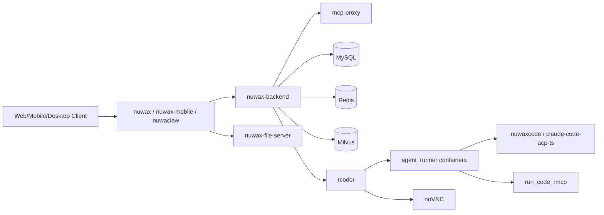

# 部署链路与代码仓库映射

生成时间：2026-06-10

## 1. 直接部署链路

从以下文件可以确认当前部署主链：

- `../nuwax_deploy/docker/docker-compose.yml`
- `../nuwax_computer_deploy/docker-computer/docker-compose.yml`
- `../nuwax_deploy/docker/README.md`
- `../nuwax/README.md`
- `../nuwax-backend/README.md`

### 1.1 主服务部署链

`nuwax_deploy/docker/docker-compose.yml` 里的核心服务：

- `frontend`
- `backend`
- `mcp-proxy`
- `mysql`
- `redis`
- `milvus`

对应代码仓库映射：

| 部署服务 | 代码仓库 | 说明 |
| --- | --- | --- |
| `frontend` | `nuwax` | Web 前端主站 |
| `backend` | `nuwax-backend` | 平台后端，承接业务、知识库、插件、工作流等 |
| `mcp-proxy` | `mcp-proxy` | MCP 代理与桥接层 |
| `mysql` / `redis` / `milvus` | 无业务代码仓库 | 基础设施服务 |

### 1.2 Agent Computer / Sandbox 部署链

`nuwax_computer_deploy/docker-computer/docker-compose.yml` 里的核心服务：

- `rcoder`
- `agent-runner-image-pre-pull`
- `agent-runner-image-puller`

从 `rcoder/README.md` 可知，`rcoder` 是主控层，会动态创建 `agent_runner` 容器，并对外暴露：

- `/computer/chat`
- `/computer/progress/{session_id}`
- `/computer/vnc/...`
- `/computer/audio/...`
- `/computer/ime/...`

对应代码仓库映射：

| 部署服务 | 代码仓库 | 说明 |
| --- | --- | --- |
| `rcoder` | `rcoder` | 沙箱主控、容器调度、gRPC/SSE 桥接、代理路由 |
| VNC 前端能力 | `noVNC` | 远程桌面网页端 |

## 2. 运行时补充链路

这些仓库不一定直接出现在 `docker-compose` 里，但在容器内运行、桌面端运行或 Agent 依赖中被明确引用。

### 2.1 NuwaClaw 本地客户端链路

根据 `../nuwaclaw/AGENTS.md`：

- 支持的引擎包括 `claude-code`、`nuwaxcode`
- Required Dependencies 明确包含：
  - `nuwax-file-server`
  - `nuwaxcode`
  - `nuwax-mcp-stdio-proxy`

映射如下：

| 运行时组件 | 代码仓库 | 来源依据 |
| --- | --- | --- |
| 本地桌面客户端 | `nuwaclaw` | `nuwaclaw/README.md` |
| 文件服务 | `nuwax-file-server` | `nuwaclaw/AGENTS.md` |
| Agent 引擎 | `nuwaxcode` | `nuwaclaw/AGENTS.md` |
| MCP 聚合代理 | `mcp-proxy` | `nuwaclaw/AGENTS.md`、命名上对应 `nuwax-mcp-stdio-proxy` |
| ACP 适配器 | `claude-code-acp-ts` | `rcoder/config.yml` 默认 `default_agent_id: claude-code-acp-ts` |

### 2.2 后端能力补充链路

根据 `../nuwax-backend/README.md` 中的 “Project Repository Overview”：

| 组件能力 | 代码仓库 | 是否本轮作为必拉取 |
| --- | --- | --- |
| Web 前端 | `nuwax` | 是 |
| 移动端 | `nuwax-mobile` | 是 |
| 桌面客户端 | `nuwaclaw` | 是 |
| 沙箱调度 | `rcoder` | 是 |
| MCP 服务 | `mcp-proxy` | 是 |
| 文件服务 | `nuwax-file-server` | 是 |
| Agent 引擎 | `nuwaxcode` | 是 |
| Claude ACP 适配器 | `claude-code-acp-ts` | 是 |
| 脚本执行服务 | `run_code_rmcp` | 是 |
| 前端模板/设计插件 | `xagi-frontend-templates` / `vite-plugin-design-mode` / `dev-inject` | 否，本轮列为生态扩展 |

## 3. 整体链路理解

可以把当前工程理解成 4 层：

### 分层解释

- 交互层：`nuwax`、`nuwax-mobile`、`nuwaclaw`
- 平台层：`nuwax-backend`
- 协议与桥接层：`mcp-proxy`
- 沙箱与执行层：`rcoder`、`agent_runner`、`noVNC`、`nuwaxcode`、`claude-code-acp-ts`、`run_code_rmcp`

## 4. 本轮建议纳入“必看仓库”的范围

按照“部署直接出现 + 运行时明确依赖 + 便于串整体链路”的原则，建议先聚焦这 11 个仓库：

- `nuwax`
- `nuwax-backend`
- `mcp-proxy`
- `rcoder`
- `noVNC`
- `nuwaclaw`
- `nuwax-file-server`
- `nuwaxcode`
- `claude-code-acp-ts`
- `run_code_rmcp`
- `nuwax-cli`

其中：

- `nuwax-cli` 负责部署、升级、备份，是“运维入口”
- `nuwax-mobile` 是端侧补充，建议第二阶段再看
- 模板/设计类仓库放到最后
