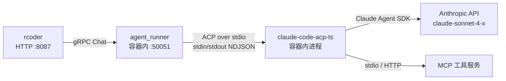

# claude-code-acp-ts 总览

`claude-code-acp-ts` 是 Nuwax 平台默认的 **AI Agent 引擎**，运行在 rcoder 管理的 Docker 容器内。它是 [Zed Industries 的 claude-code-acp](https://github.com/zed-industries/claude-code-acp) 的 TypeScript fork，把 Anthropic 官方 Claude Agent SDK（`@anthropic-ai/claude-agent-sdk`）包装成 **ACP（Agent Client Protocol）** 协议对外暴露，让 rcoder 的 `agent_runner` 通过 gRPC 与之交互。

一句话定位：`claude-code-acp-ts` = **Claude 模型能力 + ACP 协议适配层**，是容器内 Agent 的实际执行引擎，rcoder 配置项 `default_agent_id: "claude-code-acp-ts"` 指的就是它。

## 1. 在平台中的位置



`agent_runner`（Rust，rcoder workspace 内）负责管理 `claude-code-acp-ts` 子进程，并把子进程的 ACP 消息桥接为 gRPC ProgressEvent 推给 rcoder 主服务。

## 2. ACP 协议简介

ACP（Agent Client Protocol）是一个开放协议，定义了 AI Agent 与调用方之间的交互接口。通信方式为 **stdio NDJSON 流**（每行一个 JSON 对象）：

```
rcoder agent_runner
    ↓ spawn 子进程
claude-code-acp-ts
    stdin ← NDJSON 请求（PromptRequest、CancelNotification、...）
    stdout → NDJSON 响应（SessionNotification、PromptResponse、...）
```

## 3. 核心组件

### runAcp()（入口）

```typescript
// src/index.ts → src/acp-agent.ts
export function runAcp() {
  const input  = nodeToWebWritable(process.stdout);  // 写到 stdout
  const output = nodeToWebReadable(process.stdin);   // 读自 stdin
  const stream = ndJsonStream(input, output);
  const connection = new AgentSideConnection((client) => {
    return new ClaudeAcpAgent(client);
  }, stream);
  return { connection, agent };
}
```

进程启动后监听 stdin，通过 `AgentSideConnection` 解析 ACP NDJSON 消息，交给 `ClaudeAcpAgent` 处理。

### ClaudeAcpAgent（核心类）

实现 ACP `Agent` 接口，处理以下 RPC 方法：

| ACP 方法 | 说明 |
|---------|------|
| `initialize` | 初始化 Agent，返回能力声明 |
| `newSession` | 创建新会话（新 Claude Code 进程）|
| `resumeSession` | 恢复已有会话 |
| `loadSession` | 加载历史会话 |
| `forkSession` | 分叉会话（创建子会话）|
| `closeSession` | 关闭会话 |
| `deleteSession` | 删除会话 |
| `listSessions` | 列出所有会话 |
| `prompt` | 发送用户消息，接收流式响应 |
| `setSessionModel` | 切换会话使用的模型 |
| `setSessionMode` | 切换会话模式（interactive / background）|
| `setSessionConfigOption` | 设置会话配置项 |
| `authenticate` | 处理鉴权流程 |

### query（Claude Agent SDK 调用）

每个 `prompt` 请求最终调用 `@anthropic-ai/claude-agent-sdk` 的 `query()` 函数，`query()` 底层启动 `claude` CLI 子进程并与之通信：

```
ClaudeAcpAgent.prompt()
  → query({ prompt, sessionId, mcpServers, ... })
    → 启动/复用 claude CLI 子进程
      → 调用 Anthropic API
      → 流式返回 SDKPartialAssistantMessage
    → streamEventToAcpNotifications() 转换为 ACP 通知
    → 通过 stdout NDJSON 推给 agent_runner
```

## 4. 会话管理

- 每个 `sessionId` 对应一个 claude CLI 子进程（通过 Agent SDK 管理）
- 会话状态保存在 `~/.claude/`（`CLAUDE_CONFIG_DIR` 可覆盖）
- `resumeSession` / `forkSession` 复用已有进程或历史消息
- `ClaudeAcpAgent.dispose()` 在进程退出时清理所有 session

## 5. 工具调用与权限

`tools.js` 实现工具调用相关逻辑：

| 功能 | 说明 |
|------|------|
| `createTaskHook` | Task 状态跟踪（TodoWrite 集成）|
| `createPostToolUseHook` | 工具调用后置钩子 |
| `resolvePermissionMode` | 权限模式解析（auto-approve / confirm）|
| `describeAlwaysAllow` | 返回始终允许的工具列表 |

工具权限通过 ACP `PermissionOption` 传递，`agent_runner` 收到 `ask_confirmation` ProgressEvent 时把确认请求通过 gRPC 上报给 rcoder，最终传给 nuwax-backend 用户侧。

## 6. MCP 服务支持

`ClaudeAcpAgent` 支持两类 MCP 服务器配置（通过 ACP `mcpServers` 传入）：

```typescript
// HTTP/SSE 类型
{ type: "http" | "sse", url: "...", headers: {...} }

// stdio 类型（本地子进程）
{ type: "stdio", command: "...", args: [...], env: {...} }
```

这些 MCP 服务由 nuwax-backend 在发起 gRPC Chat 请求时通过 `model_config.mcp_servers` 字段传递，最终注入到 `query()` 调用。

## 7. 与 agent_runner 的关系

`agent_runner`（Rust）是 `claude-code-acp-ts` 的父进程，负责：

- `spawn()` 启动 `claude-code-acp-ts` 进程
- 把 gRPC `ChatRequest` 转换为 ACP `PromptRequest` 写入子进程 stdin
- 读取子进程 stdout 的 ACP 事件，转换为 `UnifiedSessionMessage`
- 转换为 gRPC `ProgressEvent` 推给 rcoder

`rcoder` 配置中 `default_agent_id: "claude-code-acp-ts"` 就是告诉 `agent_runner` 要在容器内找这个二进制来启动。

## 8. 与 nuwaxcode 的关系

学习路线中 `nuwaxcode`（第 8 个）在本地仓库中未找到，可能是另一个 Agent 引擎实现（类似 OpenCode 的 fork）。`claude-code-acp-ts` 和 `nuwaxcode` 是**可替换关系**：`rcoder` 通过 `default_agent_id` 配置选择用哪个，两者都暴露 ACP 接口（或 gRPC 接口），对上层透明。

## 9. 快速查阅

| 我想了解… | 看这里 |
|----------|--------|
| ACP 入口与 stdio 通信 | [src/acp-agent.ts:3233 `runAcp()`](../../claude-code-acp-ts/src/acp-agent.ts) |
| 会话创建与 query 调用 | `ClaudeAcpAgent.newSession()` / `prompt()` |
| 工具权限管理 | [src/tools.ts](../../claude-code-acp-ts/src/tools.ts) |
| 设置/配置管理 | [src/settings.ts](../../claude-code-acp-ts/src/settings.ts) |
| ACP 协议规范 | [agentclientprotocol.com](https://agentclientprotocol.com) |
| Claude Agent SDK 文档 | Anthropic 官方文档 |

## 一句话总结

`claude-code-acp-ts` 是容器内 AI 执行引擎，通过 ACP 协议（stdio NDJSON 流）接收 `agent_runner` 下发的任务，调用 Anthropic Claude Agent SDK 驱动 `claude` CLI 进程执行，并把流式进度事件回传，是 Nuwax Computer Agent 能力的最终执行层。
