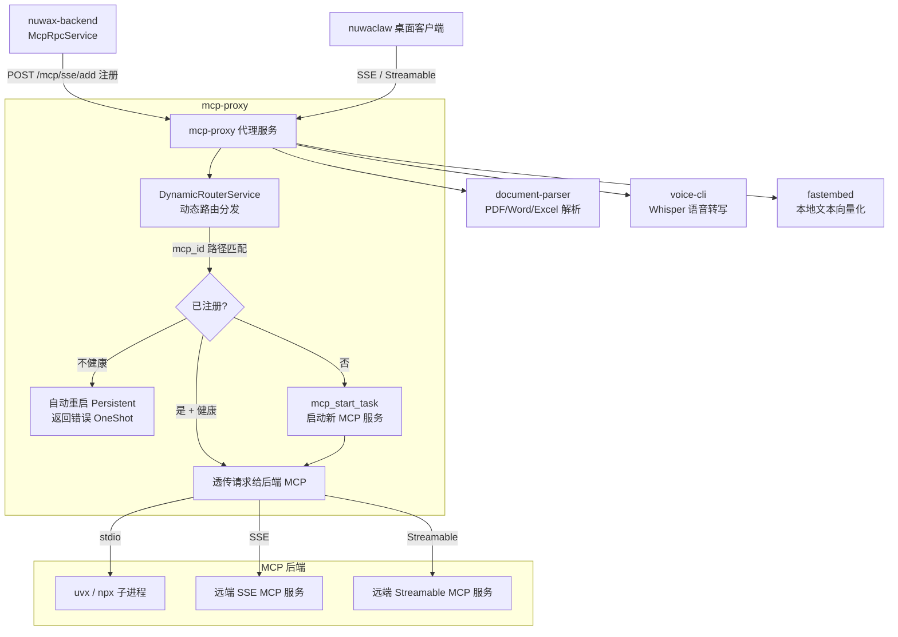

# mcp-proxy 总览

`mcp-proxy` 是一个用 **Rust** 写的 MCP（Model Context Protocol）代理服务工作空间。它在 Nuwax 平台里扮演"MCP 能力中间层"的角色：把各种 MCP 服务（stdio 命令行、SSE、Streamable HTTP 三种协议）统一包装成平台可访问的 HTTP 接口，同时还附带文档解析、语音转写、文本向量化等工具服务。

一句话定位：`mcp-proxy` = **MCP 协议代理枢纽 + 知识库辅助工具集**，`nuwax-backend` 和 `nuwaclaw` 都依赖它。

## 1. 它解决什么问题

MCP 工具服务（`uvx some-tool`、`npx some-server` 等）通常以 stdio 子进程形式运行，无法直接被 HTTP 服务调用。`mcp-proxy` 做的事：

1. 把 **stdio 子进程** 包成 HTTP SSE / Streamable HTTP 接口（让 nuwax-backend 通过 HTTP 调用）
2. 把**远端 SSE MCP 服务** relay 转发给调用方（协议转换）
3. 动态注册、路由、健康检查、自动重启（Persistent 模式）
4. 附带文档解析（PDF/Word/Excel → Markdown）、语音 ASR、文本 Embedding 等基础能力

## 2. 整体架构一图看清



## 3. Workspace 成员（子 crate 一览）

```
mcp-proxy/
├── mcp-proxy/          主代理服务（核心）
├── mcp-common/         共享类型和工具（其他 crate 都依赖）
├── mcp-sse-proxy/      SSE 协议的服务端/客户端实现（rmcp 0.10）
├── mcp-streamable-proxy/ Streamable HTTP 协议实现（rmcp 0.12）
├── document-parser/    文档解析服务（Python + Rust）
├── voice-cli/          语音转写服务（Whisper）
├── fastembed/          本地 Embedding 服务
└── oss-client/         阿里云 OSS 客户端库
```

## 4. 核心：mcp-proxy 子 crate 内部结构

```
mcp-proxy/src/
├── main.rs             启动入口（服务器模式 / CLI 模式双入口）
├── config.rs           配置加载（config.yml / 环境变量）
├── model/              数据模型
│   ├── mcp_config.rs   McpConfig（mcp_id、类型、协议、JSON 配置）
│   ├── mcp_router_model.rs  McpRouterPath（路径解析）、McpServerConfig
│   ├── app_state_model.rs   AppState（axum 状态）
│   └── global.rs       全局 ProxyManager（DashMap 存路由表）
├── server/
│   ├── handlers/       HTTP 接口处理器
│   │   ├── mcp_add_handler.rs      POST /mcp/sse/add 或 /mcp/stream/add
│   │   ├── mcp_check_status_handler.rs  GET /mcp/sse/{id}/check_status
│   │   ├── delete_route_handler.rs POST /mcp/delete
│   │   ├── run_code_handler.rs     POST /run_code（代码执行）
│   │   └── health.rs               GET /health  GET /ready
│   ├── mcp_dynamic_router_service.rs  动态路由核心（Tower Service）
│   ├── task/
│   │   ├── mcp_start_task.rs       启�� MCP 子进程并注册路由
│   │   └── schedule_check_mcp_live.rs  定时健康检查（60s）
│   └── middlewares/    鉴权、日志、OpenTelemetry
├── client/             CLI 工具（convert / check / detect / proxy）
└── proxy/              McpHandler 抽象（SSE/Stream 协议适配）
```

## 5. 两种运行模式

**服务器模式（默认）**

```bash
mcp-proxy
```

启动 HTTP 服务（默认 8080 端口），提供动态注册 API，供 `nuwax-backend` 调用。

**CLI 模式（工具）**

```bash
mcp-proxy convert https://example.com/mcp/sse   # 把远端 SSE 转成 stdio
mcp-proxy check   https://example.com/mcp/sse   # 检查服务状态
mcp-proxy detect  https://example.com/mcp       # 检测协议类型
```

`nuwaclaw` 桌面客户端启动本地 MCP 工具时用这个模式���把 stdio 子进程包成 SSE 暴露给本地 Agent。

## 6. HTTP 接口速查

| 方法 | 路径 | 说明 |
|------|------|------|
| GET  | `/health` | 健康检查 |
| GET  | `/ready`  | 就绪检查 |
| GET  | `/mcp/list` | 查看所有已注册 MCP 服务 |
| POST | `/mcp/sse/add` | 注册新 MCP 服务（客户端协议 SSE）|
| POST | `/mcp/stream/add` | 注册新 MCP 服务（客户端协议 Streamable）|
| GET  | `/mcp/sse/{id}/sse` | SSE 连接端点 |
| POST | `/mcp/sse/{id}/message` | SSE 消息端点 |
| POST | `/mcp/stream/{id}/mcp` | Streamable HTTP 端点 |
| GET  | `/mcp/sse/{id}/check_status` | 检查服务状态并按需启动 |
| POST | `/mcp/delete` | 删除已注册的 MCP 服务 |
| POST | `/run_code` | 直接执行代码（TS/JS/Python）|

## 7. 配置文件

`config.yml`（核心字段）：

```yaml
server:
  host: 0.0.0.0
  port: 8080          # MCP_PROXY_PORT 环境变量可覆盖
fastembed:
  default_model: BGELargeZHV15
  max_length: 512
```

环境变量覆盖：`MCP_PROXY_PORT` / `MCP_PROXY_LOG_DIR` / `MCP_PROXY_LOG_LEVEL`

## 8. 与平台其他组件的关系

| 调用方 | 调用什么 | 目的 |
|-------|---------|------|
| `nuwax-backend` | `POST /mcp/sse/add` | 注册 agent 配置的 MCP 工具 |
| `nuwax-backend` | `GET /mcp/sse/{id}/check_status` | 检查状态并自动重启 |
| `nuwax-backend` | `/mcp/sse/{id}/sse` + `/message` | 实际执行 MCP 工具调用 |
| `nuwaclaw` 桌面 | `mcp-proxy convert` CLI | 把本地 stdio 工具包成 SSE |
| `rcoder` 沙箱 | 同上 | 沙箱内 agent 调用 MCP 工具 |
| `nuwax-backend` | `document-parser` 服务 | 知识库文档解析（PDF/Word）|
| `nuwax-backend` | `fastembed` 服务 | 本地轻量 Embedding（可选）|

## 9. 技术栈

| 技术 | 用途 |
|------|------|
| Rust + Tokio | 异步主体 |
| Axum | HTTP 服务框架 |
| Tower | 中间件层（DynamicRouterService）|
| rmcp 0.10/0.12 | MCP 协议 Rust 实现 |
| DashMap | 无锁并发路由表 |
| OpenTelemetry + OTLP | 分布式追踪 |
| Python + uv | document-parser / voice-cli 依赖管理 |
| Whisper | 语音转写 |
| FastEmbed | 本地 Embedding |

## 10. 一句话总结

`mcp-proxy` 是一个 Rust 编写的 MCP 协议代理网关，核心能力是把 stdio/SSE/Streamable 三类 MCP 服务动态注册成 HTTP 接口并带健康检查自动重启；同时捆绑了文档解析、语音转写、本地 Embedding 三个辅助服务，是 `nuwax-backend` 使用 MCP 工具和处理知识库文档的关键基础设施。
