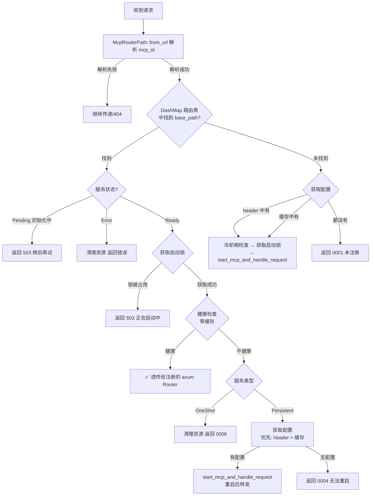

# MCP 协议与动态路由

mcp-proxy 的核心是"动态路由"：在运行时通过 HTTP API 注册新的 MCP 服务，并把后续对应路径的所有请求自动转发给该服务。整个流程由三个组件串联：`add_route_handler`（注册）→ `DynamicRouterService`（拦截与路由）→ `integrate_server_with_axum`（启动后端）。

## 1. 路径命名规则

`McpRouterPath::new(mcp_id, client_protocol)` 按客户端协议生成固定格式的路径：

| 客户端协议 | 暴露路径 | 说明 |
|-----------|---------|------|
| SSE       | `/mcp/sse/{mcp_id}/sse` | 客户端建立 SSE 长连接 |
| SSE       | `/mcp/sse/{mcp_id}/message` | 客户端 POST 发送消息 |
| Streamable | `/mcp/stream/{mcp_id}/mcp` | Streamable HTTP 统一端点 |

`base_path` = `/mcp/sse/{mcp_id}` 或 `/mcp/stream/{mcp_id}`，用于路由表的 key。

## 2. 注册流程（POST /mcp/sse/add）

```
POST /mcp/sse/add
Body: { mcp_json_config: "...", mcp_type: "Persistent"/"OneShot" }
```

```
add_route_handler
├── UUID::now_v7() → mcp_id（去除连字符）
├── McpRouterPath::from_uri_prefix_protocol() → 确定客户端协议
├── McpServerConfig::try_from(mcp_json_config) → 解析后端配置
├── integrate_server_with_axum() → 启动后端、注册路由（见下节）
└── 返回 { mcp_id, sse_path, message_path, mcp_type }
     或 { mcp_id, stream_path, mcp_type }
```

`nuwax-backend` 的 `McpRpcService` 拿到返回的路径后，把它存到插件配置里，后续每次调用 MCP 工具时带上这个路径（以及 `McpConfig` JSON 放在请求 extension 里）。

## 3. DynamicRouterService — Tower Service 实现

`DynamicRouterService` 实现了 Tower `Service<Request<Body>>`，作为 axum 的 fallback 拦截所有未匹配的路径。

### 请求处理决策树



### 健康检查缓存机制

每次实际健康检查结果会写入 `GLOBAL_RESTART_TRACKER` 的缓存，TTL 较短。下次同路径请求进来先读缓存，命中则跳过实际探测，减少对后端进程的压力。

### 配置优先级（三档）

| 优先级 | 来源 | 说明 |
|-------|------|------|
| 1 | 请求 Extension（`McpConfig`） | nuwax-backend 每次调用都带上，最新 |
| 2 | ProxyManager 配置缓存 | integrate_server_with_axum 时写入 |
| 3 | 找不到 | 返回错误，无法重启 |

## 4. integrate_server_with_axum — 启动核心

```
integrate_server_with_axum(mcp_server_config, mcp_router_path, full_mcp_config)
├── 确定 backend_protocol
│   ├── McpServerConfig::Command → Stdio
│   └── McpServerConfig::Url → 读 type 字段 / 自动检测
├── 根据 client_protocol × backend_protocol 构建服务
│   ├── SSE 客户端 + Streamable 后端 → connect_stream_backend() → BackendBridge
│   ├── SSE 客户端 + 其他后端 → build_sse_backend_config() → SseServerBuilder
│   └── Streamable 客户端 → build_stream_backend_config() → StreamServerBuilder
├── .build().await → (router, CancellationToken, McpHandler)
├── McpServiceStatus::new(..., status=Ready)
├── proxy_manager.add_mcp_service_status_and_proxy()
├── proxy_manager.register_mcp_config()          ← 写入配置缓存
├── DynamicRouterService::register_route()        ← 写入路由 DashMap
└── GLOBAL_RESTART_TRACKER.record_restart()
```

### OneShot vs Persistent 在启动时的差异

| 参数 | Persistent | OneShot |
|------|-----------|---------|
| `keep_alive` 间隔 | 15 秒 | 5 秒（防后端空闲退出）|
| `stateful` | true（完整 MCP 握手） | false（跳过初始化，更快）|

## 5. start_mcp_and_handle_request

Persistent 类型不健康时，路由服务会调用此函数：先 `mcp_start_task()` 重启，再把原始请求透传给新的 Router。整个过程对调用方透明——调用方只感受到一次稍慢的响应，不需要重试。

## 6. 完整调用链一览

```
nuwax-backend McpRpcService
    → POST /mcp/sse/add             # 1. 注册（首次）
    → GET  /mcp/sse/{id}/sse        # 2. 建立 SSE 连接
    → POST /mcp/sse/{id}/message    # 3. 发送 MCP 消息（tool call）

DynamicRouterService（每次请求都经过）
    → 解析 mcp_id
    → 状态 / 启动锁 / 健康检查
    → 透传 or 重启后透传
    → mcp-sse-proxy / mcp-streamable-proxy 处理协议转换
    → 后端：stdio 子进程 / 远端 SSE / 远端 Streamable
```

## 一句话总结

`DynamicRouterService` 是 mcp-proxy 的路由核心，通过 Tower Service + DashMap 实现"按 mcp_id 动态分发"，并内置状态检查、启动锁、健康缓存、Persistent 自动重启四重保护机制，让 nuwax-backend 无需感知 MCP 服务的生命周期细节。
