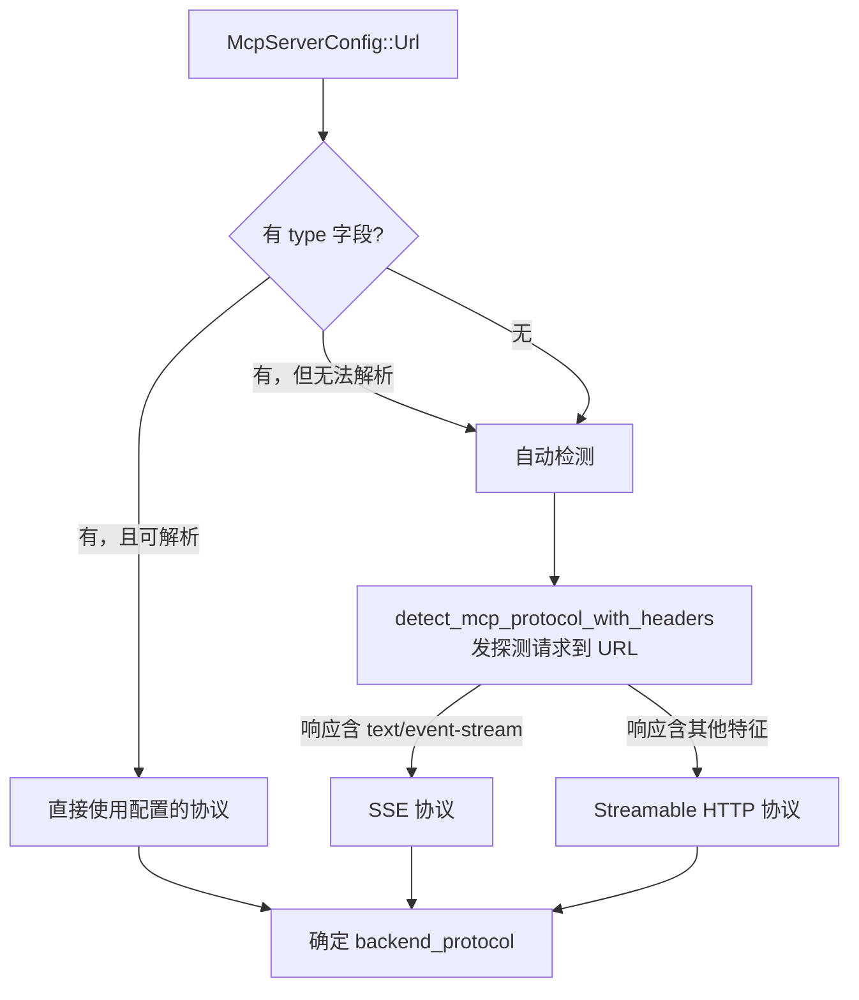
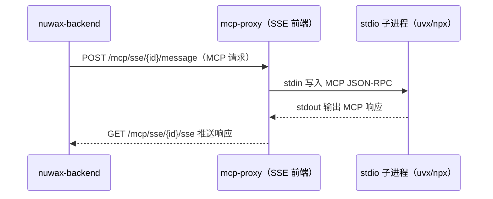
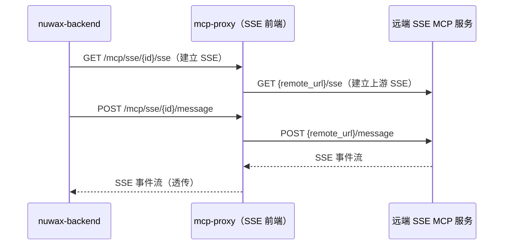
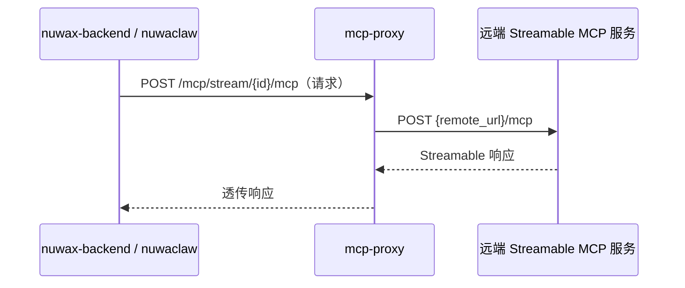

# 三种后端协议适配

mcp-proxy 支持把三种形态的 MCP 服务包成统一的 HTTP 接口。"后端协议"指 mcp-proxy 与实际 MCP 服务进程之间的通信方式；"客户端协议"指 nuwax-backend / nuwaclaw 访问 mcp-proxy 的方式（始终是 SSE 或 Streamable HTTP）。

## 1. 协议矩阵

| 后端配置字段 | 后端协议 | 说明 |
|------------|---------|------|
| `command` | **stdio** | 启动本地子进程（`uvx`、`npx`、Python 脚本等），通过 stdin/stdout 交换 MCP 消息 |
| `url` + `type: sse` 或自动检测为 SSE | **SSE** | 转发给远端 SSE MCP 服务，relay 模式 |
| `url` + `type: stream` 或自动检测为 Streamable | **Streamable HTTP** | 转发给远端 Streamable HTTP MCP 服务 |

客户端协议由注册 API 路径决定：`POST /mcp/sse/add` → SSE 对外，`POST /mcp/stream/add` → Streamable HTTP 对外。

## 2. McpServerConfig 解析

`mcp_json_config` 是一段标准 MCP JSON，形如：

```json
// Command 形式
{
  "mcpServers": {
    "my-tool": {
      "command": "uvx",
      "args": ["some-mcp-tool"],
      "env": { "API_KEY": "xxx" }
    }
  }
}

// URL 形式
{
  "mcpServers": {
    "remote-tool": {
      "url": "https://example.com/mcp",
      "type": "sse",                    // 可选，不填则自动检测
      "authToken": "Bearer xxx"         // 可选
    }
  }
}
```

`McpServerConfig::try_from(json_str)` 解析后得到 `McpServerConfig::Command(McpServerCommandConfig)` 或 `McpServerConfig::Url(McpServerUrlConfig)`。

## 3. 后端协议检测（URL 形式）



探测请求会带上 `headers` 和 `auth_token` 字段（自动补 `Bearer ` 前缀）。

## 4. stdio 协议（Command 形式）



- `SseServerBuilder` 内部启动子进程（`Command::new(cmd).args(args).envs(env).spawn()`）
- `cancellation_token` 取消时终止子进程
- 子进程 stdin/stdout 通过 Tokio 异步 pipe 连接

## 5. SSE 协议（URL relay 形式）



- 由 `mcp-sse-proxy` crate（基于 rmcp 0.10）实现
- `SseBackendConfig::SseBackend { url, headers, auth_token }` 携带远端认证信息

## 6. Streamable HTTP 协议（URL relay 形式）



- 由 `mcp-streamable-proxy` crate（基于 rmcp 0.12）实现
- Streamable HTTP 是 MCP 协议的较新规范，单端点双向流

## 7. 跨协议桥接（SSE 客户端 + Streamable 后端）

特殊场景：调用方用 SSE 协议，但后端是 Streamable HTTP。

```
connect_stream_backend() → BackendBridge（mcp-streamable-proxy 句柄）
    ↓
SseServerBuilder::new(SseBackendConfig::BackendBridge(bridge))
```

`mcp-sse-proxy` 通过 `BackendBridge` 抽象层调用 `mcp-streamable-proxy`，实现协议解耦——两个 crate 互不直接依赖。

## 8. 构建参数速查

| 参数 | SSE 服务器 | Streamable 服务器 |
|-----|-----------|-----------------|
| `keep_alive` | 5s（OneShot）/ 15s（Persistent）| 不适用 |
| `stateful` | OneShot=false，Persistent=true | 固定 false |
| `sse_path` | `/mcp/sse/{id}/sse` | 不适用 |
| `post_path` | `/mcp/sse/{id}/message` | 不适用 |
| 统一端点 | 不适用 | `/mcp/stream/{id}/mcp` |

`stateful=true` 时服务器会在连接建立时执行完整 MCP initialize 握手；`stateful=false` 跳过握手直接处理请求（OneShot 场景用，加快响应）。

## 一句话总结

mcp-proxy 通过"后端协议自动检测 + 两个独立协议 crate（rmcp 0.10 / 0.12）+ BackendBridge 跨协议桥"，把 stdio、SSE、Streamable HTTP 三种形态的 MCP 服务统一包装成 nuwax-backend 能直接 HTTP 访问的接口，调用方无需感知后端细节。
