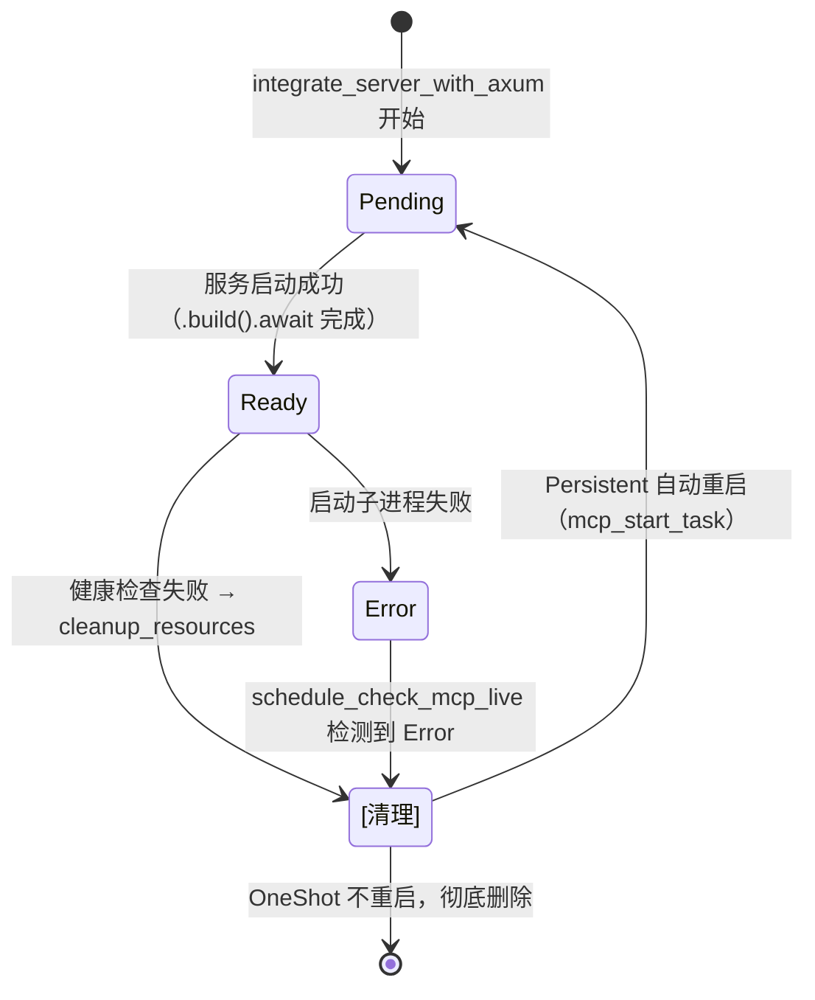
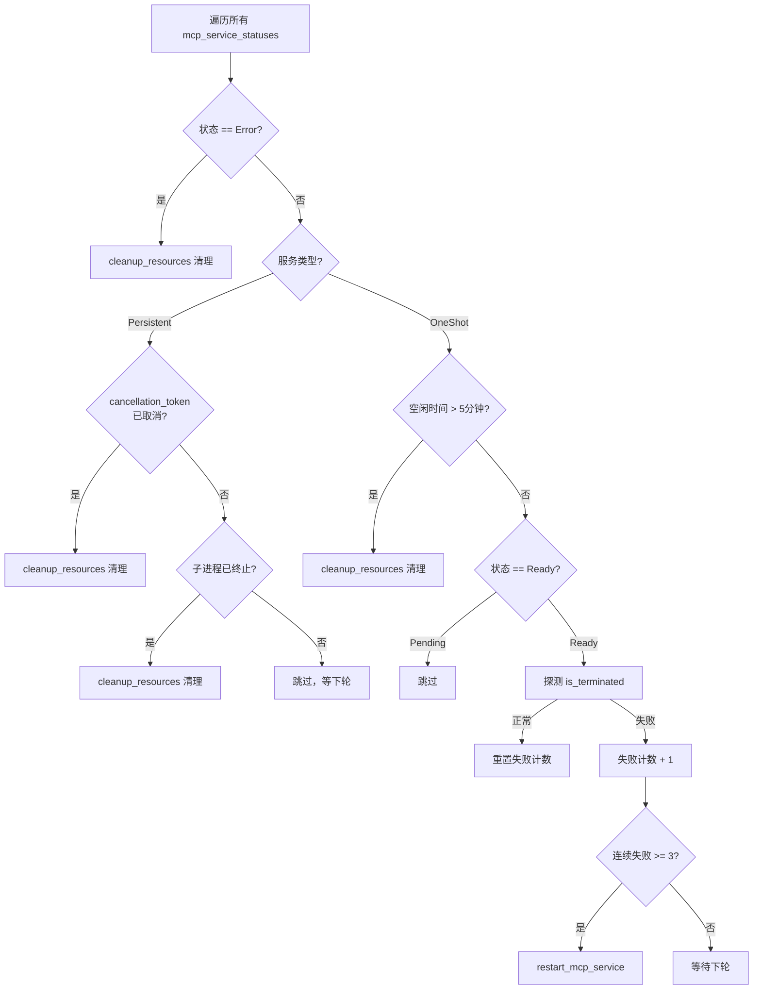
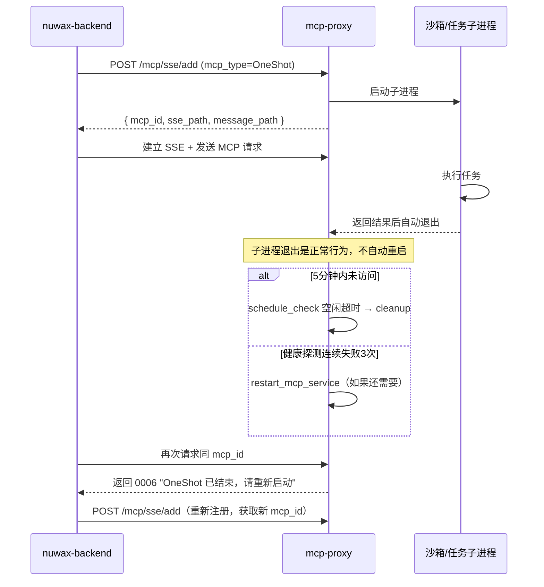

# 服务类型与生命周期

mcp-proxy 把 MCP 服务分为两种类型，生命周期管理策略完全不同。理解这两种类型是看懂 `DynamicRouterService` 和 `schedule_check_mcp_live` 调度逻辑的前提。

## 1. 两种类型对比

| 维度 | Persistent（持久运行）| OneShot（一次性）|
|------|---------------------|----------------|
| 典型场景 | 工具类 MCP（文件系统、数据库等长期在线服务）| 代码沙箱、任务执行类（执行一次即结束）|
| 进程生命 | 常驻，异常时自动重启 | 执行完自动退出，正常行为 |
| 不健康时 | DynamicRouter 自动重启后透传 | 返回 0006 错误，要求调用方显式重启 |
| 空闲超时 | 无（常驻）| 5 分钟无活动后清理 |
| 定时检查行为 | 检测子进程是否存活/被取消 | 检测空闲超时 + 健康探测 |
| stateful | true（完整 MCP 握手）| false（跳过握手）|
| keep_alive | 15 秒 | 5 秒（防后端空闲退出）|

## 2. 服务状态机

每个 MCP 服务在 `ProxyManager`（DashMap）里有一个 `McpServiceStatus`，其 `check_mcp_status_response_status` 字段是状态机：



> `integrate_server_with_axum` 成功后直接写入 `Ready` 状态（见 `McpServiceStatus::new(..., CheckMcpStatusResponseStatus::Ready)`），没有真正的 Pending 过渡——Pending 状态更多是保留给未来异步初始化场景使用。

## 3. 定时健康检查（schedule_check_mcp_live）

每 60 秒运行一次，遍历所有已注册服务：



### 重启冷却期

`GLOBAL_RESTART_TRACKER.can_restart(mcp_id)` 检查是否在 **30 秒冷却期**内。重启过于频繁时直接跳过，避免进入死循环。冷却期到期后 `record_restart()` 更新时间戳。

```rust
// 重启条件：全部满足
1. 连续健康探测失败 >= 3 次（MAX_PROBE_FAILURES）
2. 不在 30 秒冷却期内（can_restart）
3. 能获取到 mcp_config（from status / from cache）
```

## 4. cleanup_resources vs cleanup_resources_for_restart

| 函数 | 行为 |
|------|------|
| `cleanup_resources` | 完全清理：取消 token、移除状态、移除路由、移除配置缓存 |
| `cleanup_resources_for_restart` | 清理旧进程：取消 token、移除状态、移除路由；**保留**配置缓存 |

重启时用 `_for_restart` 版本，保留配置以便 `mcp_start_task` 重新注册路由。

## 5. 请求触发的 Persistent 重启

不只定时任务会重启——`DynamicRouterService` 在请求处理中检测到不健康时也会立即重启（on-demand 重启）：

```
请求到来
 → 健康检查失败
 → 服务类型 == Persistent
 → 获取配置（Extension header > cache）
 → start_mcp_and_handle_request()
     → mcp_start_task() 重启
     → 原始请求透传给新 Router
     → 调用方感受到一次慢响应，无需重试
```

## 6. OneShot 生命周期全程



## 7. 关键常量速查

| 常量 | 值 | 作用 |
|------|----|------|
| `ONESHOT_TIMEOUT` | 5 分钟 | OneShot 空闲超时后清理 |
| `MAX_PROBE_FAILURES` | 3 次 | OneShot 连续失败阈值 |
| 重启冷却期 | 30 秒 | 防止 Persistent 无限重启 |
| 定时任务间隔 | 60 秒 | `start_schedule_task` tokio::interval |
| SSE keep_alive（OneShot）| 5 秒 | 防后端进程因 stdin 无数据而退出 |
| SSE keep_alive（Persistent）| 15 秒 | 标准心跳 |

## 一句话总结

Persistent 服务"常驻 + 出问题自动重启"，OneShot 服务"用完即走 + 5 分钟后自动清理"，两者的切换策略都体现在 `DynamicRouterService` 的请求处理和 `schedule_check_mcp_live` 的定时巡检中，由 `GLOBAL_RESTART_TRACKER` 统一管理重启冷却和健康状态缓存。
