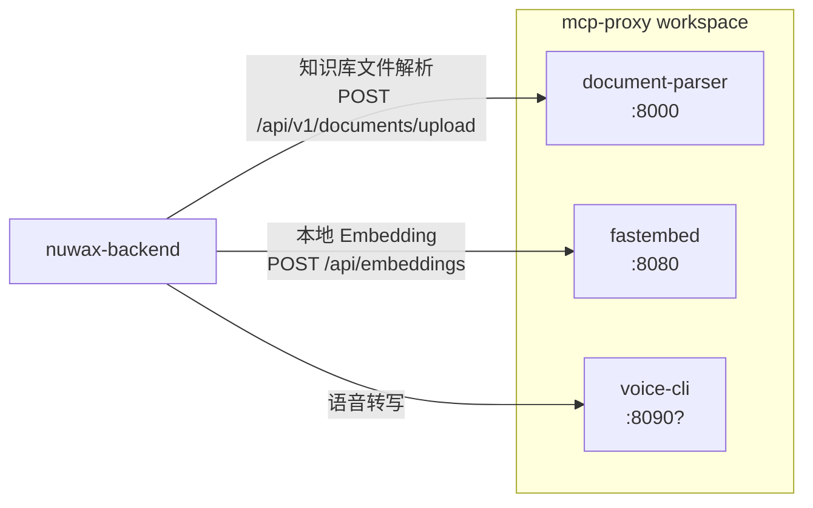

# 附属工具服务

除核心 MCP 代理功能外，mcp-proxy workspace 还捆绑了三个独立的 HTTP 微服务，分别承担文档解析、本地向量化、语音转写职责，均可单独部署，由 `nuwax-backend` 按需调用。

## 1. document-parser — 多格式文档解析

### 定位

把 PDF、Word、Excel、PowerPoint 等富文本文档转换为 **Markdown + 结构化 JSON**，供知识库向量化管道消费。

### 技术栈

| 层 | 技术 |
|----|------|
| HTTP 服务 | Rust + Axum |
| PDF 解析 | MinerU（Python，通过 venv 调用）|
| Office 解析 | MarkItDown（Python）|
| 依赖管理 | uv（虚拟环境 `./venv/`）|
| 异步任务 | 内置 Task 队列（Rust 侧管理）|

### HTTP 接口

```
GET  /health
GET  /ready

# 文档操作（同步或触发异步任务）
POST /api/v1/documents/upload                     # 上传文件 → 解析
POST /api/v1/documents/download-from-url          # 从 URL 下载 → 解析
POST /api/v1/documents/generate-structured        # 生成结构化文档
POST /api/v1/documents/parse-markdown-sections    # 解析 Markdown 章节
GET  /api/v1/documents/formats                    # 支持的格式列表
GET  /api/v1/documents/parser/stats               # 解析器统计
GET  /api/v1/documents/parser/health              # 解析器健康

# 异步任务管理
POST /api/v1/tasks                                # 创建任务
GET  /api/v1/tasks                                # 列出任务
GET  /api/v1/tasks/{task_id}                      # 查询任务状态
GET  /api/v1/tasks/{task_id}/result               # 获取结果
GET  /api/v1/tasks/{task_id}/toc                  # 获取目录树
POST /api/v1/tasks/{task_id}/cancel               # 取消任务
POST /api/v1/tasks/{task_id}/retry                # 重试任务

# OSS 集成（可选）
POST /api/v1/oss/private/...                      # 私有 OSS 操作
```

### 上传参数

```json
// multipart/form-data，Query 参数：
{
  "enable_toc": true,       // 是否生成目录，默认 false
  "max_toc_depth": 3,       // 目录最大深度，默认 6
  "bucket_dir": "projectA"  // OSS 子目录（可选）
}
```

### 初始化流程

首次部署需初始化 Python 环境：

```bash
document-parser uv-init    # 创建 ./venv/ 并安装 MinerU + MarkItDown
document-parser check      # 检查环境状态
document-parser server     # 启动服务（默认端口 8000）
```

### 与 nuwax-backend 的关系

`nuwax-backend` 知识库模块的 `DocumentParserRpcService` 在用户上传知识库文件时调用 `POST /api/v1/documents/upload`，拿到 Markdown 文本后再做分块向量化写入 Milvus / Elasticsearch。

---

## 2. fastembed — 本地文本向量化

### 定位

提供**本地轻量级文本 Embedding**，作为调用外部 Embedding API 的替代方案。适合对延迟敏感或需要离线运行的场景。

### 技术栈

| 层 | 技术 |
|----|------|
| HTTP 服务 | Rust + Axum |
| Embedding 引擎 | FastEmbed（Rust 原生，ONNX 推理）|
| 默认模型 | BGELargeZHV15（中文优化）|
| 序列最大长度 | 512 token |

### HTTP 接口

```
GET  /health
GET  /api/models/available    # 列出已下载模型
POST /api/embeddings          # 文本向量化
```

### 向量化请求/响应

```json
// 请求
POST /api/embeddings
{
  "model": "BGELargeZHV15",      // 可选，默认用配置中的模型
  "texts": ["query: 搜索词", "passage: 文档段落"],
  "batch_size": 256              // 可选
}

// 响应
{
  "model": { "name": "BGELargeZHV15", "dim": 1024 },
  "count": 2,
  "embeddings": [[0.001, -0.004, ...], [0.002, 0.003, ...]],
  "elapsed_ms": 12
}
```

### 启动

```bash
fastembed server [--port 8080]      # 启动服务
fastembed models download           # 预下载模型
fastembed models list               # 列出本地模型
```

启动时自动 warm-up 默认模型，第一次推理无冷启动延迟。

### 配置文件

```yaml
# config.yml
server:
  port: 8080
fastembed:
  default_model: BGELargeZHV15
  max_length: 512
```

---

## 3. voice-cli — 语音转写（ASR）

### 定位

基于 **Whisper** 的语音转文字服务，支持多语言，供 nuwax 平台的语音输入功能使用。

### 技术栈

| 层 | 技术 |
|----|------|
| HTTP 服务 | Rust + Axum |
| ASR 引擎 | Whisper（通过 Python venv 或本地库）|
| 子命令 | server / tts / model |
| 配置管理 | config-rs（层级配置：文件 + 环境变量 + CLI）|

### 主要子命令

```bash
voice-cli server start      # 启动 HTTP 服务
voice-cli server init       # 初始化配置
voice-cli tts ...           # 文字转语音（TTS，可选功能）
voice-cli model ...         # 模型管理
```

### 配置层级

config-rs 合并以下来源（优先级从低到高）：

1. 默认值（代码内嵌）
2. `config.yml`（文件）
3. 环境变量
4. CLI 参数（最高优先级）

---

## 4. 三服务与平台的关系一览



三个服务**独立进程、独立端口**，不依赖 mcp-proxy 主进程，可单独部署。它们共享 workspace 的 `oss-client` crate（阿里云 OSS 客户端）用于文件存取。

## 一句话总结

`document-parser`、`fastembed`、`voice-cli` 是 mcp-proxy workspace 里三个轻量 HTTP 微服务，分别解决知识库文档格式转换、本地轻量 Embedding、语音 ASR 三个基础能力需求，`nuwax-backend` 通过 HTTP RPC 按需调用，无需集成到主进程。
