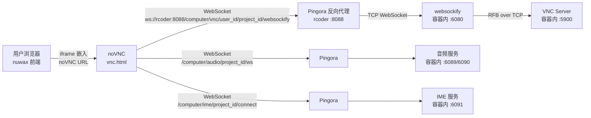

# noVNC 总览

`noVNC` 是上游开源 HTML5 VNC 客户端库（MPL 2.0），Nuwax 平台对其进行了定制扩展，在容器远程桌面场景下增加了**音频流**、**输入法透传**、**心跳保活**三项能力，并通过 rcoder 的 Pingora 代理嵌入平台前端。

一句话定位：`noVNC` = **nuwax 平台 Computer Agent 的远程桌面前端**，通过 `<iframe>` 或直接访问嵌入 nuwax 前端，让用户看到并操控容器内的图形桌面。

## 1. 与平台的关系



## 2. 访问 URL 格式

前端拿到 rcoder 返回的 VNC 地址后构造如下 URL：

```
http://{rcoder_host}:{proxy_port}/vnc.html
  ?host={rcoder_host}
  &port={proxy_port}
  &path=computer/vnc/{user_id}/{project_id}/websockify
  &encrypt=0
  &resize=scale
  &autoconnect=true
  &project_id={project_id}
  &base_url=http://{rcoder_host}:{proxy_port}
```

关键参数：

| URL 参数 | 说明 |
|---------|------|
| `host` / `port` | Pingora 代理地址（不是容器地址）|
| `path` | WebSocket 路径，Pingora 用此路径识别转发目标 |
| `project_id` | 用于构建音频/IME WebSocket URL |
| `base_url` | rcoder Pingora 基础地址，音频/IME 使用 |
| `autoconnect` | `true` 则无需点按钮自动连接 |
| `resize` | `scale`（缩放适配窗口）/ `remote`（远端调整分辨率）|

`defaults.json` 存储默认参数，URL 参数优先级更高。

## 3. 平台扩展的三项能力

### 3.1 心跳保活（Keepalive）

VNC 连接建立后启动 60 秒周期定时器，发送一条 `FramebufferUpdateRequest`（1×1 像素增量请求）：

```js
// 每 60s 发送一次
UI.rfb._sock.sQpush8(3);  // message type: FramebufferUpdateRequest
UI.rfb._sock.sQpush8(1);  // incremental=1
UI.rfb._sock.sQpush16(0); // x=0, y=0
UI.rfb._sock.sQpush16(1); // w=1, h=1
UI.rfb._sock.flush();
```

目的：防止 Pingora / 容器网络因空闲断开 WebSocket 连接。

### 3.2 音频流（audio.js）

VNC 连接成功且有 `projectId` 时自动建立音频 WebSocket：

```
ws://{base_url}/computer/audio/{project_id}/ws
```

- 接收容器内 **Opus 编码**音频数据
- 用 **Web Audio API** 解码并通过 `GainNode` 播放
- 支持音量调节、最多 3 次自动重连
- 通过工具栏音频按钮开关

### 3.3 输入法透传（ime.js）

建立 IME WebSocket：

```
ws://{base_url}/computer/ime/{project_id}/connect
```

- 监听浏览器 `compositionend` 事件（中文/日文等输入法确认输入）
- 把确认的文本通过 WebSocket 发送到容器内 IME 服务（:6091）
- 容器内服务再注入到 X11 输入流

**普通键盘输入**仍走原 RFB 协议，IME 透传只处理输入法合成结果，两者不冲突。

## 4. 参数初始化逻辑（ui.js）

`ui.js` 在启动时从多个来源提取 `userId` / `projectId` / `baseUrl`：

```
优先级（从高到低）：
1. URL 参数 user_id / project_id / base_url
2. 从 VNC path 提取（computer/vnc/{user_id}/{project_id}/websockify）
3. 从 host 字段解析
```

提取完成后判断是否需要自动启动音频/IME 连接（`projectId` 和 `baseUrl` 都存在时自动启动）。

## 5. 入口文件

| 文件 | 说明 |
|------|------|
| `vnc.html` | 完整 UI 版本，含工具栏、全屏、剪贴板、音频、IME 按钮 |
| `vnc_lite.html` | 精简版，适合嵌入 iframe |
| `app/ui.js` | 主 UI 逻辑，平台扩展主要在此 |
| `app/audio.js` | 音频 WebSocket 客户端 |
| `app/ime.js` | IME 透传 WebSocket 客户端 |
| `core/rfb.js` | 核心 RFB/VNC 协议实现（上游，基本未改）|

## 6. 开发调试

```bash
pnpm dev      # 启动本地静态服务 :8080

# 连接内网容器
http://localhost:8080/vnc.html?host=192.168.1.34&port=8088&path=computer/vnc/user_123/666/websockify&autoconnect=true&resize=scale
```

`debugMode`（URL 参数 `debug=1`）：构建音频/IME URL 时包含 `userId`，方便直连内网调试。

## 7. 与 rcoder 的协作边界

| 职责 | 由谁负责 |
|------|---------|
| WebSocket → TCP VNC 转换 | 容器内 `websockify`（:6080）|
| WebSocket 路径路由 | rcoder Pingora（:8088）|
| VNC 协议处理 | noVNC `core/rfb.js` |
| 音频编码（Opus）| 容器内音频服务（:6089/6090）|
| 音频解码播放 | noVNC `app/audio.js`（Web Audio API）|
| 输入法注入 X11 | 容器内 IME 服务（:6091）|
| 输入法事件捕获 | noVNC `app/ime.js`（compositionend）|

## 一句话总结

Nuwax 平台的 noVNC 在上游基础上扩展了音频流（Opus + Web Audio API）、输入法透传（IME WebSocket + compositionend）、心跳保活（RFB FramebufferUpdateRequest）三项能力，通过 rcoder Pingora 代理连接容器内的 VNC/音频/IME 服务，实现完整的 AI 桌面操控体验。
