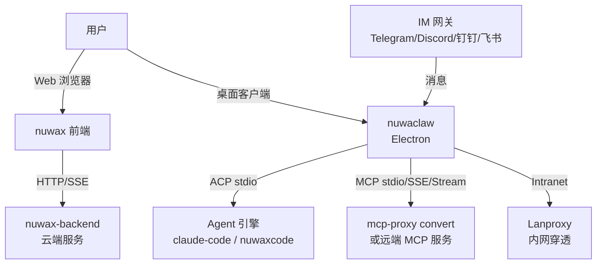

# nuwaclaw 总览

`nuwaclaw`（NuwaClaw）是 Nuwax 平台的**本地桌面客户端**，基于 Electron + React 18 + Rust 构建。它在用户本地机器上运行，可以调用本地 AI Agent 引擎（Claude Code、nuwaxcode 等），管理 MCP 工具，并通过 IM 网关（Telegram/Discord/钉钉/飞书）接收外部指令。

一句话定位：`nuwaclaw` = **多引擎 AI Agent 桌面客户端**，是 Nuwax 平台的本地执行入口，补充了 Web 平台（`nuwax`）无法覆盖的本��文件系统、本地工具、IM 控制等场景。

## 1. 与平台其他组件的关系



## 2. 整体架构

```
Electron 主进程
├── 引擎管理（engineManager）    ← 管理 Agent 子进程生命周期
├── 统一 Agent（unifiedAgent）  ← ACP 协议通信，MCP 注入
├── IPC 处理器（40+ 个）        ← 主进程 ↔ 渲染进程桥接
├── 服务层（services/）
│   ├── shellEnv.ts             ← 跨平台 Shell 环境
│   ├── workspaceManager.ts     ← 工作目录管理
│   ├── mcp.ts                  ← MCP 服务器管理
│   ├── fileServer.ts           ← 本地文件服务
│   ├── lanproxy.ts             ← 内网穿透
│   ├── skills.ts               ← 技能同步
│   ├── im.ts                   ← IM 网关集成
│   ├── scheduler.ts            ← 任务调度
│   ├── dependencies.ts         ← 依赖管理（npm/uv/deno）
│   └── setup.ts                ← 初始化向导与鉴权
└── SQLite                      ← 本地持久化

Electron 渲染进程
└── React 18 + Redux Toolkit    ← UI，仅通过 IPC 与主进程通信
```

## 3. 多引擎支持（ACP 协议）

nuwaclaw 通过 **ACP（Agent Client Protocol）** 与 Agent 引擎通信，通信方式为 stdio NDJSON 流。支持所有实现 ACP 协议的 Agent：

| 引擎 | 说明 |
|------|------|
| `claude-code` | Anthropic 官方 CLI，推荐 |
| `nuwaxcode` | 基于 OpenCode 的 Nuwax 定制版 |
| `codex-cli` | OpenAI Codex |
| `gemini-cli` | Google Gemini |
| `goose` | Block 开源 Agent |
| 更多... | 任何 ACP 兼容 Agent |

`engineManager.ts` 管理引擎子进程的启动、停止、切换；`unifiedAgent.ts` 封装 ACP 协议通信并注入 MCP 服务器配置。

## 4. MCP 工具管理

`mcp.ts` 管理本地 MCP 服务器，支持与 mcp-proxy 相同的三种协议：

```json
{
  "mcpServers": {
    "filesystem": {
      "command": "npx",
      "args": ["-y", "@modelcontextprotocol/server-filesystem", "/path"]
    },
    "remote-tool": {
      "url": "https://example.com/mcp/sse"
    }
  }
}
```

- **stdio 类型**：nuwaclaw 直接 `spawn()` 子进程（或通过 `mcp-proxy convert` CLI 包成 SSE）
- **SSE/Streamable 类型**：直接 HTTP 连接远端 MCP 服务
- **`nuwax-mcp-stdio-proxy` crate**：MCP 协议聚合代理，Rust 实现，用于多路复用本地 stdio MCP 服务

## 5. 本地依赖管理（dependencies.ts）

nuwaclaw 负责在用户机器上安装和管理运行时依赖：

- Node.js / npm（Agent 引擎依赖）
- `uv`（Python 运行时，供代码执行和 Python MCP 工具使用）
- Deno（JS/TS 代码执行）
- 引擎本身（从 npm/GitHub 拉取 `claude-code-acp-ts` 等）

`setup.ts` 提供三步初始化向导，引导用户完成环境配置和鉴权（Anthropic API Key 等）。

## 6. IM 集成（im.ts）

支持通过即时通讯软件控制 Agent：

| IM 平台 | 说明 |
|--------|------|
| Telegram Bot | 发送消息触发 Agent 任务 |
| Discord Bot | 同上 |
| 钉钉（DingTalk）| 企业场景 |
| 飞书（Feishu）| 企业场景 |

用户在 IM 中 `@机器人 帮我做XX` → nuwaclaw 收到消息 → 传给 Agent 引擎 → 返回结果到 IM。

## 7. 内网穿透（lanproxy.ts）

Lanproxy 把本地 nuwaclaw 服务暴露到公网，用于：
- IM 机器人 Webhook 接收（微信等需要公网地址）
- 远程访问本地 MCP 服务

## 8. 与 nuwax-backend / mcp-proxy 的关系

nuwaclaw 是**本地自治**的，不强依赖 nuwax-backend：

- Agent 引擎（claude-code 等）直接调用 Anthropic API，无需经过 nuwax-backend
- MCP 工具通过本地 stdio 或直连远端 SSE，无需 mcp-proxy 主服务
- 但 nuwaclaw 可以将 mcp-proxy 的 `convert` CLI 用于把本地 stdio 工具转成 SSE 供 rcoder 使用

## 9. 技术栈

| 技术 | 用途 |
|------|------|
| Electron | 跨平台桌面壳 |
| React 18 + Redux Toolkit | 渲染进程 UI |
| Rust（Tokio + Axum）| 核心逻辑 crate（nuwax-agent-core）|
| SQLite | 本地持久化 |
| ACP SDK | Agent 引擎通信 |
| rmcp（nuwax-mcp-stdio-proxy）| MCP 协议聚合代理 |
| GPUI（实验）| 高性能原生 UI 备选方案 |

## 10. 目录结构速查

```
nuwaclaw/crates/
├── agent-electron-client/   主客户端（Electron + React）
│   └── src/main/services/   核心服务（engineManager、unifiedAgent、mcp 等）
├── nuwax-mcp-stdio-proxy/   MCP stdio 聚合代理（Rust/TS）
├── agent-gpui-client/       GPUI 实验性客户端
├── agent-server-admin/      管理端 API
├── agent-protocol/          通信协议定义
├── system-permissions/      系统权限管理
└── nuwax-agent-core/        核心逻辑（Rust）
```

## 一句话总结

`nuwaclaw` 是 Nuwax 平台的本地桌面 AI Agent 执行环境，通过 ACP 协议统一接入多种 Agent 引擎，管理本地 MCP 工具，并集成 IM 网关实现 24 小时自动化任务，是面向开发者和高级用户的本地 AI 生产力平台。
