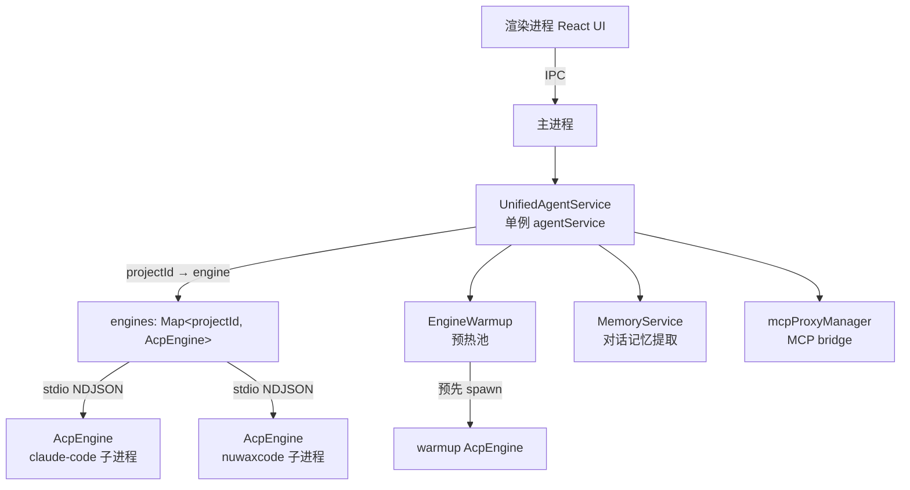

# nuwaclaw：引擎管理与 ACP 通信

nuwaclaw 的核心是 `UnifiedAgentService`（`unifiedAgent.ts`）——一个事件总线 + 引擎代理，把每个 `projectId` 路由到对应的 `AcpEngine` 子进程，并管理引擎的懒创建、warmup 预热、配置变更检测、记忆提取。

## 1. 整体架构



**懒模式**：`init()` 只设置 `baseConfig`，不立即 spawn 子进程。第一次 `ensureEngineForRequest()` 才为 `projectId` 创建 `AcpEngine`。最多同时维持 100 个引擎（`MAX_ENGINES`），超出时驱逐最旧的空闲引擎。

## 2. 两种引擎类型

| 引擎 | 启动参数 | 说明 |
|------|---------|------|
| `claude-code` | `node claude-code --sACP` | Anthropic 官方 Claude CLI，ACP 模式 |
| `nuwaxcode` | `node nuwaxcode serve --stdio` | Nuwax 定制 Agent 引擎 |

`engineManager.ts` 负责查找引擎二进制路径：

```
优先级（高→低）：
1. 应用打包的二进制（nuwaxcode bundled bin）
2. ~/.nuwaclaw/engines/{engine}/node_modules/.bin/
3. 系统 PATH 全局安装
```

`installEngine()` 通过 `npm install` 把引擎安装到 `~/.nuwaclaw/engines/{engine}/`，不污染用户系统 node_modules。

## 3. 环境隔离（createIsolatedEnvironment）

每次 `startEngine()` 为这一次运行生成独立的 `runId` 和临时 HOME：

```
tmpdir/nuwaclaw-{runId}/
├── .claude/
│   └── settings.json   ← 注入 MCP 服务器配置
└── .nuwaxcode/
```

关键：
- `HOME` / `USERPROFILE` 指向隔离目录，引擎读不到用户真实的 `~/.claude/settings.json`
- 所有 `CLAUDE_*` / `ANTHROPIC_*` 系统环境变量先清洗，再由 nuwaclaw 显式注入（防止用户 `.zshrc` 里的配置泄漏）
- `CLAUDE_CONFIG_DIR` / `NUWAXCODE_CONFIG_DIR` 指向隔离目录内的子目录

## 4. getOrCreateEngine 流程

```
getOrCreateEngine(projectId, effectiveConfig)
  │
  ├── engines.get(projectId)
  │     存在 + isReady → 直接返回（复用）
  │     存在 + 已死   → destroy + 从 Map 删除
  │
  ├── nuwaxcode 请求？
  │     尝试 warmup.tryReuse()  ← 命中则返回预热引擎，立即补仓
  │
  ├── 内存就绪检查（memoryService.ensureMemoryReadyForSession）
  │
  ├── engines.size >= 100？→ evictIdleEngine()
  │
  ├── new AcpEngine(engineType)
  ├── engine.init(effectiveConfig)
  └── engines.set(projectId, engine)
```

**nuwaxcode warmup 池**：始终在后台维持一个预热的 nuwaxcode 进程。被消费（命中 `tryReuse`）后立即 `ensureNuwaxWarmup()` 补仓，保证连续的新 conversation 都能命中预热、跳过 ~2s 冷启动。

## 5. ensureEngineForRequest：请求入口

这是每次 AI 对话请求的实际入口，逻辑最重：

```
ensureEngineForRequest(request)
  │
  ├── 解析 engineKey = session_id || project_id || "default"
  │
  ├── 解析 context_servers（MCP 配置）：
  │     mcp-proxy bridge 入口 → extractRealMcpServers()
  │     uvx/npx 命令 → resolveUvCommand()
  │
  ├── 快速路径：已有就绪引擎 + 无 MCP/模型变更 → 直接返回
  │
  ├── detectConfigChange()：检测六类变更
  │     引擎类型切换 / env 变更 / 模型变更 / API Key / baseUrl / MCP
  │     MCP 比较用原始格式快照（engineRawMcpServers），避免与 proxy 包装格式跨格式误判
  │
  ├── MCP 有变更？
  │     syncMcpConfigToProxyAndReload(enabledMcpServers)   ← 同步到本地 mcp-proxy bridge
  │     并行 memoryService.ensureMemoryReadyForSession()
  │
  ├── 合并 MCP 优先级：
  │     本地配置（SQLite saved）< ACP context_servers（request 下发）
  │
  ├── bridge 入口（command=mcp-proxy）→ extractRealMcpServers + ensureBridgeStarted
  │
  └── getOrCreateEngine(engineKey, effectiveConfig)
```

**配置变更重建规则**：检测到变更时，若引擎当前有活跃 prompt（`getActivePromptCount() > 0`），不重建，继续用旧引擎；无活跃 prompt 则 destroy 重建。

## 6. MCP 两条路径

| 场景 | 路径 |
|------|------|
| 本地用户配置的 MCP（设置页面）| SQLite `settings.mcp_local_config` → 每次 `ensureEngineForRequest` 加载，作为基础配置 |
| ACP `context_servers`（nuwax-backend 下发）| request 中实时携带，优先级更高，覆盖本地配置 |

合并后通过 `mcpProxyManager` 启动本地 mcp-proxy bridge，bridge URL 写入 `AcpEngine` 的 `settings.json`，引擎启动时自动连接。

## 7. Memory 集成

`MemoryService` 通过事件钩子接入对话流：

| 事件 | 触发时机 | 操作 |
|------|---------|------|
| `computer:promptStart` | prompt 开始 | 清空该 session 的 assistant 文本 buffer |
| `message.part.updated` | 流式文本 chunk | 追加到 `assistantTextBuffers[sessionId]` |
| `computer:promptEnd` | prompt 结束（`openLongMemory=true`）| flush buffer → `memoryService.handleMessage(assistant)` |
| `session.idle` | 每次 prompt 完成空闲（`openLongMemory=true`）| 增量提取（`onSessionEnd`，只处理未提取的新消息）|
| destroy | 应用退出 | 全量 `onSessionEnd` 触发提取 |

`openLongMemory` 开关默认 `false`，只有显式开启才触发记忆提取，避免对不需要记忆的会话产生额外 LLM 调用开销。

## 8. 引擎驱逐策略（MAX_ENGINES = 100）

达到上限时 `evictIdleEngine()`：

1. 优先找 `getActivePromptCount() === 0` 的空闲引擎驱逐
2. 全忙时强制驱逐 Map 中插入最早的（`entries().next().value`）
3. 驱逐后立即 `warmup.respawn()` 补仓预热

## 9. 关键源码位置

| 文件 | 说明 |
|------|------|
| [services/engines/unifiedAgent.ts](../../nuwaclaw/crates/agent-electron-client/src/main/services/engines/unifiedAgent.ts) | 核心：UnifiedAgentService，1700+ 行 |
| [services/engines/engineManager.ts](../../nuwaclaw/crates/agent-electron-client/src/main/services/engines/engineManager.ts) | 引擎安装、查找、环境隔离、spawn |
| [services/engines/acp/acpEngine.ts](../../nuwaclaw/crates/agent-electron-client/src/main/services/engines/acp/acpEngine.ts) | ACP stdio 通信实现 |
| [services/engines/engineWarmup.ts](../../nuwaclaw/crates/agent-electron-client/src/main/services/engines/engineWarmup.ts) | warmup 池管理 |
| [services/memory/MemoryService.ts](../../nuwaclaw/crates/agent-electron-client/src/main/services/memory/MemoryService.ts) | 记忆提取调度 |

## 一句话总结

`UnifiedAgentService` 以 `projectId → AcpEngine` 的 Map 实现多项目并发引擎管理，通过环境变量隔离（独立 HOME 目录）、nuwaxcode warmup 预热池（消费立即补仓）、MCP 原始格式快照（防跨格式误判重建）、`openLongMemory` 开关控制记忆提取这四个机制，在保证隔离安全的同时把首 token 延迟压到最低。
