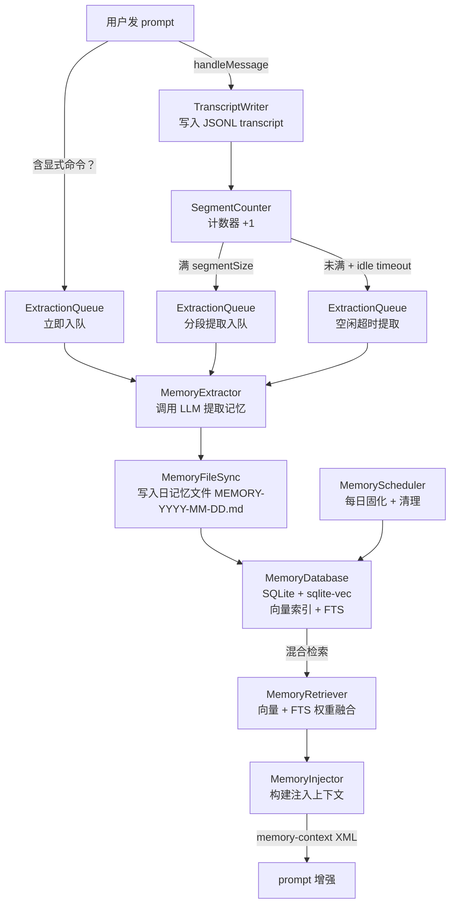

# nuwaclaw：长期记忆系统

nuwaclaw 的记忆系统以 `MemoryService` 为调度核心，通过对话转录（JSONL）+ 分段提取（LLM）+ 混合检索（向量 + FTS）+ 注入上下文四个阶段，把用户跨会话的信息持久化为可检索的记忆条目。

## 1. 整体架构



## 2. 会话中记忆触发时机

`handleMessage` 在每条消息（user/assistant）时调用，触发三类提取：

| 触发 | 条件 | 说明 |
|------|------|------|
| 显式命令 | 用户消息含 `!remember`/类似指令 | 立即入队，单条消息 |
| 分段满 | `segmentCounters[sessionId] >= segmentSize`（默认 10 条）| 按 segment 批量提取 |
| 空闲超时 | 消息数未满 + `idleTimeoutMs`（默认 60s）无新消息 | 定时器触发，提取累积消息 |

**会话结束**（`onSessionEnd`）：读取 `extraction_progress` 表的 `maxCompletedMsgIndex`，对未处理的剩余消息分段提取。保证即使 AI 对话很短也不遗漏。

**分段重叠**：每次分段提取成功后，`segmentCounters` 重置为 `segmentOverlap`（默认 2），而非 0，保证相邻分段间有 2 条重叠消息作上下文过渡。

## 3. ExtractionQueue — 异步提取管道

```
enqueue(sessionId, messageId, messages[], modelConfig, segmentIndex?)
  │
  └── 入队 Task（有优先级：显式命令 > 分段 > 空闲超时）
        └── 后台 worker 每 1s 轮询
              ├── 已有相同 segmentIndex 处理中？→ skip（去重）
              ├── 调用 MemoryExtractor.extract(messages, modelConfig)  ← LLM
              ├── 成功 → MemoryFileSync.appendToDailyMemory(memories)
              │          MemoryDatabase.updateExtractionProgress(completed)
              └── 失败 → 最多重试 maxRetries 次（默认 3）
```

提取任务失败不阻塞对话，仅记录日志。

## 4. 存储层：MEMORY.md 文件 + SQLite

```
~/.nuwaclaw/memory/
├── MEMORY-YYYY-MM-DD.md        ← 每日记忆文件（MemoryFileSync 追加写入）
├── MEMORY.md                   ← 主记忆文件（MemoryScheduler 每日固化）
├── transcripts/
│   └── {sessionId}.jsonl       ← 对话 transcript（TranscriptWriter）
└── memory.db                   ← SQLite（MemoryDatabase）
    ├── memories                 ← 记忆条目 + 向量嵌入
    ├── extraction_progress      ← 分段提取进度
    └── FTS5 虚拟表              ← 全文索引
```

`MemoryScheduler` 通过 cron 任务：
- **每日固化**（consolidation）：把日记忆文件合并去重到 `MEMORY.md`，可选 LLM 重写
- **清理**（cleanup）：删除过期条目（`dailyRetentionDays`）、孤立 transcript

## 5. MemoryRetriever — 混合检索

检索时对同一 query 同时跑向量搜索（cosine similarity）和全文搜索（FTS5 BM25），按权重融合排名：

```
score_final = vectorWeight × score_vec + ftsWeight × score_fts
```

默认 `vectorWeight=0.7, ftsWeight=0.3`，优先语义相似，辅以关键词命中。若 `sqlite-vec` 扩展不可用自动退化为纯 FTS。

## 6. MemoryInjector — 上下文注入

`getInjectionContext(query)` → `buildContext(query, options)`:

1. `MemoryRetriever.search(query, { limit, minScore })` 取 top-K 条记忆
2. 按 `importance × confidence` 排序
3. 格式化为：

```
Known information about the user (use as reference when answering):
- {memory text 1}
- {memory text 2}
...
```

调用方（`AcpEngine.chat`）把此内容包进 `<memory-context>` XML 标签追加到 prompt 前缀：

```
<memory-context>
Known information about the user (use as reference when answering):
{context}
</memory-context>

User question: {original prompt}
```

## 7. 与 AcpEngine 的集成点

`AcpEngine.chat()` 中记忆触发顺序：

```
1. session.openLongMemory = request.open_long_memory    ← 存到 session，供事件用
2. memoryService.handleMessage(session.id, userMsg)     ← 记录用户消息
3. memoryService.getInjectionContext(pureUserPrompt)    ← 检索注入上下文
4. 增强 prompt → promptAsync(enhancedPrompt)            ← 发给引擎
5. AcpEngine 事件链：
   - computer:promptEnd → memoryService.handleMessage(assistantText)  ← 记录 AI 回复
   - session.idle       → memoryService.onSessionEnd(session.id)      ← 增量提取剩余消息
```

`assistantTextBuffers`（在 `unifiedAgent.ts`）：通过监听 `message.part.updated(type=text)` 事件累积 AI 流式输出，在 `computer:promptEnd` 时 flush 给 `handleMessage`，保证 assistant 侧记忆完整。

## 8. openLongMemory 开关的作用

`openLongMemory = false`（默认）时：
- `handleMessage` 调用跳过（不记录对话）
- `getInjectionContext` 跳过（不注入记忆）
- `onSessionEnd` 跳过（不提取剩余消息）
- 无额外 LLM 调用，无 SQLite 写入

整个记忆流水线对不需要记忆的会话完全无感知，不影响性能。

## 9. 关键源码位置

| 文件 | 说明 |
|------|------|
| [services/memory/MemoryService.ts](../../nuwaclaw/crates/agent-electron-client/src/main/services/memory/MemoryService.ts) | 记忆调度总入口，1100 行 |
| [services/memory/MemoryExtractor.ts](../../nuwaclaw/crates/agent-electron-client/src/main/services/memory/MemoryExtractor.ts) | LLM 提取，显式/隐式命令识别 |
| [services/memory/ExtractionQueue.ts](../../nuwaclaw/crates/agent-electron-client/src/main/services/memory/ExtractionQueue.ts) | 异步提取队列，去重 + 重试 |
| [services/memory/MemoryDatabase.ts](../../nuwaclaw/crates/agent-electron-client/src/main/services/memory/MemoryDatabase.ts) | SQLite + sqlite-vec，FTS5 |
| [services/memory/MemoryRetriever.ts](../../nuwaclaw/crates/agent-electron-client/src/main/services/memory/MemoryRetriever.ts) | 混合检索：向量 + FTS 权重融合 |
| [services/memory/TranscriptWriter.ts](../../nuwaclaw/crates/agent-electron-client/src/main/services/memory/TranscriptWriter.ts) | JSONL transcript 读写 |
| [services/memory/MemoryScheduler.ts](../../nuwaclaw/crates/agent-electron-client/src/main/services/memory/MemoryScheduler.ts) | 每日固化 + 清理 cron |

## 一句话总结

记忆系统以 `openLongMemory` 为开关，通过「写 transcript → 分段/空闲超时 → 异步 LLM 提取 → SQLite 向量+FTS 索引 → 混合检索注入 prompt」五步管线实现跨会话长期记忆，所有步骤异步非阻塞，失败不影响正常对话流程。
