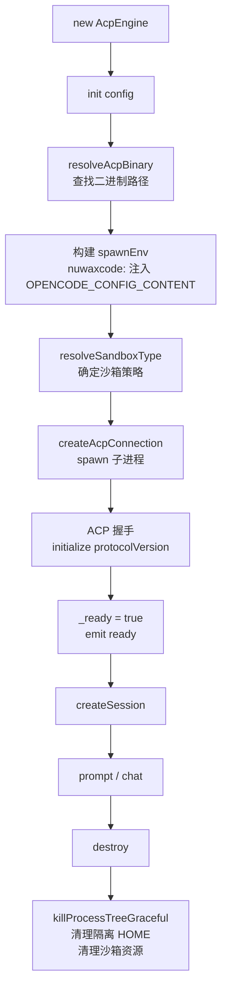

# nuwaclaw：AcpEngine — ACP 协议通信层

`AcpEngine` 是单个 AI 引擎进程的代理对象，封装了 ACP（Agent Client Protocol）协议的全部通信细节：spawn 子进程、ACP 握手、session 管理、prompt 发送、权限处理、沙箱策略。

## 1. 生命周期



`isReady = _ready && acpConnection !== null`，两者缺一不可。`engineName` 属性（`claude-code` | `nuwaxcode`）决定整个 init 流程的差异路径。

## 2. OPENCODE_CONFIG_CONTENT — nuwaxcode 配置注入

nuwaxcode 不通过命令行参数接受配置，而是通过环境变量 `OPENCODE_CONFIG_CONTENT`（JSON 字符串）注入：

| 字段 | 值 | 说明 |
|------|----|------|
| `mcp` | `{name: {type, url/command, ...}}` | MCP 服务器列表（含 HTTP 和 stdio 两种格式）|
| `permission` | `{edit:"allow", bash:"allow", question:"deny"}` | 全局允许工具调用，禁止交互询问 |
| `provider` | `{providerID: {models: {modelID: ...}}}` | 注册自定义 provider（openai-compatible 等）|
| `sandbox` | `{mode, writable_roots, ...}` | per-command 沙箱配置（nuwaxcode 读取）|

`question: "deny"` 是关键设计：防止 nuwaxcode 在无人值守的 Agent 模式下阻塞等待用户输入。

## 3. 沙箱策略（SandboxPolicy）

`getSandboxPolicy()` 读取应用配置，`resolveSandboxType` 确定实际沙箱类型：

| 平台 | 沙箱类型 | 机制 |
|------|---------|------|
| Windows | `windows-sandbox` | `nuwax-sandbox-helper.exe` 受限 token |
| macOS | `seatbelt` | Apple Sandbox 沙盒配置文件 |
| Linux | `bwrap` | bubblewrap 命名空间隔离 |
| 降级 | `none` | 不启用（`autoFallback=true` 时自动降级）|

沙箱模式（`mode`）：
- `strict`：只允许写 `workspaceDir` + 临时目录，禁止 `external_directory`
- `compat`：额外允许 APPDATA/XDG 目录
- `permissive`：不限制写入

## 4. createSession — MCP 注入优先级

`createSession` 时从两个来源合并 MCP 服务器列表：

```
mcpServers = []
  ← config.mcpServers（全局配置，init 时传入）
  ← opts.mcpServers（per-request，不重名则追加）

若沙箱开启：
  ← 过滤 gui-agent（GUI MCP 与沙箱互斥）
  ← 注入 sandboxed-bash（Windows，替换内置 Bash）
  ← 注入 sandboxed-fs（跨平台，strict/compat 模式替换内置 Write/Edit）
```

对应地，`_meta.claudeCode.options.disallowedTools` 会把被替换的内置工具（`Bash`、`Write`、`Edit`、`NotebookEdit`）列入黑名单，防止引擎同时调用内置和沙箱版本。

**compat 模式 MCP 预热延迟**：claude-code + 沙箱开启 + 新 session + 有 MCP 时，首次 prompt 前额外 sleep 1200ms，等待 MCP sandbox 初始化，防止工具调用在 sandbox 就绪前失败。

## 5. prompt — 核心调用路径

```
prompt(sessionId, parts, opts)
  │
  ├── emit computer:promptStart
  ├── activePromptSessions.add(sessionId)
  │
  ├── runPromptWithRetry()
  │     nuwaxcode 允许最多 2 次 retry（仅 MCP reconnect 场景）
  │     claude-code 不重试
  │     MCP 重连检测：isMcpReconnectWindowActive + 4s 时间窗口
  │     重试间隔：1200ms
  │
  ├── 成功 → emit computer:promptEnd(reason=stopReason)
  │          emit session.idle
  ├── 失败 → emit computer:promptEnd(reason=error/mcp_reconnecting)
  │          emit session.error
  │
  └── finally: activePromptSessions.delete(sessionId) → session.status = idle
```

`promptAsync`（`AcpEngine.chat` 调用）：fire-and-forget，不 await，`ComputerChatResponse` 里的 `session_id` 立即返回，AI 输出通过 SSE 事件流发给客户端。

## 6. 权限处理（handlePermissionRequest）

引擎执行工具时会通过 ACP 协议发 `permission_request`，`AcpEngine` 自动处理：

| 工具类型 | 处理方式 |
|---------|---------|
| `question`（交互询问）| 直接 `cancelled` — Agent 模式不允许交互 |
| strict 沙箱 + 写操作 | `evaluateStrictWritePermission` 检查目标路径是否在 `writableRoots` 内，超出则 `cancelled` |
| 其他写操作（非 strict）| `allow_always`（优先）→ `allow_once` → `options[0]` |
| strict 沙箱内合规写 | 只选 `allow_once`（不允许 `allow_always`，防止权限膨胀）|

**Windows 前置拦截**：nuwaxcode + strict 模式下，`tool_call_update(status=in_progress)` 事件中主动检查路径（`evaluateStrictWritePermission`），不等 `permission_request`，发现违规立即 emit 错误 + `abortSession`。

## 7. ACP → 事件映射

`handleAcpSessionUpdate` 把 ACP 协议事件转换为 Electron EventEmitter 事件，供 SSE 推送给前端：

| ACP 事件 | Electron 事件 |
|---------|-------------|
| `agent_message_chunk` | `message.part.updated {type:text}` |
| `agent_thought_chunk` | `message.part.updated {type:reasoning}` |
| `tool_call` | `message.part.updated {type:tool, status, input}` |
| `tool_call_update` | `message.part.updated {type:tool, status, output}` |
| `session_info_update` | `session.updated {title}` |

所有事件同时也 emit `computer:progress`（包含完整 `UnifiedSessionMessage`），供 SSE 流整包转发给前端。

## 8. 关键源码位置

| 文件 | 说明 |
|------|------|
| [services/engines/acp/acpEngine.ts](../../nuwaclaw/crates/agent-electron-client/src/main/services/engines/acp/acpEngine.ts) | AcpEngine 全量实现，2500 行 |
| [services/engines/acp/acpClient.ts](../../nuwaclaw/crates/agent-electron-client/src/main/services/engines/acp/acpClient.ts) | ACP SDK 动态加载 + `createAcpConnection` |
| [services/engines/acp/strictPermissionGuard.ts](../../nuwaclaw/crates/agent-electron-client/src/main/services/engines/acp/strictPermissionGuard.ts) | strict 写权限检查，路径解析 |
| [services/engines/acp/acpTerminalManager.ts](../../nuwaclaw/crates/agent-electron-client/src/main/services/engines/acp/acpTerminalManager.ts) | ACP Terminal API，Windows sandbox shell 路由 |
| [services/sandbox/policy.ts](../../nuwaclaw/crates/agent-electron-client/src/main/services/sandbox/policy.ts) | 沙箱策略读取 + sandbox 类型解析 |

## 一句话总结

`AcpEngine` 通过 `OPENCODE_CONFIG_CONTENT` 注入 MCP 和权限配置，用沙箱替换 MCP（sandboxed-bash/fs）替代内置危险工具，以 `permission_request` 自动批准 + strict 路径拦截实现无交互 Agent 运行，全部 ACP 事件映射为 Electron EventEmitter 供 SSE 转发给前端。
