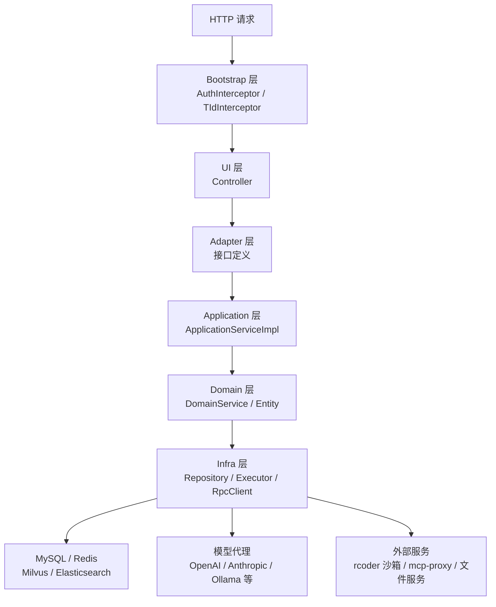

# nuwax-backend 总览

`nuwax-backend` 是 Nuwax 平台的核心后端，承载了从用户鉴权、智能体对话、知识库管理，到计费、订阅、生态市场的全部服务端逻辑。

一句话定位：它是一个**以 DDD 分层架构组织、以 Spring WebFlux 实现 AI 流式能力、以 Maven 多模块拆分业务域的企业级平台后端**。

## 1. 这个仓库解决什么问题

它主要承载六类后端能力：

1. **用户与租户**：登录鉴权、JWT 签发、租户配置、菜单权限
2. **智能体对话**：会话管理、SSE 流式推流、工具调用编排（知识库/插件/工作流/MCP/沙箱）
3. **工作空间资源**：知识库（向量+全文检索）、工作流、插件、MCP、页面开发、数据表
4. **生态与开放**：广场发布/订阅/审核、API Key、外部调用接口（OpenAI 兼容格式）
5. **计费与权限**：积分、订阅、定价、用量计量、数据权限管控
6. **基础设施对接**：沙箱调度（rcoder）、模型代理、IM 接入（微信/飞书/钉钉）、文件存储

## 2. 整体架构一图看清



## 3. Maven 模块版图

工程分三个顶层目录：

```
nuwax-backend/
├── app-platform-bootstrap/         启动模块（入口、拦截器、全局异常）
├── app-platform-foundation/        基础模块（共享规范、SDK 底座）
└── app-platform-modules/           业务模块（按业务域拆分）
    ├── app-platform-agent/         智能体核心（最重的模块）
    ├── app-platform-knowledge/     知识库
    ├── app-platform-memory/        长期记忆
    ├── app-platform-model-proxy/   模型代理
    ├── app-platform-mcp/           MCP 协议
    ├── app-platform-compose/       自定义数据表
    ├── app-platform-custom-page/   无代码页面
    ├── app-platform-eco-market/    生态广场
    ├── app-platform-sandbox/       沙箱管理
    ├── app-platform-file/          文件服务
    ├── app-platform-im/            IM 接入（微信/飞书）
    ├── app-platform-log/           日志
    ├── app-platform-bill/          账单
    ├── app-platform-credit/        积分
    ├── app-platform-pay/           支付
    ├── app-platform-pricing/       定价
    ├── app-platform-subscription/  订阅
    └── platform-system/            系统管理（菜单/权限/用户）
```

## 4. DDD 分层：每个业务模块内部的套路

除个别简单模块外，每个业务模块都遵循同一套 DDD 子模块结构（以 `app-platform-agent` 为例）：

| 子模块 | 包名规律 | 职责 |
|-------|---------|------|
| `*-spec` | `*.spec.enums / constants` | 枚举、常量、系统级约定（最无依赖） |
| `*-sdk` | `*.sdk` | 供其他模块调用的 RPC 接口 / DTO |
| `*-adapter` | `*.adapter.application` | Application 层接口声明（Port / 防腐层） |
| `*-domain` | `*.domain.service` | 领域服务（纯业务规则，不含 IO） |
| `*-application` | `*.application.service` | 应用服务（用例编排，跨领域协调） |
| `*-infra` | `*.infra.repository / component / rpc` | 仓储实现、外部调用、执行器 |
| `*-ui` | `*.web.ui.controller` | REST Controller（HTTP 接口层） |

依赖方向严格单向：`ui → application → domain → infra`，`adapter` 是 Application 的接口声明，供 `ui` 引用。

## 5. Bootstrap 层：请求的门卫

核心文件：

- [PlatformApiApplication.java](../../nuwax-backend/app-platform-bootstrap/app-platform-web-bootstrap/src/main/java/com/xspaceagi/PlatformApiApplication.java)
- [AuthInterceptor.java](../../nuwax-backend/app-platform-bootstrap/app-platform-web-bootstrap/src/main/java/com/xspaceagi/interceptor/AuthInterceptor.java)

每个请求进来依次经过：

1. **`AuthInterceptor`**：解析 JWT Token / API Key，构建 `RequestContext`（含 userId、tenantId、租户配置）
2. **`ApiKeyInterceptor`**：处理 Open API 外部调用（API Key → 换算成内部 userId/tenantId）
3. **`TIdInterceptor`**：注入租户 id 到 MDC，方便链路日志
4. **`AppExceptionHandler`**：统一异常映射为 `{code, message}` JSON 响应

`SandboxApiRewriteFilter` 是一个特殊的 URL 重写 Filter，把沙箱容器的路径前缀透明代理出去。

## 6. 最核心模块：app-platform-agent

这是整个后端最重的模块，负责智能体的全生命周期。

### 6.1 UI 层 Controller 全景

| Controller | 路径前缀 | 核心职责 |
|-----------|---------|---------|
| `ConversationController` | `/api/agent/conversation` | 会话 CRUD、**SSE 聊天推流** |
| `AgentController` | `/api/agent/config` | 智能体配置增删改查 |
| `WorkflowController` | `/api/agent/workflow` | 工作流编排管理 |
| `PluginController` | `/api/agent/plugin` | 插件管理 |
| `ModelController` | `/api/agent/model` | 用户侧模型查询 |
| `ModelManageController` | `/api/agent/model/manage` | 管理员侧模型配置 |
| `ComputerPodController` | `/api/agent/computer` | 远程桌面 Pod 管理 |
| `SkillController` | `/api/agent/skill` | Skill 管理 |
| `PublishController` | `/api/agent/publish` | 发布/广场 |
| `TaskCenterController` | `/api/agent/task` | 定时任务 |
| `AgentAKController` | `/api/agent/ak` | API Key 管理 |
| `ChatApiController` | `/api/open/chat` | Open API（OpenAI 格式兼容） |
| `AgentManageController` | `/api/manage/agent` | 系统管理员操作 |

### 6.2 Infra 层关键组件

**执行核心**

| 类 | 位置 | 职责 |
|----|------|------|
| `AgentExecutor` | `infra/component/agent` | 主执行引擎：上下文加载 → 组件编排 → 模型/沙箱调用 → 流式推流 |
| `SandboxAgentClient` | `infra/component/agent` | TaskAgent 走 rcoder 沙箱的客户端 |
| `ModelInvoker` | `infra/component/model` | 普通 Agent 的模型调用（Function Calling 循环） |
| `ModelClientFactory` | `infra/component/model` | 根据协议类型创建模型客户端实例 |
| `KnowledgeBaseSearcher` | `infra/component/knowledge` | 知识库检索（向量 + 全文 + QA）|
| `McpExecutor` | `infra/component/mcp` | MCP 工具调用 |

**已内置的模型适配**

| 适配器 | 目录 |
|-------|------|
| Anthropic Claude | `infra/component/model/anthropic` |
| OpenAI 兼容（含 Ollama、通义千问等） | `ModelClientFactory` 统一创建 |

**RPC 调用层**（Infra 调外部模块）

| RPC 类 | 调用目标 |
|--------|---------|
| `KnowledgeRpcService` | 知识库模块 |
| `McpRpcService` | MCP 模块 |
| `MetricRpcService` | 用量计量 |
| `ResourcePricingRpcService` | 定价模块 |
| `SandboxServerConfigService` | 沙箱模块 |
| `ComputerPodClient` | 远程桌面容器 |
| `SkillFileClient` | 文件服务 |
| `DbTableRpcService` | 数据表模块 |

**仓储层**（Repository 实现）

| Repository | 对应实体 |
|-----------|---------|
| `ConversationRepositoryImpl` | 会话记录（MySQL） |
| `ConversationMessageRepositoryImpl` | 消息记录（MySQL + Redis 缓存） |
| `AgentConfigRepositoryImpl` | 智能体配置 |
| `WorkflowConfigRepositoryImpl` | 工作流配置 |
| `PluginConfigRepositoryImpl` | 插件配置 |
| `PublishedRepositoryImpl` | 发布记录 |

## 7. 其他重要模块一览

| 模块 | 核心职责 | 关键技术 |
|------|---------|---------|
| **knowledge** | 文档上传、解析分块、向量化存储、混合检索 | Milvus（向量）+ Elasticsearch（全文） |
| **memory** | 长期记忆存储与按话题检索 | 12 大类 50+ 子类分类体系，Milvus 向量检索 |
| **model-proxy** | 统一模型 API 代理，Token 计量、限流、日志 | 反代 OpenAI/Claude 协议，依赖 Elasticsearch 存日志 |
| **mcp** | MCP 协议服务端，Tool 注册与调用 | Model Context Protocol，HTTP/SSE 传输 |
| **compose** | 自定义数据表（结构化数据组件） | Doris / MySQL，支持 SQL 查询 |
| **custom-page** | 无代码页面构建与发布 | 对接 rcoder 构建服务 |
| **eco-market** | 广场发布、审核、订阅、分类 | 含定时任务（`-job` 子模块） |
| **sandbox** | 沙箱容器生命周期管理（创建/分配/保活/销毁）| 对接 rcoder |
| **im** | IM 接入（微信公众号、企微等） | WebSocket + 微信 SDK |
| **bill/credit/pay/pricing/subscription** | 完整的计费体系 | 订阅积分 + 按量计费 |
| **platform-system** | 用户管理、菜单权限、租户配置、系统日志 | RBAC 权限 |

## 8. 启动入口与配置

**入口类**：`PlatformApiApplication.java`（`app-platform-bootstrap/app-platform-web-bootstrap`）

**默认端口**：`8081`

**配置文件层级**：

```
application.yml             公共配置
application-dev.yml         本地开发（不提交）
application-test.yml        测试环境
application-prod.yml        生产环境
```

**必要基础设施**：MySQL 8.0+ / Redis 7.0+ / Milvus 2.5+ / Elasticsearch 9.2.1

可选项：腾讯云 COS（文件存储）/ rcoder（沙箱）/ mcp-proxy / 模型代理

## 9. 如果你现在最关心什么

| 关注点 | 建议先看 |
|-------|---------|
| 前后端消息是怎么流起来的 | [01-前后端主链路.md](./01-前后端主链路.md) |
| 智能体执行引擎怎么工作 | `AgentExecutor.java`（`app-platform-agent-core-infra`）|
| 知识库检索是怎么做的 | `app-platform-knowledge` 模块 |
| 模型怎么接入 | `ModelClientFactory.java` + `AnthropicChatModel.java` |
| 怎么启动本地开发环境 | `nuwax-backend/README.zh-CN.md` 快速开始章节 |

## 10. 一句话总结

`nuwax-backend` 是一个以 DDD 严格分层、Spring WebFlux 驱动 AI 流式推流、十几个业务模块各自独立的 Java 单体应用，核心是 `app-platform-agent` 模块的 `AgentExecutor` 执行引擎——它把知识库检索、插件/MCP/工作流调用、模型推理、沙箱执行统一编排成一条 Reactor 响应式流，再通过 SSE 实时推给前端。
