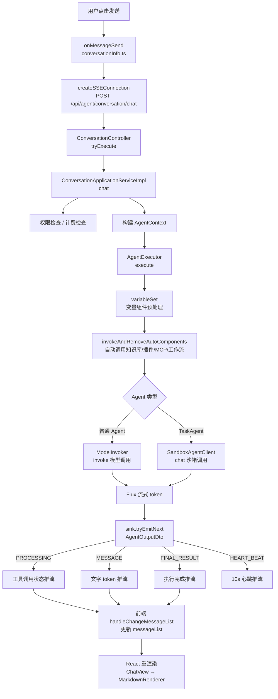

# 前后端主链路：一条消息从前端到模型的完整旅程

## 1. 这条链路解决什么问题

用户在浏览器里发一条消息，后端怎么把回答"打"回来的？

这条链路横跨前端 SSE 连接 → 后端 Controller → Application → Infra 四层，涉及：

- 前端如何发起请求、如何接收 SSE 流
- 后端 DDD 各层的职责边界在哪里
- `AgentExecutor` 如何根据 agent 类型分叉执行
- SSE 推流的三种事件类型如何产生、如何被前端消费

## 2. 整体链路一图看清



## 3. 第一层：前端发起 SSE 连接

核心文件：

- [src/models/conversationInfo.ts](../../nuwax/src/models/conversationInfo.ts)

前端用户点击"发送"后，`onMessageSend()` 调用 `createSSEConnection`：

```
POST /api/agent/conversation/chat
Content-Type: application/json
Accept: text/event-stream

{
  conversationId: 123,
  message: "你好",
  attachments: [...],
  selectedComponents: [...],
  requestId: "uuid"
}
```

建立长连接后，逐条处理 SSE 事件，每条事件触发 `handleChangeMessageList()` 更新 `messageList`，从而驱动 React 渲染。

## 4. 第二层：Controller（UI 层）

核心文件：

- [ConversationController.java](../../nuwax-backend/app-platform-modules/app-platform-agent/app-platform-agent-core-ui/src/main/java/com/xspaceagi/agent/web/ui/controller/ConversationController.java)

关键端点：

| 方法 | 路径 | 说明 |
|------|------|------|
| POST | `/api/agent/conversation/chat` | 发消息，返回 `Flux<AgentOutputDto>`（SSE）|
| POST | `/api/agent/conversation` | 创建会话 |
| GET  | `/api/agent/conversation/{id}` | 获取会话详情 |
| GET  | `/api/agent/conversation/list` | 历史会话列表 |
| POST | `/api/agent/conversation/stop/{id}` | 停止执行中的会话 |

`/chat` 端点返回 `Flux<AgentOutputDto>`，Spring WebFlux 自动序列化成 `text/event-stream`，每个 `AgentOutputDto` 是一条 SSE 消息。

Controller 只负责参数绑定和权限上下文装配，调用即转交 Application 层：

```java
return conversationApplicationService.chat(tryReqDto, headersFromRequest, false);
```

## 5. 第三层：Application 层 — 执行的指挥部

核心文件：

- [ConversationApplicationServiceImpl.java](../../nuwax-backend/app-platform-modules/app-platform-agent/app-platform-agent-core-application/src/main/java/com/xspaceagi/agent/core/application/service/ConversationApplicationServiceImpl.java)

`chat()` 方法是整条链路的"调度大厅"，大约做这几件事：

**准入检查（串行，任何一步失败立即返回错误 SSE）**

1. 查询 `ConversationDto`（会话是否存在）
2. 查询 `AgentConfigDto`（开发态取草稿配置，发布态取线上配置）
3. 空间权限验证 / 发布权限验证 / 用户数据权限验证
4. 付费估算（`estimatePrice`）与 Token 配额检查（`metricRpcService`）

**构建 `AgentContext`**

把所有运行时信息装进一个上下文对象，传给 Infra 层：

```
AgentContext = {
  agentConfig,     // agent 快照（含模型/组件配置）
  message,         // 用户消息
  userId / tenantId,
  conversationId,
  headers,         // 请求头（含 Cookie 等，用于页面组件）
  attachments,     // 附件列表
  variableParams,  // 变量参数（从前端 or 会话变量读取）
  traceContext,    // 全链路追踪上下文
  debug,           // 是否开发态
  ...
}
```

**组件选择处理**

前端传来 `selectedComponents`（用户手动选了哪些知识库/工作流/插件），`chat()` 据此把对应组件的 `invokeType` 从 `MANUAL` 改为 `AUTO`，或直接从列表里删除不该执行的组件。

**建立输出 Sink**

创建 `Sinks.Many<AgentOutputDto>`，启动心跳（`Flux.interval(10s)` → `HEART_BEAT` 事件），订阅 `agentExecutor.execute(agentContext)` 的输出，把每条 `AgentOutputDto` 转发给 SSE 连接。

## 6. 第四层：Infra 层 — AgentExecutor 执行核

核心文件：

- [AgentExecutor.java](../../nuwax-backend/app-platform-modules/app-platform-agent/app-platform-agent-core-infra/src/main/java/com/xspaceagi/agent/core/infra/component/agent/AgentExecutor.java)

`AgentExecutor.execute()` 是真正"干活"的地方。

### 执行流程

**① 上下文加载**

```
getRoundMessages(conversationId, contextRounds * 2)  // 短期记忆（历史轮次）
queryMemory(...)                                      // 长期记忆（仅关键词匹配）
```

**② variableSet（变量组件预处理）**

如果 agent 配置了"变量组件"（需要用户输入或自动识别的参数），先用模型提取参数值，提取完成后才进入正式执行。

**③ invokeAndRemoveAutoComponents（自动组件执行）**

按顺序自动调用所有 `invokeType=AUTO` 的组件：

| 组件类型 | 执行方式 | SSE 事件 |
|---------|---------|---------|
| 知识库 | `knowledgeBaseSearcher.search()` 批量检索 | `PROCESSING(EXECUTING → FINISHED)` |
| 插件 | `pluginExecutor.execute()` | `PROCESSING(EXECUTING → FINISHED)` |
| MCP | `mcpExecutor.execute()` | `PROCESSING(EXECUTING → FINISHED)` |
| 工作流 | `workflowExecutor.execute()` | `PROCESSING(EXECUTING → FINISHED)` |

每个组件执行完成后，把结果拼进 `autoToolCallResult` 作为上下文送给后续模型。

**PROCESSING 事件的 custom block 格式**：

```html
<div>
  <markdown-custom-process
    executeId="uuid"
    type="Knowledge"
    status="FINISHED"
    name="产品知识库">
  </markdown-custom-process>
</div>
```

前端 `genCustomPlugin` 解析此标签，渲染成工具调用进度卡片。

**④ 模型调用分叉**

```java
if ("TaskAgent".equals(agentContext.getAgentConfig().getType())) {
    // 通用智能体：走沙箱/rcoder
    callMessageFlux = sandboxAgentClient.chat(agentContext);
} else {
    // 普通 agent（工作流/问答型）：走模型代理
    callMessageFlux = modelInvoker.invoke(modelContext);
}
```

| 类型 | 调用路径 | 特点 |
|------|---------|------|
| 普通 agent | `ModelInvoker` → 模型代理 → 大模型 API | Function Calling 让模型自主决定调用组件 |
| TaskAgent | `SandboxAgentClient` → rcoder 沙箱 | 支持代码执行、文件操作、GUI 等 |

**⑤ 流式 token 转发**

订阅 `callMessageFlux`，每收到一个 `CallMessage`（含 `type=CHAT` 或 `type=THINK`），立刻 `sink.tryEmitNext(buildOutputMessage(...))` 推一条 `MESSAGE` 事件。

**⑥ 执行收尾**

`chatComplete()` 触发时：
- 持久化 AI 回复消息（`addRoundMessage`）
- 推 `FINAL_RESULT` 事件
- `sink.tryEmitComplete()`
- 如果开启了长期记忆，把会话 id 推入"长期记忆摘要队列"

## 7. SSE 事件类型总览

前端 `handleChangeMessageList()` 按如下规则处理每条 SSE 事件：

| eventType | data 类型 | 前端处理 |
|-----------|-----------|---------|
| `PROCESSING` | `ComponentExecutingDto` | 把 custom block HTML 拼进 `currentMessage.text`，触发工具进度渲染 |
| `MESSAGE` | `ChatMessageDto / CallMessage` | 把 `text` 追加到 `currentMessage.text`，把 `think` 追加到 `currentMessage.think` |
| `FINAL_RESULT` | `AgentExecuteResult` | 设置消息状态为 `Complete`，触发推荐问题查询 |
| `HEART_BEAT` | - | 前端忽略（仅保活 SSE 连接） |

## 8. 消息持久化在哪里发生

消息持久化由 Application 层通过 `conversationApplicationService.addRoundMessage()` 触发，有两个时机：

1. **用户消息**：`doNext()` 开始时立即持久化用户消息（`ChatMessageDto.Role.USER`）
2. **AI 消息**：`chatComplete()` 或 `chatError()` 时持久化 AI 回复（含 `think`、`componentExecutedList`）

Domain 层的 `ConversationDomainService` 负责实际写库（Redis Round Cache + MySQL 持久化）。

## 9. 与前端文档的对应关系

本文档是 [06-agent聊天渲染链路.md](../nuwax/06-agent聊天渲染链路.md) 的后端对称版，两者合起来才是完整的端到端链路：

| 前端文档章节 | 本文档对应章节 |
|------------|-------------|
| 第一层：消息发送与 SSE 连接 | 第 3 节：前端发起 SSE 连接 |
| 第二层：全局消息状态管理 | 第 7 节：SSE 事件类型总览 |
| 第五层：MarkdownRenderer | （前端侧，后端不涉及）|
| 第八节：SSE 事件触发 UI 扩展 | 第 6 节：PROCESSING 事件的 custom block |

## 10. 一句话总结

前端 SSE 连接打到 `ConversationController` → Application 层做准入/鉴权/计费后构建 `AgentContext` → `AgentExecutor` 先自动调用知识库/插件等组件（推 `PROCESSING` 事件），再按 agent 类型分叉调模型或沙箱（推 `MESSAGE` token 流），最后 `chatComplete` 推 `FINAL_RESULT` 收尾；全程通过 Reactor `Sinks.Many` 反压管道透传，Spring WebFlux 自动序列化为 SSE。
