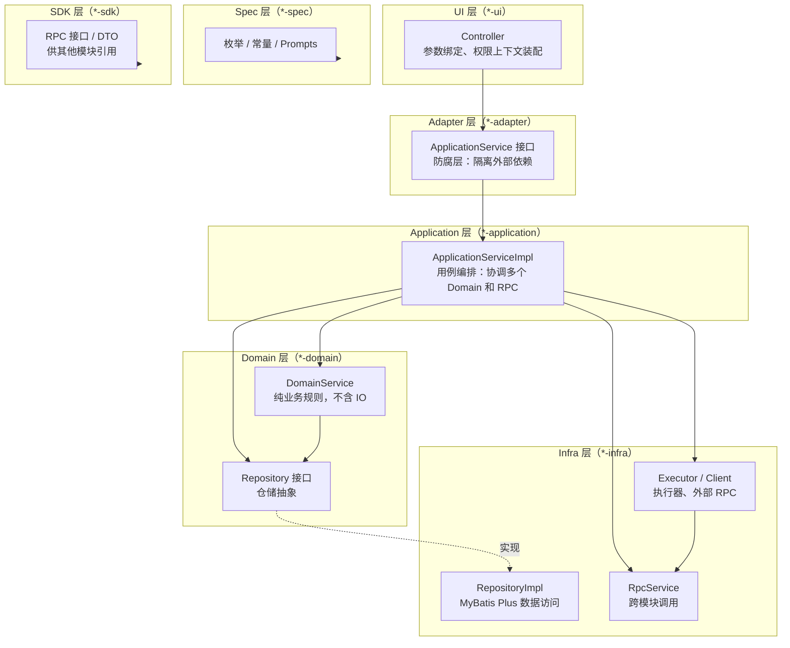

# DDD 分层架构

## 1. 这篇文档解决什么问题

`nuwax-backend` 的代码为什么要分成这么多子模块？一个请求进来，到底经过了哪些层，每层在干什么？改一个业务逻辑应该动哪个子模块？

## 2. 分层一图看清



依赖方向：`UI → Adapter → Application → Domain → Infra`，Spec / SDK 无方向限制（被所有层引用）。

## 3. 七层子模块的职责

### spec（最底层，零依赖）

存放跨层共享的约定：

- 枚举（`AgentTypeEnum`、`ComponentTypeEnum` 等）
- 常量（`Prompts`：系统内置 AI 提示词模板）

任何层都可以引用，它本身不引用任何业务代码。

### sdk（对外暴露接口）

存放给**其他业务模块**调用的内容：

- RPC 接口（`AgentRpcService`、`KnowledgeRpcService` 等）
- 跨模块传输的 DTO

当 agent 模块需要调用 knowledge 模块时，它引用 `app-platform-knowledge-sdk`，而不是直接依赖知识库的 Domain。

### adapter（防腐接口层）

Application 层接口的声明集合（Port 风格）：

```java
// adapter 层只定义接口
public interface ConversationApplicationService {
    Flux<AgentOutputDto> chat(TryReqDto req, Map<String,String> headers, boolean isTempChat);
    ConversationDto createConversation(Long userId, ConversationCreateDto dto);
    ...
}
```

UI 层（Controller）依赖这个接口，而不是实现类，使得 Controller 与具体实现解耦。

### domain（领域核心）

包含两类东西：

**DomainService**（业务规则）

```java
// 只描述"会话创建的业务规则"，不关心调用者和存储细节
public interface ConversationDomainService {
    Conversation createConversation(...);
    void addRoundMessage(String conversationId, ChatMessageDto message);
    List<ChatMessageDto> getRoundMessages(String conversationId, int limit);
    ...
}
```

**Repository 接口**（仓储抽象）

Domain 层依赖接口，不依赖具体 ORM：

```java
public interface ConversationRepository {
    Conversation findById(Long id);
    void save(Conversation conversation);
    ...
}
```

**重要**：Domain 层不含任何 IO 操作，不注入 Mapper，不调外部服务。它只描述规则，实现细节都在 Infra。

### application（用例编排）

最"脏"也最重要的一层，负责把一个完整业务用例从头跑完：

```java
public Flux<AgentOutputDto> chat(TryReqDto req, ...) {
    // 1. 查会话（调 DomainService）
    // 2. 查 agent 配置（跨模块 RPC）
    // 3. 权限检查（调 DomainService）
    // 4. 计费估算（跨模块 RPC）
    // 5. 构建 AgentContext
    // 6. 调 AgentExecutor.execute()（Infra 组件）
    // 7. 订阅流，推 SSE
}
```

它可以：

- 调同模块的 DomainService
- 调其他模块的 SDK（通过 RPC 接口）
- 调 Infra 层的执行器
- 跨事务边界

它不应该：直接写数据库 SQL、包含纯业务规则（那是 Domain 的职责）。

### infra（技术实现）

三类组件：

| 子目录 | 内容 |
|-------|------|
| `repository/` | Repository 接口的 MyBatis Plus 实现 |
| `component/` | 执行器（AgentExecutor、ModelInvoker 等）、外部客户端（SandboxAgentClient）|
| `rpc/` | 跨模块 RPC 调用的 HTTP 客户端实现 |

### ui（HTTP 接口）

Spring MVC Controller，职责极薄：

1. 参数绑定与校验（`@Valid`）
2. 从 `RequestContext` 取 userId / tenantId
3. 调 Application 层接口
4. 把结果序列化返回（或直接返回 `Flux<T>` 让 WebFlux 转成 SSE）

## 4. 一个完整请求的分层旅程

以"发一条聊天消息"为例：

```
POST /api/agent/conversation/chat
        ↓
ConversationController（UI 层）
  → 取 RequestContext，绑定 TryReqDto
        ↓
ConversationApplicationService 接口（Adapter 层）
  → 运行时注入 ConversationApplicationServiceImpl
        ↓
ConversationApplicationServiceImpl（Application 层）
  → 调 conversationDomainService.getConversation()     # Domain
  → 调 agentApplicationService.queryConfigForExecute() # 跨模块 RPC
  → 调 metricRpcService.queryMetricCurrent()           # 跨模块 RPC
  → 构建 AgentContext
  → 调 agentExecutor.execute(agentContext)              # Infra 组件
        ↓
AgentExecutor（Infra 层 component）
  → 调 KnowledgeBaseSearcher.search()                  # Infra 组件
  → 调 ModelInvoker.invoke()                           # Infra 组件
  → 调 conversationDomainService.addRoundMessage()     # Domain（持久化）
        ↓
ConversationDomainServiceImpl（Domain 层）
  → 调 conversationRepository.save()                   # 接口
        ↓
ConversationRepositoryImpl（Infra 层 repository）
  → MyBatis Plus → MySQL
```

## 5. 跨模块依赖怎么走

业务模块之间**不直接相互依赖**，而是通过 SDK 层的 RPC 接口通信。

以 agent 调 knowledge 为例：

```
app-platform-agent-core-infra
    └─ KnowledgeRpcService（HTTP Client 实现）
         → 调用 app-platform-knowledge 模块的 REST 接口
         ← 返回 KnowledgeRpcService 定义的 DTO

（agent 模块只依赖 app-platform-knowledge-sdk，不依赖 knowledge 的 domain/infra）
```

这样做的好处：知识库模块可以独立迭代，agent 模块只关心 SDK 接口契约。

## 6. 哪些情况破坏了分层

`nuwax-backend` 中有几个已知的轻微破层：

- Application 层部分方法直接注入了 `RedisUtil`（应属于 Infra），实际上为性能直接做了缓存操作
- `AgentExecutor`（Infra 组件）内部调用了 `ConversationDomainService`（Domain），方向看似反向，但因为 AgentExecutor 本身是 Infra 的一部分，这条路径是允许的（Infra 可以调 Domain）

## 7. 一句话总结

`spec（枚举/常量）→ sdk（对外接口）→ adapter（防腐接口声明）→ domain（业务规则+仓储抽象）→ application（用例编排）→ infra（技术实现）→ ui（HTTP 接入）`；依赖单向流动，跨模块走 SDK 的 RPC 接口，Domain 层零 IO 只描述规则。
