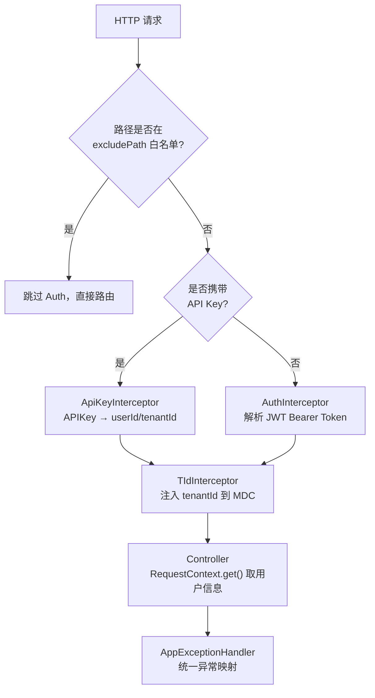

# 请求生命周期与鉴权

## 1. 这篇文档解决什么问题

一个 HTTP 请求从进入 Tomcat 到最终返回，中间经过哪些拦截器？Token / API Key 如何校验？用户信息和租户信息怎么传递到 Controller 和 Service？

## 2. 请求处理流水线



## 3. 拦截器逐层说明

### AuthInterceptor — 登录态校验

核心文件：[AuthInterceptor.java](../../nuwax-backend/app-platform-bootstrap/app-platform-web-bootstrap/src/main/java/com/xspaceagi/interceptor/AuthInterceptor.java)

从 `Authorization: Bearer <token>` 中取出 JWT，做三件事：

1. **验证签名**：�� `JWT_SECRET_KEY` 校验 HS256 签名，过期或签名错误返回 401
2. **拉取用户信息**：解析 JWT payload，从 Redis / DB 查完整用户对象
3. **构建 RequestContext**：把 `userId`、`tenantId`、`user 对象`、`租户配置(TenantConfigDto)` 写入 `RequestContext.set()`（ThreadLocal）

白名单路径（`application.yml` 的 `auth.excludePath`）直接放行，包括登录接口、健康检查、SSE MCP 端点、部分开放接口等。

### ApiKeyInterceptor — 开放 API 鉴权

核心文件：[ApiKeyInterceptor.java](../../nuwax-backend/app-platform-bootstrap/app-platform-web-bootstrap/src/main/java/com/xspaceagi/interceptor/ApiKeyInterceptor.java)

处理 `/api/v1/` 和 `/api/open/` 前缀的外部 API 调用：

1. 从 `Authorization: Bearer <api-key>` 读取 AK
2. 查数据库找到 AK 对应的 `userId` / `tenantId` / `agentId`
3. 构建 RequestContext，写入 `isApiKeyRequest=true`

OpenAI 兼容接口（`/api/v1/chat/completions`）就走这条路，前端/外部系统只需要持有 API Key 即可。

### TIdInterceptor — 租户 MDC 注入

把 `tenantId` 注入 SLF4J MDC，让 logback 配置在每行日志里自动带上租户 id，方便按租户过滤日志。

### AppExceptionHandler — 统一异常

核心文件：[AppExceptionHandler.java](../../nuwax-backend/app-platform-bootstrap/app-platform-web-bootstrap/src/main/java/com/xspaceagi/interceptor/AppExceptionHandler.java)

全局 `@RestControllerAdvice`，把各种异常映射成统一的 JSON：

```json
{
  "code": 401,
  "message": "未登录或登录已过期"
}
```

| 异常类型 | HTTP 状态码 | 说明 |
|---------|-----------|------|
| `UnauthorizedException` | 401 | JWT 失效 / 未登录 |
| `ForbiddenException` | 403 | 权限不足 |
| `BizException` | 200 | 业务异常（code 字段区分） |
| `其他 RuntimeException` | 500 | 兜底 |

## 4. RequestContext — 请求上下文的传递方式

RequestContext 是一个 ThreadLocal 容器，在同一个请求线程内全局可读：

```java
// 在拦截器里设置
RequestContext.set(requestContext);

// 在 Service 里读取（无需传参）
Long userId = RequestContext.get().getUserId();
Long tenantId = RequestContext.get().getTenantId();
TenantConfigDto tenantConfig = (TenantConfigDto) RequestContext.get().getTenantConfig();
UserDto user = (UserDto) RequestContext.get().getUser();
```

**一个重要细节**：`AgentExecutor.execute()` 是异步 Reactor 管道，换线程了。`ConversationApplicationServiceImpl` 在订阅前会显式保存一份引用：

```java
final RequestContext<Object> requestContext = RequestContext.get();
// ... 在 onComplete 回调里
RequestContext.set(requestContext);  // 回调线程里恢复上下文
```

## 5. 租户配置对请求的影响

`TenantConfigDto` 从 DB/Redis 加载，随 RequestContext 传递，在多个地方影响业务：

| 配置项 | 影响位置 |
|-------|---------|
| `globalSystemPrompt` | `chat()` 方法，自动追加到所有 agent 的 system prompt |
| `enableSubscription` | 计费判断，是否走订阅模式 |
| 租户菜单权限开关 | 前端路由决策（通过 `/api/tenant/config` 接口暴露） |

## 6. 免登录接口（白名单）摘要

常用的无需 token 接口：

| 路径 | 说明 |
|------|------|
| `/api/user/login` | 登录 |
| `/api/temp/chat/conversation` | 临时对话（分享链接） |
| `/api/mcp/sse`、`/api/mcp/message` | MCP 协议端点 |
| `/api/v1/**` | Open API（走 ApiKey 鉴权） |
| `/api/published/agent/list` | 广场公开列表 |
| `/api/agent/conversation/share/detail` | 会话分享详情 |
| `/health`、`/ready` | 健康检查 |

## 7. 一句话总结

每个请求先过 `AuthInterceptor`（JWT → RequestContext）或 `ApiKeyInterceptor`（API Key → RequestContext），再经 `TIdInterceptor` 注入日志 MDC；全程用 ThreadLocal 的 `RequestContext` 传递 userId/tenantId/tenantConfig，Reactor 异步回调里需要手动 `set()` 恢复；`AppExceptionHandler` 兜底统一输出错误格式。
