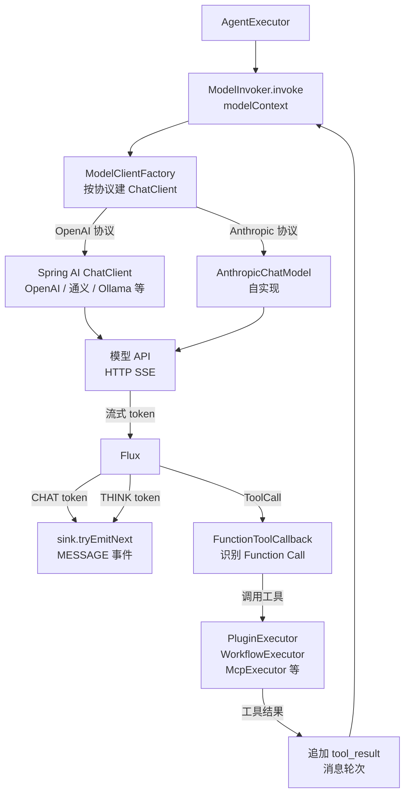

# 模型调用与流式推流

## 1. 这篇文档解决什么问题

后端是如何真正调用 AI 模型的？支持哪些模型协议？流式 token 怎么从模型 API 一路流到 SSE 推给前端？Function Calling 的循环是怎么跑的？

## 2. 模型调用全链路一图看清



模型调用是一个**循环**：只要模型返回 Tool Call，就执行工具、追加结果、再次调用模型，直到模型不再调 Tool Call 为止。

## 3. ModelClientFactory — 协议工厂

核心文件：[ModelClientFactory.java](../../nuwax-backend/app-platform-modules/app-platform-agent/app-platform-agent-core-infra/src/main/java/com/xspaceagi/agent/core/infra/component/model/ModelClientFactory.java)

按 `ModelConfig` 里的 `apiProtocol` 字段决定用哪套客户端：

| apiProtocol | 底层实现 | 适用模型 |
|------------|---------|---------|
| `OPENAI` | Spring AI `OpenAiChatModel` | GPT、通义千问、DeepSeek、Ollama（兼容模式） |
| `ANTHROPIC` | 自实现 `AnthropicChatModel` | Claude 系列 |
| 其他 | 同 OpenAI 协议 | 任何 OpenAI 兼容接口 |

工厂每次根据模型配置（API URL、API Key、模型 id）动态创建客户端实例，不复用单例，支持运行时动态切换模型。

## 4. AnthropicChatModel — 自实现的 Claude 支持

核心文件：[AnthropicChatModel.java](../../nuwax-backend/app-platform-modules/app-platform-agent/app-platform-agent-core-infra/src/main/java/com/xspaceagi/agent/core/infra/component/model/anthropic/AnthropicChatModel.java)

Spring AI 官方 Anthropic 支持不完整（缺少思考模式、自定义缓存策略等），所以平台自己实现了：

- **Thinking 模式**：传 `thinking: {type: "enabled", budget_tokens: N}` 参数，流式接收 `thinking_delta` 事件，分别写入 `think` 字段
- **Prompt Cache**：通过 `AnthropicCacheStrategy` 和 `AnthropicCacheOptions` 控制哪段 system prompt 加 `cache_control`
- **Citation 支持**：知识库引用时把文档内容以 `citations` 格式传入
- **流式解析**：逐行解析 `data: {...}` SSE 事件，区分 `content_block_delta`（text_delta / thinking_delta）和 `message_delta`（usage）

## 5. ModelInvoker — 模型调用的主循环

核心文件：[ModelInvoker.java](../../nuwax-backend/app-platform-modules/app-platform-agent/app-platform-agent-core-infra/src/main/java/com/xspaceagi/agent/core/infra/component/model/ModelInvoker.java)

`invoke(ModelContext)` 的大致逻辑：

```java
while (true) {
    Flux<ChatMessage> stream = chatClient.stream(messages, tools);
    
    stream.subscribe(msg -> {
        if (msg.type == CHAT)  sink.tryEmitNext(MESSAGE 事件)
        if (msg.type == THINK) sink.tryEmitNext(MESSAGE 事件, isThink=true)
        if (msg.type == TOOL_CALL) toolCalls.add(msg)
    });
    
    await stream complete;
    
    if (toolCalls.isEmpty()) break; // 模型不再调工具，结束
    
    // 执行所有工具
    for (ToolCall call : toolCalls) {
        String result = functionToolCallback.call(call.name, call.args);
        messages.add(new ToolResultMessage(call.id, result));
    }
    toolCalls.clear();
}
```

**FunctionToolCallback**（[FunctionToolCallback.java](../../nuwax-backend/app-platform-modules/app-platform-agent/app-platform-agent-core-infra/src/main/java/com/xspaceagi/agent/core/infra/component/model/FunctionToolCallback.java)）是工具分发器，根据 tool name 路由到对应的执行器：

| tool name 前缀 | 分发目标 |
|--------------|---------|
| `plugin_*` | PluginExecutor |
| `workflow_*` | WorkflowExecutor |
| `mcp_*` | McpExecutor |
| `knowledge_*` | KnowledgeBaseSearcher |
| `compose_*` | DbTableRpcService（数据表查询） |

每次工具调用都会推一条 `PROCESSING` SSE 事件（`status=EXECUTING`），执行完再推一条（`status=FINISHED`）。

## 6. ModelContext — 模型调用的上下文

`ModelContext` 是 `AgentContext` 裁剪后传给 `ModelInvoker` 的对象，包含：

```
ModelContext = {
  messages,           // 对话历史（含 system + 历史轮次 + 当前 user）
  tools,              // Function Calling 工具列表（由 agent 组件配置生成）
  model,              // 模型配置（含 API URL、Key、模型 id、温度等参数）
  maxTokens,          // 最大输出 token
  systemPrompt,       // 组合后的 system prompt（全局 + agent 配置）
  userPrompt,         // 组合后的 user prompt 前缀
  autoToolCallResult, // 知识库/工作流自动调用的结果（已在 AgentExecutor 里准备好）
  thinkingEnabled,    // 是否开启 Claude thinking 模式
  ...
}
```

## 7. TaskAgent 走沙箱的另一条路

当 `agentConfig.type == "TaskAgent"` 时，不走 `ModelInvoker`，而是走：

```
SandboxAgentClient.chat(agentContext)
    → POST http://{rcoder-url}/agent/chat
    → rcoder 内部运行 claudecode/opencode 等 CLI Agent
    → 返回 Flux<AgentOutputDto>（rcoder 已封装好 SSE 格式）
```

rcoder 里的 Agent 自带工具执行能力（文件操作、终端执行、浏览器操作等），backend 只负责转发流并监听 `FINAL_RESULT`。

## 8. SSE 推流的技术实现

Spring WebFlux 把 Controller 方法返回的 `Flux<AgentOutputDto>` 自动序列化成 SSE：

```java
// Controller
@PostMapping(value = "/chat", produces = MediaType.TEXT_EVENT_STREAM_VALUE)
public Flux<AgentOutputDto> tryExecute(...) {
    return conversationApplicationService.chat(...);
}
```

Application 层用 `Sinks.Many` 作为背压管道：

```java
Sinks.Many<AgentOutputDto> sink = Sinks.many().unicast().onBackpressureBuffer();

// 心跳：每 10s 一条 HEART_BEAT，防止 SSE 超时断开
Flux.interval(Duration.ofSeconds(10))
    .takeWhile(t -> !isComplete.get())
    .doOnNext(t -> sink.tryEmitNext(heartbeat()))
    .subscribe();

// 智能体输出
agentExecutor.execute(agentContext).subscribe(
    msg -> sink.tryEmitNext(msg),
    err -> sink.tryEmitComplete(),
    () -> sink.tryEmitComplete()
);

return sink.asFlux();
```

前端收到的每条 SSE 格式：

```
data: {"eventType":"MESSAGE","requestId":"xxx","data":{"text":"你好"}}

data: {"eventType":"PROCESSING","requestId":"xxx","data":{"type":"Knowledge","status":"FINISHED",...}}

data: {"eventType":"FINAL_RESULT","requestId":"xxx","completed":true,"data":{...}}
```

## 9. 一句话总结

`AgentExecutor` 先自动调用知识库/插件等组件（推 `PROCESSING` 事件），再把消息和工具列表送给 `ModelInvoker`；`ModelInvoker` 进入 Function Calling 循环：模型流式出 token（推 `MESSAGE` 事件）、如有 Tool Call 就执行工具再回调模型，直到无 Tool Call；TaskAgent 则绕过 `ModelInvoker` 直接转发 rcoder 沙箱的流；整个过程通过 `Sinks.Many` 背压管道收集，Spring WebFlux 序列化为 SSE 推给前端。
