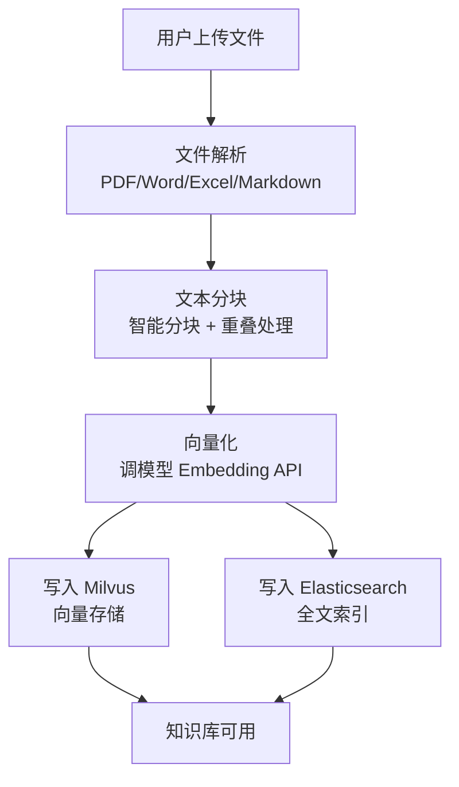
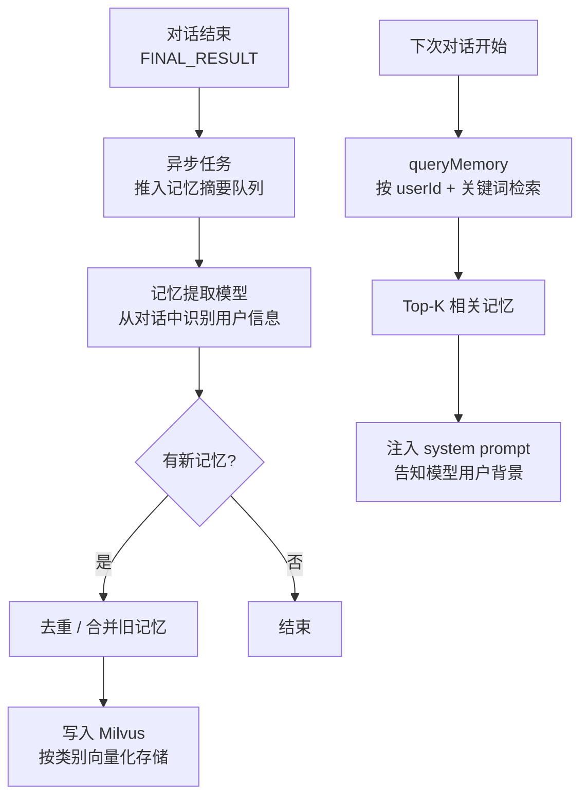

# 知识库与记忆系统

## 1. 这篇文档解决什么问题

agent 对话时的"知识库检索"和"长期记忆"是两套完全不同的机制，但都服务于同一个目标：让模型回答时有据可依。本篇梳理这两套机制各自的实现方式，以及它们在 agent 执行链路里的接入点。

## 2. 两者的本质区别

| | 知识库（Knowledge） | 长期记忆（Memory） |
|---|---|---|
| **数据来源** | 人工上传的文档（PDF/Word/Markdown 等）| 对话过程中自动提取的用户信息 |
| **触发时机** | 每次对话前自动检索（或模型 Function Call 触发）| 每次对话前注入；对话结束后异步摘要写入 |
| **存储** | Milvus（向量）+ Elasticsearch（全文） | Milvus（向量） |
| **检索方式** | 向量检索 + 全文检索 + QA 检索三路合并 | 仅关键词/语义匹配 |
| **模块** | `app-platform-knowledge` | `app-platform-memory` |

## 3. 知识库模块

### 3.1 文档上传与处理流程



### 3.2 检索时的三路合并

核心文件：[KnowledgeBaseSearcher.java](../../nuwax-backend/app-platform-modules/app-platform-agent/app-platform-agent-core-infra/src/main/java/com/xspaceagi/agent/core/infra/component/knowledge/KnowledgeBaseSearcher.java)

每次检索同时走三条路，合并后 Re-rank 排序：

| 检索路径 | 实现 | 特点 |
|---------|------|------|
| **向量检索** | Milvus ANN 搜索 | 语义相似，能找到意思相近但用词不同的段落 |
| **全文检索** | Elasticsearch BM25 | 精确关键词匹配，对专有名词效果好 |
| **QA 检索** | 预先生成 QA 对后向量化 | 问题-答案对齐，对问答型知识库效果最好 |

三路结果合并后，可选 Re-Rank 模型重排（召回率优先 → 精度优先）。

### 3.3 在 AgentExecutor 中的接入位置

```java
// AgentExecutor.invokeAndRemoveAutoComponents()
knowledgeBaseSearcher.search(searchContext)
    → 把检索结果拼成 Markdown 格式
    → 写入 agentContext.autoToolCallResult
    → 作为 system prompt 的一部分传给模型
```

如果知识库组件的 `invokeType = ON_DEMAND`（按需），则不在此处执行，而是作为 Function Calling 工具注册，由模型自行决定何时检索。

### 3.4 核心配置项

| 配置项 | 说明 |
|-------|------|
| `searchStrategy` | `VECTOR`（仅向量）/ `FULL_TEXT`（仅全文）/ `HYBRID`（混合） |
| `topK` | 召回段落数量 |
| `scoreThreshold` | 相似度分数阈值，低于此值丢弃 |
| `rerank` | 是否启用 Re-Rank 重排 |
| `chunkSize` | 分块大小（token 数） |
| `chunkOverlap` | 相邻分块的重叠 token 数 |

## 4. 记忆系统模块

### 4.1 设计理念

长期记忆模拟人的"记住用户偏好和背景"能力。每次对话结束后，系统自动从消息里提取结构化记忆，按 12 大类 50+ 子类分类存储。下次对话时，自动检索相关记忆注入 system prompt。

### 4.2 记忆的生命周期



### 4.3 记忆分类体系

12 大主分类（举例）：

| 分类 | 示例子分类 |
|------|---------|
| 个人信息 | 姓名、年龄、职业、所在城市 |
| 工作信息 | 公司、职位、主要工作内容 |
| 兴趣爱好 | 运动偏好、阅读习惯、饮食偏好 |
| 技术背景 | 编程语言、技术栈、开发经验 |
| 沟通偏好 | 回答语气、详细程度偏好 |
| 项目/任务 | 正在做的项目、遇到的问题 |
| ... | ... |

### 4.4 敏感信息过滤

提取记忆时会过滤掉：

- 身份证号、银行卡号、密码等敏感字段
- 临时性信息（"今天"、"刚才"类的非持久信息）

### 4.5 在 AgentExecutor 中的接入位置

```java
// AgentExecutor 开始执行时
memoryRpcService.queryMemory(userId, conversationId, userMessage)
    → 返回 List<MemoryDto>（相关记忆条目）
    → 拼成"关于用户的背景信息"注入到 system prompt 前缀
```

记忆注入是可配置的，agent 编辑页可以单独关闭"开启长期记忆"。

## 5. 两者在 system prompt 中的位置

最终传给模型的 system prompt 结构大致是：

```
{租户全局 system prompt}

{agent 自定义 system prompt}

{用户长期记忆（若有）}
  - 用户职业：前端工程师
  - 用户偏好：回答简洁，给代码示例

{知识库检索结果（若有）}
  ## 参考资料
  [1] 文档名 - 段落内容...

{用户变量（若有）}
  用户姓名：张三
```

模型只看到这个组合后的 prompt，不感知"这段来自知识库，那段来自记忆"。

## 6. 一句话总结

知识库是人工上传的文档经向量化后存入 Milvus + Elasticsearch，每轮对话前三路检索（向量/全文/QA）合并 Re-Rank 后注入 prompt；长期记忆是对话结束后异步提取的结构化用户信息，按 12 大类存 Milvus，下轮对话前语义检索注入 prompt——两者都服务于"让模型有上下文可读"，只是来源和更新频率不同。
