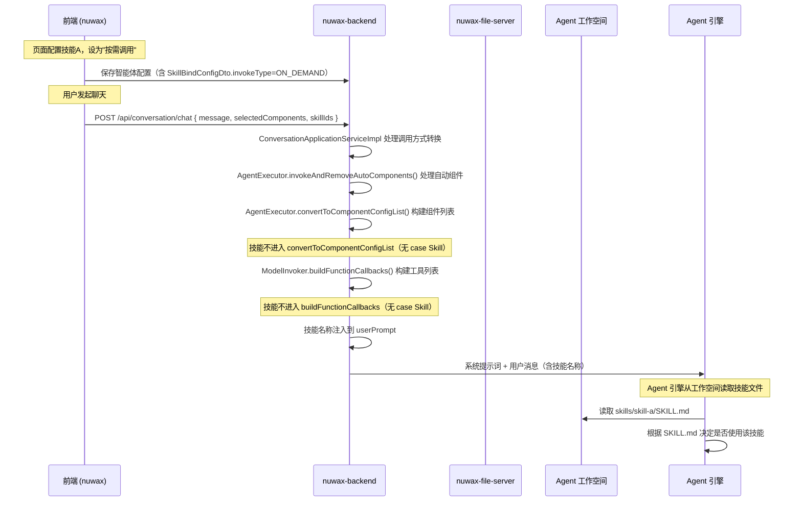

# 技能调用链路

## 1. 核心结论

**技能（Skill）不是可调用的工具（Tool）。** 技能是基于文件的资源（SKILL.md + 代码文件），被推送到 Agent 的工作空间目录，由 Agent 引擎在运行时读取和使用。这与插件（Plugin）、工作流（Workflow）、MCP 等组件不同——后者会被转换为 Function Calling 工具供模型直接调用。

## 2. 调用方式枚举

前端定义了 4 种调用方式（`nuwax/src/types/enums/agent.ts:72-82`）：

| 枚举值 | 含义 | 技能是否使用 |
|--------|------|-------------|
| `AUTO` | 自动调用（每轮对话都执行） | 不使用 |
| `ON_DEMAND` | 按需调用（模型根据任务决定） | 使用（默认） |
| `MANUAL` | 手动选择 | 不使用 |
| `MANUAL_ON_DEMAND` | 手动选择 + 按需调用 | 使用 |

技能的调用方式只有两种：`ON_DEMAND` 和 `MANUAL_ON_DEMAND`（见 `SkillBindConfigDto.java:20-23`）。

## 3. 全链路概览



## 4. 分阶段详解

### 4.1 配置阶段：前端保存技能配置

用户在智能体编排页面添加技能A，设置调用方式为"按需调用"。

前端保存的数据结构（`AgentComponentConfigDto`）：
```json
{
  "type": "Skill",
  "targetId": 10,
  "bindConfig": {
    "invokeType": "ON_DEMAND",
    "defaultSelected": 1
  }
}
```

后端存储：`SkillBindConfigDto`（`SkillBindConfigDto.java`）

```java
public class SkillBindConfigDto {
    private SkillInvokeTypeEnum invokeType;  // ON_DEMAND / MANUAL / MANUAL_ON_DEMAND
    private Integer defaultSelected;          // 是否默认选中
    private String alias;                     // 别名
}
```

### 4.2 聊天阶段：调用方式转换

用户发消息时，前端传递 `selectedComponents`（用户选中的组件 ID 列表）和 `skillIds`（@提及的技能 ID）。

`ConversationApplicationServiceImpl.java:1160-1244` 处理逻辑：

```
遍历 agentComponentConfigList:
├── Plugin (invokeType=MANUAL)     → 未选中则移除，选中则改为 AUTO
├── Plugin (invokeType=MANUAL_ON_DEMAND) → 未选中则移除，选中则改为 ON_DEMAND
├── Workflow (invokeType=MANUAL)   → 未选中则移除，选中则改为 AUTO
├── Workflow (invokeType=MANUAL_ON_DEMAND) → 未选中则移除，选中则改为 ON_DEMAND
├── Knowledge (invokeType=MANUAL)  → 未选中则移除，选中则改为 AUTO
├── Knowledge (invokeType=MANUAL_ON_DEMAND) → 未选中则移除，选中则改为 ON_DEMAND
└── Skill (invokeType=MANUAL_ON_DEMAND) → 选中则加入 userSelectedSkills
    （注意：技能不会被移除，也不会改 invokeType）
```

### 4.3 技能名称注入到提示词

对于用户选中的技能（`MANUAL_ON_DEMAND` + 已选中）或 @提及的技能：

`ConversationApplicationServiceImpl.java:1234-1243`：

```java
if (!userSelectedSkills.isEmpty()) {
    userPromptBuilder.append("\nPlease use the following skills to complete user tasks. ");
    userPromptBuilder.append("The following skills may be newly added. ");
    userPromptBuilder.append("If there are no relevant definitions in the context, ");
    userPromptBuilder.append("please load them from the working directory.\n");
    userSelectedSkills.forEach(skillConfigDto -> {
        userPromptBuilder.append("- ").append(skillName).append("\n");
    });
    agentConfigDto.setUserPrompt(userPromptBuilder.toString());
}
```

### 4.4 组件列表构建（技能不参与）

`AgentExecutor.convertToComponentConfigList()`（`AgentExecutor.java:1012-1096`）处理的组件类型：

| 组件类型 | 是否转为 ComponentConfig | 是否进入工具列表 |
|---------|------------------------|----------------|
| Knowledge | 是 | 是（Function Calling） |
| Plugin | 是 | 是（Function Calling） |
| Workflow | 是 | 是（Function Calling） |
| Mcp | 是 | 是（Function Calling） |
| Table | 是 | 是（Function Calling） |
| Agent | 是 | 是（Function Calling） |
| Page | 是 | 是（Function Calling） |
| **Skill** | **否（无 case Skill）** | **否** |

`ModelInvoker.buildFunctionCallbacks()`（`ModelInvoker.java:743-823`）同样没有处理 Skill 类型。

### 4.5 工作空间：技能文件推送

技能文件通过以下路径推送到 Agent 的工作空间：

```
AgentWorkspaceApplicationServiceImpl.createWorkspace()
    ↓
    skillFileClient.createWorkSpaceV2(userId, cId, zipFile, skillUrls)
    ↓
nuwax-file-server createWorkspace(userId, cId, file, skillUrls)
    ↓
$COMPUTER_WORKSPACE_DIR/{userId}/{cId}/skills/skill-a/
    ├── SKILL.md          ← 技能定义文件
    ├── scripts/          ← 技能代码
    └── ...
```

动态添加的技能会写入 `.dynamic_add.lock` 标记文件，保证工作空间重建时不被清除。

### 4.6 Agent 引擎读取技能

Agent 引擎（agent_runner）在容器内运行时，从工作空间的 `skills/` 目录读取技能定义：

- **TaskAgent（任务型智能体）**：通过 `sandboxAgentClient.chat(agentContext)` 调用沙箱，Agent 引擎直接读取工作空间中的技能文件。技能名称通过 `resetToolBlock` 替换占位符后注入到系统提示词。
- **Default（默认引擎）**：技能名称通过 userPrompt 注入，模型根据提示词自行决定是否参考技能。

## 5. 与其他组件的关键区别

| 维度 | 技能 (Skill) | 插件/工作流/MCP |
|------|-------------|----------------|
| 本质 | 文件资源（SKILL.md + 代码） | API/函数调用 |
| 调用方式 | 模型自行读取文件 | Function Calling 工具调用 |
| 自动调用 (AUTO) | 不支持 | 支持 |
| 按需调用 (ON_DEMAND) | 通过提示词告知模型 | 转为工具供模型调用 |
| 手动选择 (MANUAL) | 不支持 | 支持（未选中则移除） |
| 手动+按需 (MANUAL_ON_DEMAND) | 用户选中后通过提示词告知 | 未选中则移除，选中则改为 ON_DEMAND |
| 执行位置 | Agent 引擎内部 | nuwax-backend 后端 |

## 6. 代码位置索引

| 环节 | 文件 | 行号 |
|------|------|------|
| 前端调用方式枚举 | `nuwax/src/types/enums/agent.ts` | 72-82 |
| 前端技能调用方式配置 UI | `nuwax/src/pages/EditAgent/AgentArrangeConfig/ComponentSettingModal/InvokeType/index.tsx` | 19-156 |
| 后端技能绑定配置 | `nuwax-backend/.../dto/config/bind/SkillBindConfigDto.java` | 1-24 |
| 聊天时调用方式转换 | `nuwax-backend/.../service/ConversationApplicationServiceImpl.java` | 1160-1244 |
| 技能名称注入提示词 | `nuwax-backend/.../service/ConversationApplicationServiceImpl.java` | 1234-1243 |
| 自动组件处理（无 Skill） | `nuwax-backend/.../component/agent/AgentExecutor.java` | 592-769 |
| 组件列表构建（无 Skill） | `nuwax-backend/.../component/agent/AgentExecutor.java` | 1012-1096 |
| 工具回调构建（无 Skill） | `nuwax-backend/.../component/model/ModelInvoker.java` | 743-823 |
| 工作空间创建与技能推送 | `nuwax-backend/.../service/AgentWorkspaceApplicationServiceImpl.java` | 50-134 |
| 动态添加技能 | `nuwax-backend/.../service/AgentWorkspaceApplicationServiceImpl.java` | 136-186 |
| 文件服务创建工作空间 | `nuwax-file-server/src/utils/computer/computerUtils.js` | 309-648 |
| 动态技能锁标记 | `nuwax-file-server/src/utils/computer/computerUtils.js` | 148-151 |
