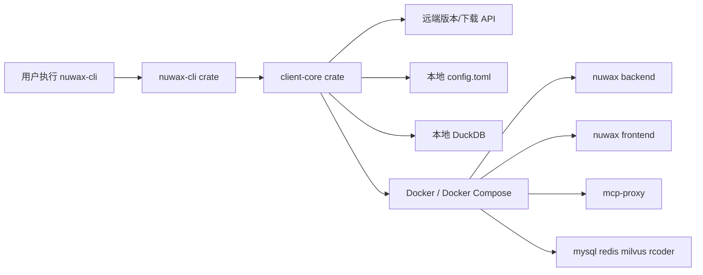

# nuwax-cli 总览

`nuwax-cli` 是 Nuwax 平台的本地部署、升级、备份、回滚和 Docker 服务管理入口。

如果把整个 Nuwax 本地部署链路拆开看：

- `nuwax-cli` 负责“拉包、落盘、改配置、管容器、做备份、执行升级”
- `nuwax_deploy` / `docker-compose.yml` 负责“最终起哪些服务”
- `nuwax` / `nuwax-backend` / `mcp-proxy` / `rcoder` 等仓库提供“真正运行的业务服务”

所以它不是业务服务本身，而是业务服务的“本地运维控制台”。

## 1. 这个仓库解决什么问题

它主要解决 5 类问题：

1. 初始化本地工作目录：生成 `config.toml`、DuckDB、本地缓存目录。
2. 检查和下载部署包：按版本、架构、全量/增量策略下载 Docker 服务包。
3. 管理 Docker 服务：启动、停止、重启、健康检查、镜像加载。
4. 做备份和回滚：在升级前或手动触发时备份 `docker/data`、`docker/app` 等目录。
5. 做自动化升级部署：把“检查版本、下载、停服务、替换文件、起服务”串成一条龙流程。

## 2. 仓库在整体链路里的位置



一句话理解：

`nuwax-cli` 接命令，`client-core` 干重活，最终去操作本地文件、数据库、远端版本服务和 Docker 环境。

## 3. 目录级结构

仓库是一个 Cargo workspace，核心只有两个子项目：

- [../nuwax-cli/Cargo.toml](../../nuwax-cli/Cargo.toml)
- [../nuwax-cli/nuwax-cli](../../nuwax-cli/nuwax-cli/src/lib.rs)
- [../nuwax-cli/client-core](../../nuwax-cli/client-core/src/lib.rs)

分工如下：

| 目录 | 作用 |
| --- | --- |
| `nuwax-cli/` | CLI 入口层，负责命令定义、参数解析、命令分发 |
| `client-core/` | 核心业务层，负责升级、备份、数据库、API、容器管理 |
| `docs/` | 原仓库已有的架构/重构/发布说明 |
| `docker/` | 与 Docker 相关的附属文件 |
| `locales/` | CLI 国际化资源 |

## 4. 先记住的 4 个关键入口

### CLI 程序入口

- [../nuwax-cli/nuwax-cli/src/main.rs](../../nuwax-cli/nuwax-cli/src/main.rs)

作用：

- 初始化 TLS 和语言
- 解析命令行
- 特殊处理 `init`、`status`、`diff-sql`、`auto-upgrade-deploy`、`upgrade download`
- 初始化 `CliApp`
- 把命令交给 `run_command`

### 命令定义

- [../nuwax-cli/nuwax-cli/src/cli.rs](../../nuwax-cli/nuwax-cli/src/cli.rs)

作用：

- 定义所有顶层命令与子命令
- 是理解“这个工具能做什么”的最短路径

### 应用装配中心

- [../nuwax-cli/nuwax-cli/src/app.rs](../../nuwax-cli/nuwax-cli/src/app.rs)

作用：

- 把配置、数据库、API、DockerManager、BackupManager、UpgradeManager 全部装进 `CliApp`
- 把 CLI 命令映射到具体 handler

### 核心业务库入口

- [../nuwax-cli/client-core/src/lib.rs](../../nuwax-cli/client-core/src/lib.rs)

作用：

- 汇总导出 API、配置、升级、备份、数据库、容器、SQL diff 等模块

## 5. 你可以把它粗略拆成三层

### 命令入口层

主要看：

- [main.rs](../../nuwax-cli/nuwax-cli/src/main.rs)
- [cli.rs](../../nuwax-cli/nuwax-cli/src/cli.rs)
- [commands/](../../nuwax-cli/nuwax-cli/src/commands/mod.rs)

负责：

- 用户参数
- 命令路由
- 用户提示和日志输出

### 业务核心层

主要看：

- [upgrade.rs](../../nuwax-cli/client-core/src/upgrade.rs)
- [backup.rs](../../nuwax-cli/client-core/src/backup.rs)
- [database_manager.rs](../../nuwax-cli/client-core/src/database_manager.rs)
- [api.rs](../../nuwax-cli/client-core/src/api.rs)
- [config.rs](../../nuwax-cli/client-core/src/config.rs)

负责：

- 升级策略
- 下载和版本判断
- 备份恢复
- DuckDB 状态持久化
- 配置读写

### 部署交互层

主要看：

- [client-core/src/container/](../../nuwax-cli/client-core/src/container/mod.rs)
- [nuwax-cli/src/docker_service/](../../nuwax-cli/nuwax-cli/src/docker_service/mod.rs)

负责：

- Docker / Docker Compose 检测与调用
- 环境判断
- 宿主机路径、挂载目录、健康检查

## 6. 最常用的命令

```bash
nuwax-cli init
nuwax-cli status
nuwax-cli upgrade
nuwax-cli upgrade download
nuwax-cli docker-service start
nuwax-cli docker-service stop
nuwax-cli backup
nuwax-cli rollback
nuwax-cli auto-upgrade-deploy run
nuwax-cli check-update check
```

如果你当前最关心“它到底怎么部署”，建议优先看：

- [06-部署主链梳理.md](./06-部署主链梳理.md)
- [07-分布式与内部平台改造关注点.md](./07-分布式与内部平台改造关注点.md)
- [08-平台部署视角的容器关系与改造清单.md](./08-平台部署视角的容器关系与改造清单.md)

如果你是第一次看这个仓库，建议下一步看：

- [01-新人快速上手.md](./01-新人快速上手.md)

如果你是研发，建议直接跳：

- [02-源码与架构.md](./02-源码与架构.md)

如果你已经知道命令，但想搞清内部流程，直接看：

- [03-关键流程梳理.md](./03-关键流程梳理.md)
