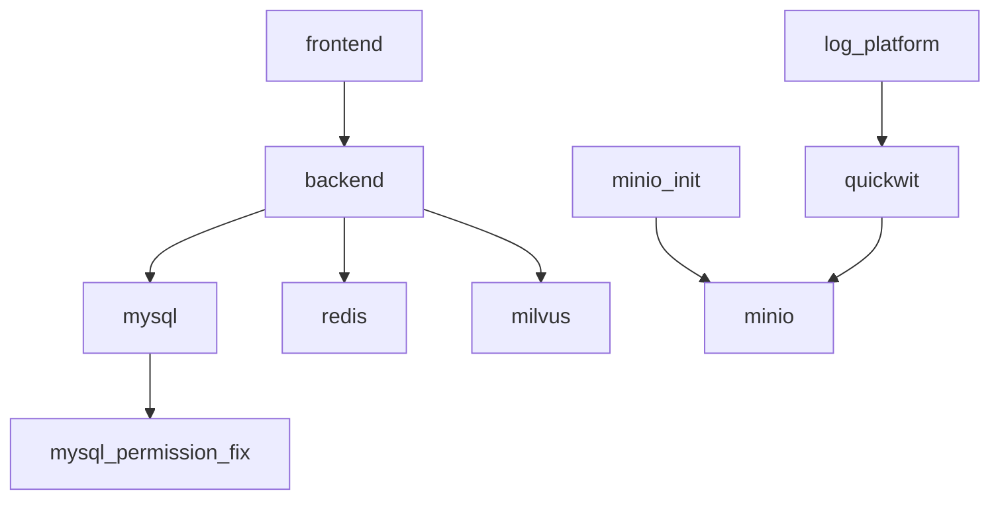

# 平台部署视角的容器关系与改造清单

这篇文档只回答一个问题：

如果后续不使用 `nuwax-cli` 做部署，而是直接接入公司内部平台，我们能不能把服务关系梳理出来，并拆成平台可落地的部署单元？

结论是：可以，而且已经能梳理出主干关系。

但要注意两点：

1. 我们当前拿到的是仓库里的编排样例，不一定等于线上最终编排。
2. 我们已经足够做“平台化第一版部署设计”，但还需要后续和真实环境配置对一次口径。

## 1. 当前判断依据

这次不是从 `nuwax-cli` 命令去倒推，而是直接从仓库里的编排和升级文档去看：

- [client-core/fixtures/docker-compose.yml](../../nuwax-cli/client-core/fixtures/docker-compose.yml)
- [docker/mysql-integration/docker-compose.yml](../../nuwax-cli/docker/mysql-integration/docker-compose.yml)
- [docs/UPGRADE_ARCHITECTURE.md](../../nuwax-cli/docs/UPGRADE_ARCHITECTURE.md)
- [06-部署主链梳理.md](./06-部署主链梳理.md)
- [07-分布式与内部平台改造关注点.md](./07-分布式与内部平台改造关注点.md)

因此，这份文档的重点不是“`nuwax-cli` 怎么调用 Docker”，而是“业务容器之间原本是怎么组织的”。

## 2. 已经能确认的服务集合

从 compose 样例里，可以明确看到下面这些服务：

- `frontend`
- `backend`
- `mcp-proxy`
- `mysql-permission-fix`
- `mysql`
- `redis`
- `milvus`
- `minio`
- `minio-init`
- `quickwit`
- `log_platform`

其中要先区分三类：

### 常驻业务服务

- `frontend`
- `backend`
- `mcp-proxy`
- `log_platform`

### 常驻基础设施服务

- `mysql`
- `redis`
- `milvus`
- `minio`
- `quickwit`

### 一次性初始化任务

- `mysql-permission-fix`
- `minio-init`

这一步很重要，因为平台化时，最后会对应成两种完全不同的资源：

- 常驻服务 -> Deployment / StatefulSet / 长期运行服务
- 一次性初始化任务 -> Job / Init Container / 发布前置任务

## 3. 当前能确认的显式依赖关系

按 compose 里的 `depends_on` 来看，主关系已经比较清晰：

换成文字版：

- `frontend -> backend`
- `backend -> mysql`
- `backend -> redis`
- `backend -> milvus`
- `mysql -> mysql-permission-fix`
- `minio-init -> minio`
- `quickwit -> minio`
- `log_platform -> quickwit`

还有一个相对独立的服务：

- `mcp-proxy`

至少从当前 compose 来看，它没有显式 `depends_on`，说明它更像独立服务，或者依赖外部配置而不是本编排里的其他容器。

## 4. 平台视角下的分层

如果不用 `nuwax-cli`，而是直接用公司内部平台来部署，建议先按下面四层理解。

### 第一层：入口层

- `frontend`

职责：

- 对外提供 Web 访问入口
- 依赖 `backend`

### 第二层：核心业务层

- `backend`
- `mcp-proxy`
- `log_platform`

职责：

- `backend` 是主业务服务
- `mcp-proxy` 提供 MCP 相关能力
- `log_platform` 依赖日志检索链路

### 第三层：基础能力层

- `mysql`
- `redis`
- `milvus`
- `minio`
- `quickwit`

职责：

- 关系型数据
- 缓存
- 向量检索
- 对象存储
- 日志检索

### 第四层：初始化任务层

- `mysql-permission-fix`
- `minio-init`

职责：

- 修目录/文件权限
- 初始化桶或基础资源

## 5. 不能只看 `depends_on`

如果直接迁到平台，只看 `depends_on` 还不够，因为这个仓库里还存在大量“隐式依赖”。

主要有三种：

### 环境变量依赖

例如 `backend` 里可以看到：

- `DATABASE_URL`
- `REDIS_URL`
- `MILVUS_HOST`
- `MILVUS_PORT`
- `MILVUS_URI`
- `DORIS_HOST`
- `DORIS_PORT`
- `DORIS_USER`

这说明：

- `mysql` / `redis` / `milvus` 是明确依赖
- `doris` 很可能是外部依赖，而不是当前 compose 里自带的容器

所以平台化时，不能机械地认为“仓库里没这个容器，就没有这个依赖”。

### 卷挂载依赖

例如当前样例里明显存在这些宿主机目录依赖：

- `./app`
- `./config`
- `./logs`
- `./upload`
- `./data`
- `./script`

这说明当前部署模型默认是“单机目录组织模式”。

平台化后，这些目录通常要被改造成：

- 镜像内静态文件
- 平台配置挂载
- 平台持久卷
- 对象存储
- 初始化任务输入

### 健康检查依赖

compose 里很多服务都是靠 health check 决定依赖是否 ready。

例如：

- `frontend` 等 `backend` healthy
- `backend` 等 `mysql` / `redis` / `milvus` healthy
- `minio-init` 等 `minio` healthy
- `log_platform` 等 `quickwit` healthy

平台化时，这些健康检查要迁移成平台自己的探针，不再依赖 compose 的启动顺序控制。

## 6. 平台化时的推荐拆分

如果我们的目标是“不靠 `nuwax-cli`，直接交给公司内部平台部署”，推荐第一版先这样拆：

### A. 做成长期服务的部分

- `frontend`
- `backend`
- `mcp-proxy`
- `log_platform`

如果公司平台不托管中间件，也可以继续把下面这些一起容器化部署：

- `mysql`
- `redis`
- `milvus`
- `minio`
- `quickwit`

### B. 做成初始化任务的部分

- `mysql-permission-fix`
- `minio-init`

这两个不要按长期服务来建。

更合理的落法是：

- 发布前 Job
- Init Container
- 平台的初始化流水线步骤

### C. 优先替换成平台托管能力的部分

如果公司平台本身提供基础设施，优先考虑替换：

- `mysql`
- `redis`
- `minio`

如果公司内部已经有检索/向量服务，也可以继续评估替换：

- `milvus`
- `quickwit`

这样做的好处是：

- 降低容器编排复杂度
- 降低状态数据迁移难度
- 降低后续升级成本

## 7. 哪些内容可以直接靠重打镜像解决

如果只是为了“先让平台把服务跑起来”，有一部分问题可以通过镜像和部署描述解决：

- 把 `frontend` / `backend` / `mcp-proxy` / `log_platform` 镜像重新打包
- 把环境变量翻译成平台配置项
- 把端口、探针、卷配置翻译成平台部署模板
- 把部分静态文件从宿主机挂载改进镜像

这部分属于运行时适配。

## 8. 哪些内容不能只靠重打镜像解决

下面这些不是“换个镜像”就能消掉的：

### 单机目录模型

当前大量依赖：

- `./config`
- `./logs`
- `./data`
- `./upload`

平台里要改成：

- 配置中心 / ConfigMap
- 持久卷
- 对象存储
- 日志采集标准路径

### 初始化时序

当前靠：

- `mysql-permission-fix`
- `minio-init`
- `depends_on + healthcheck`

平台里要改成：

- Job
- Init Container
- 发布流水线顺序控制

### 外部依赖注入

例如 `DORIS_*` 这类配置，说明最终环境里可能存在 compose 之外的外部中间件。

平台化前必须确认：

- 这些外部依赖是否由平台统一提供
- 还是仍然要在部署单里显式配置连接信息

## 9. 当前已经足够支持的判断

基于现在仓库里的材料，我们已经足够支持下面这些工作：

1. 画出主要容器关系图
2. 区分常驻服务和一次性初始化任务
3. 区分容器内依赖和外部依赖
4. 设计平台部署的第一版服务拆分
5. 识别哪些部分能只靠镜像迁移，哪些必须做平台适配

## 10. 当前还需要补的口径

如果后面要进入实施阶段，还需要补三类确认：

### 真实生产编排

要确认当前 `client-core/fixtures/docker-compose.yml` 是不是只用于测试/演示，还是已经接近真实部署。

### 外部依赖清单

要确认这些是否由外部提供：

- `Doris`
- 统一对象存储
- 统一日志系统
- 统一向量检索基础设施

### 状态目录归属

要确认这些目录最终归谁管理：

- `data`
- `logs`
- `upload`
- `config`

因为这会直接决定平台卷、对象存储、配置中心怎么拆。

## 11. 建议的下一步

如果我们后续真的要做“去 `nuwax-cli` 的平台部署”，建议按这个顺序推进：

1. 先把当前服务拆成“常驻服务 / 初始化任务 / 外部依赖”
2. 再把宿主机目录拆成“镜像内文件 / 配置 / 持久卷 / 对象存储”
3. 再决定哪些基础设施继续自建容器，哪些替换成平台托管能力
4. 最后再设计平台部署模板和发布流水线

一句话总结：

不依赖 `nuwax-cli`，我们依然可以把容器关系梳理出来；真正的难点不是“找不到关系”，而是把原本单机 compose 模式拆成平台能接住的长期服务、初始化任务、外部依赖和持久化资源。
