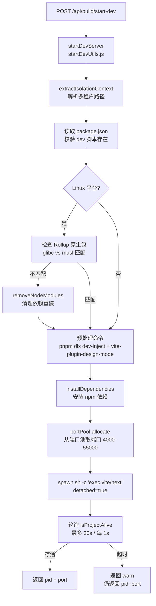

# nuwax-file-server：Dev Server 管理

nuwax-file-server 对前端项目的开发服务器（Vite/Next.js）进行完整的生命周期管理：启动、保活、停止、重启、日志采集。这是 nuwaclaw 桌面客户端本地开发能力的核心机制。

## 1. 启动流程全貌



### 关键设计点

**`exec` 替换 shell 进程**：启动命令为 `exec vite ...`（而非 `sh -c vite ...`），让 `child.pid` 直接对应 vite/next 进程本身，而不是 shell 进程，后续 kill 更精准。

**`detached: true`**：子进程脱离父进程控制，nuwax-file-server 重启不会杀死已运行的 dev server。

**环境变量极简原则**：spawn 时只注入 `PATH`、`NODE_ENV=development`、端口相关变量，不透传父进程的全部环境，防止生产配置污染 dev 进程。

**预处理命令（尽力而为）**：
```bash
set +e
pnpm dlx @xagi/dev-inject@latest install --framework
pnpm dlx @xagi/vite-plugin-design-mode@latest install
set -e
```
`set +e` 保证即使两个预处理命令失败也不阻断后续启动。这就是 `xagi/dev-inject` 和 `vite-plugin-design-mode` 在学习路线里被列为"生态扩展仓库"的原因：它们被 nuwax-file-server 在每次启动时动态注入到项目里。

## 2. 端口池（portPool.js）

内存级单例，进程内全局唯一：

```
可用端口：4000–55000（跳过 8000–9000 保留段）
allocatedPorts: Map<projectId, port>    // 已分配
availablePorts: Set<port>               // 可用池
```

| 操作 | 时机 | 说明 |
|------|------|------|
| `allocate(projectId)` | 启动 dev server 前 | 幂等：同一项目复用已分配端口 |
| `release(projectId)` | 启动失败 / stop-dev | 归还端口到可用池 |
| `getStatus()` | `/api/build/port-pool-status` | 查看当前分配情况 |

容器重启后进程全部释放，内存状态也随之清零，不需要持久化。

## 3. 进程注册表（processManager.js）

```
runningDevProcesses: Map<projectId, { pid, logPath, startedAt, port }>
startingProjects:    Set<projectId>   // 启动锁，防并发重复启动
```

停止进程策略（killProcess）：
1. 优先 `process.kill(-pid)`：向**进程组**发 SIGTERM，连同子进程一起杀（Vite 会 spawn 子进程）
2. 失败则 `process.kill(pid)`：只杀单个进程
3. 等待 100ms 验证进程确实退出

## 4. 日志双写机制

每次 dev server 启动生成两个日志文件：

| 文件 | 用途 |
|------|------|
| `dev-{YYYY-MM-DD}.log` | **主日志**，按日期滚动，长期保存 |
| `dev-temp-{timestamp}.log` | **临时日志**，用于端口解析后删除 |

所有 stdout/stderr 通过 `safeWrite()` 写入两个流，每行自动加东八区时间戳 `[YYYY/MM/DD HH:mm:ss]`。写入前检查流是否已销毁（`stream.destroyed`），避免子进程意外退出后写入已关闭的流报错。

**LogCacheManager** 缓存日志内容到内存（`Map<projectId, lines[]>`），`/api/build/get-dev-log` 优先读缓存，避免频繁 I/O。跨天日志文件路径变化时自动失效旧缓存。

## 5. libc 匹配检测

在 Linux 上，如果项目 `node_modules/.pnpm/` 中存在 `@rollup+rollup-linux-x64-gnu` 原生包，但当前系统是 musl（Alpine）——或反之——Vite 启动会报原生模块加载错误。检测逻辑：

```
有 glibc 版本  → glibc 系统，需要 -gnu 包
无 glibc 版本  → 视为 musl 系统，需要 -musl 包
```

不匹配时调用 `removeNodeModules()` 清理 `node_modules`，下次 `installDependencies` 重装正确变体。同时设置 `ROLLUP_WASM=1` / `ROLLUP_DISABLE_NATIVE=1` 作为备用回退（优先使用 WASM/JS 实现，跳过 .node 原生模块）。

## 6. 存活轮询（isProjectAlive）

```
启动子进程
  └── 等待 1s（框架初始化）
    └── 每 1s 轮询一次 HTTP GET :{port}/
      └── 成功 → 返回 alive
      └── 30s 超时 → 记录 WARN，仍返回 pid+port（框架可能启动慢）
```

超时不代表失败，调用方根据后续 keep-alive 心跳再判断是否真正可用。

## 7. 只支持 Vite 和 Next.js

`startDev_NonBlocking` 明确检测 devScript 中是否包含 `vite` 或 `next`，不满足直接抛 `BusinessError`。两种框架的命令构造有差异：

- **Vite**：先用 `sanitizeCliFlags` 移除已有的 `--host`/`--base`，再追加端口池分配的端口和 `--host 0.0.0.0`，防止重复参数冲突
- **Next.js**：直接追加 `-p {port}`

## 一句话总结

nuwax-file-server 的 dev server 管理通过端口池（4000-55000）、进程注册表（Map）、双日志流（主日志+临时日志）、30s 存活轮询四个机制，支持 Vite/Next.js 项目的并发启动，并在 Linux 上自动检测 glibc/musl 原生包不匹配并清理重装。
