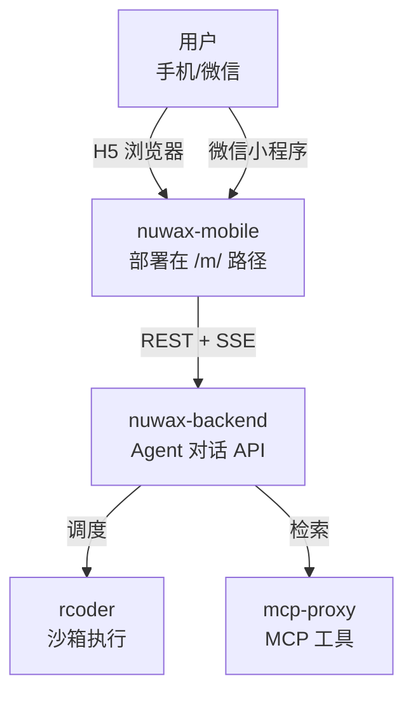

# nuwax-mobile 总览

`nuwax-mobile` 是 Nuwax 平台的**移动端 AI Agent 应用**，基于 UniApp X（Vue 3）构建，一套代码同时支持 H5 和微信小程序两个目标平台。用户通过它浏览 Agent、发起流式对话、语音输入、文件预览，并通过微信授权、手机号等方式登录。

一句话定位：`nuwax-mobile` = **Nuwax Web 平台的移动端延伸**，通过 UniApp X 统一跨端，消费 `nuwax-backend` 的同一套 REST + SSE API。

## 1. 在平台中的位置



nuwax-mobile 与 `nuwax`（Web 前端）共用同一个 `nuwax-backend`，区别在于：
- 运行在移动端（UniApp X 编译目标）
- 组件库和渲染引擎适配小程序/H5 双端
- 使用 `uni.request` + chunked 实现 SSE（小程序无原生 EventSource）

## 2. 目录结构

```
nuwax-mobile/
├── pages/                 主包页面（首次进入即加载）
│   ├── index/             首页（Agent 推荐）
│   ├── agent-list/        Agent 列表
│   ├── agent-union-record/ 使用记录
│   └── page-app/          App 页面容器
├── subpackages/pages/     分包（按需加载，减小主包体积）
│   ├── chat-conversation-component/  聊天界面（核心）
│   ├── agent-detail/      Agent 详情
│   ├── login/             手机号登录
│   ├── login-weixin/      微信授权登录
│   ├── file-preview-page/ 文件预览（DOCX/XLSX/PDF…）
│   └── …
├── servers/               API 层（UTS，调用 nuwax-backend）
│   ├── conversation.uts   对话/会话接口
│   ├── agentDev.uts       Agent 信息接口
│   ├── account.uts        账户/登录接口
│   └── useRequest.uts     通用 HTTP 请求封装
├── components/            可复用组件
│   ├── markdown-renderer/ Markdown 渲染（mp-html + markdown-it）
│   ├── voice-recorder-button/ 语音录入按钮
│   └── …
├── utils/
│   ├── streamRequest.uts  流式请求（SSE 多端适配）
│   ├── sseDataProcessor.uts SSE 数据解析
│   └── utf8.uts           多字节字符解码
└── pages.json             路由与分包配置
```

## 3. 核心：流式对话（SSE 多端适配）

聊天界面通过 `StreamRequest` 类统一接收 AI 流式响应。三个平台的底层实现不同，但对业务层透明：

```
业务层（chat-conversation-component）
    ↓ StreamRequest.request(config)
流式请求层（utils/streamRequest.uts）
    ├── H5：@microsoft/fetch-event-source（原生 EventSource API）
    ├── 微信小程序：uni.request + enableChunked: true（分块回调）
    └── App：uni.request + 流处理
    ↓
SSE 数据处理器（sseDataProcessor.uts）
    ↓
业务回调：onMessage / onError / onComplete
```

### 小程序 SSE 的关键处理

微信小程序不支持原生 EventSource，使用 `uni.request` 的 `enableChunked: true` 模式接收分块数据，配合自定义 UTF-8 多字节字节序列缓冲（`utf8.uts`）防止中文字符被截断。60 秒超时监控由 `TIMEOUT_DURATION` 常量控制，没有收到新 chunk 时触发 `onTimeout` 回调。

## 4. Markdown 渲染与工具调用显示

聊天界面的 AI 回复通过 `markdown-renderer` 组件渲染，底层是 `mp-html`（UniApp 社区组件）+ `markdown-it` + `markdown-it-container` 插件。

工具调用进度（Tool Use）以 `:::container` 语法内嵌在 Markdown 中：

```markdown
:::container executeId="xxx" type="Page" status="EXECUTING"
:::
```

`mp-html` 的 `node.vue` 识别 `<container>` 标签，与 `processingList`（实时进度数据）合并后渲染 `container.vue` 组件，显示工具执行状态和详情。

## 5. 主要 API（nuwax-backend）

| 接口 | 说明 |
|------|------|
| `GET /api/home/list` | 首页 Agent 分类列表 |
| `GET /api/published/agent/:id` | Agent 详情 |
| `POST /api/agent/conversation/create` | 创建会话 |
| `POST /api/agent/conversation/list` | 查询历史会话 |
| SSE `/api/agent/conversation/chat/stream` | 流式对话（核心）|
| `POST /api/agent/conversation/chat/stop/:id` | 停止对话 |
| `POST /api/agent/conversation/chat/suggest` | 问题建议 |
| `POST /api/temp/chat/completions` | 临时会话（免登录体验）|
| `GET /api/user/agent/used/list/:size` | 最近使用的 Agent |

## 6. 技术栈

| 技术 | 用途 |
|------|------|
| UniApp X（Vue 3）| 跨端框架（H5 + 微信小程序）|
| UTS（UniApp TypeScript）| 业务逻辑，编译为各平台原生代码 |
| Vite | 构建工具 |
| mp-html | Markdown / 富文本渲染引擎 |
| markdown-it + markdown-it-container | Markdown 解析 + 自定义容器语法 |
| @microsoft/fetch-event-source | H5 SSE 客户端 |
| uni.request chunked | 小程序 SSE 实现 |
| HBuilderX | 官方推荐 IDE（UniApp X 编译依赖）|

## 7. 平台适配细节

| 能力 | H5 | 微信小程序 |
|------|----|------------|
| SSE 流式接收 | EventSource / fetch-event-source | uni.request + enableChunked |
| 登录方式 | 手机号验证码、微信 OAuth | 微信 open-type 授权 |
| 文件预览 | iframe / object | 小程序文件预览 API |
| 语音输入 | Web MediaRecorder | uni.getRecorderManager |
| 部署路径 | `{domain}/m/` | 微信小程序包 |

## 8. 分包策略

`pages.json` 把聊天界面、详情页、登录页、文件预览等放入 `subpackages`（分包），首页和 Agent 列表留在主包，减小初始加载体积，满足微信小程序主包 2MB 限制。

## 一句话总结

`nuwax-mobile` 是 Nuwax 平台的 UniApp X 移动客户端，通过分包 + 多端 SSE 适配实现 H5 和微信小程序的统一 AI Agent 对话体验，Markdown + container 语法使工具调用进度在移动端也能实时可视化呈现。
