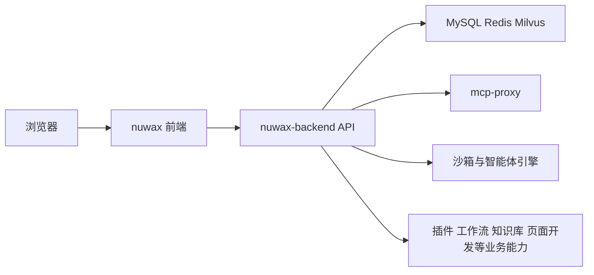

# nuwax 前端总览

`nuwax` 是 Nuwax 平台的 Web 前端主工程。

如果把它放进整条产品链路里看：

- `nuwax` 负责 Web 端页面、交互、路由、权限、主题、国际化、前端工作台
- `nuwax-backend` 负责接口、业务状态、菜单权限、资源管理、会话能力
- `mcp-proxy`、沙箱、模型/知识库/插件等后端能力通过 `nuwax-backend` 或专项接口间接暴露给前端

一句话理解：

`nuwax` 不是一个轻量官网，而是 Nuwax 平台的大型业务前端控制台。

## 1. 这个仓库解决什么问题

它主要承载 6 类前端能力：

1. 登录、鉴权、租户控制、菜单权限
2. 智能体对话、临时对话、历史会话
3. 工作空间开发台：智能体、插件、工作流、MCP、知识库、数据表、页面开发
4. 广场与开放应用：发布、订阅、订单、收益、API Key
5. 系统管理后台：日志、任务、菜单权限、模型监控、订阅积分
6. Web IDE / AI Agent AppDev 等增强能力

## 2. 仓库在整体链路里的位置

这个仓库本质上是：

- 面向最终用户的主 Web 应用
- 面向管理员/开发者的统一控制台
- 面向 AI/Agent 场景的复杂业务前端

## 3. 先记住的 6 个关键入口

### 工程脚本与依赖

- [package.json](../../nuwax/package.json)

看点：

- `React 18`
- `@umijs/max 4`
- `Ant Design 5`
- `pnpm`
- `vitest`
- 构建脚本 `max build` / 开发脚本 `max dev`

### Umi 配置入口

- [config/config.ts](../../nuwax/config/config.ts)

看点：

- Umi 全局配置
- 路由注册
- 国际化
- Ant Design 主题
- PC/H5 双向跳转脚本
- Monaco / 静态资源复制

### 路由总入口

- [src/routes/index.ts](../../nuwax/src/routes/index.ts)

看点：

- 登录页与开放页
- 主布局下的业务页面分区
- 工作空间、广场、系统管理、更多页面

### 运行时入口

- [src/app.tsx](../../nuwax/src/app.tsx)

看点：

- `getInitialState`
- 用户信息拉取
- 菜单加载
- 全局主题与语言
- 全局错误处理
- 版本更新提示

### 主布局入口

- [src/layouts/index.tsx](../../nuwax/src/layouts/index.tsx)

看点：

- 响应式菜单
- 移动端布局
- 页面主容器
- 一级/二级菜单联动

### 请求与接口基础层

- [src/services/common.ts](../../nuwax/src/services/common.ts)

看点：

- 统一请求拦截器
- token 注入
- 错误码处理
- 登录失效跳转
- `process.env.BASE_URL + url`

## 4. 技术栈一句话结论

这是一个：

- `React 18 + TypeScript`
- `Umi Max 4`
- `Ant Design 5 + ProComponents`
- `Umi request`
- `ahooks`
- `Monaco`
- `AntV X6 / G6`
- `Zustand`

的大型平台型前端工程。

## 5. 页面版图一句话结论

从目录结构看，这个仓库不是“几个页面”，而是多个子系统拼成的一体化前端：

- 对话与首页
- 工作空间开发体系
- 广场与发布体系
- OpenApp / 订阅 / 收益体系
- 系统管理后台
- AppDev / Web IDE / 工作流编排体系

## 6. 如果你现在最关心什么

如果你最关心“前端整体长什么样”，建议优先看：

- [01-技术栈与运行时.md](./01-技术栈与运行时.md)
- [02-路由与页面版图.md](./02-路由与页面版图.md)

如果你最关心“它怎么调后端”，建议看：

- [03-接口层与后端交互.md](./03-接口层与后端交互.md)

如果你最关心“它怎么打包上线”，建议看：

- [04-部署与打包.md](./04-部署与打包.md)

如果你想快速开始学习，直接看：

- [05-阅读路径.md](./05-阅读路径.md)
