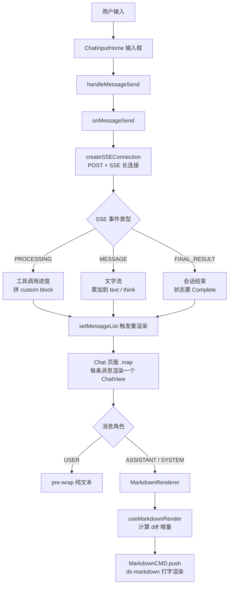

# Agent 聊天渲染链路

## 1. 这条链路解决什么问题

用户在聊天框里发一条消息，AI 的回答是怎么一字一字"打"出来的，又是怎么支持 Markdown、代码高亮、数学公式、Mermaid 图表、工具调用进度、思考过程的？

这条链路横跨：

- 消息发送与 SSE 连接管理
- 全局消息状态的维护
- 消息气泡组件的渲染分支
- 流式 Markdown 的增量 push 机制

## 2. 整体链路一图看清



## 3. 第一层：消息发送与 SSE 连接

核心文件：

- [src/models/conversationInfo.ts](../../nuwax/src/models/conversationInfo.ts)
- [src/utils/fetchEventSourceConversationInfo.ts](../../nuwax/src/utils/fetchEventSourceConversationInfo.ts)

用户点击发送，进入 `onMessageSend()`，它会：

1. 把用户消息立刻追加进 `messageList`（先插一条 `Loading` 状态的 AI 占位消息）
2. 调 `createSSEConnection` 建立 SSE 长连接
3. 每收到一条 SSE 事件，就调 `handleChangeMessageList()` 更新消息状态

SSE 事件分三类：

- `PROCESSING`：AI 正在调用某个工具/组件，把进度信息拼进消息文本的 custom block 里
- `MESSAGE`：AI 正在输出文字，把新字符追加到 `currentMessage.text` 或 `currentMessage.think`
- `FINAL_RESULT`：本轮会话结束，状态置为 `Complete`，触发问题建议查询

每次事件处理完，都通过 `setMessageList(prev => [...])` 更新 React 状态，驱动下游重渲染。

## 4. 第二层：全局消息状态管理

核心文件：

- [src/models/conversationInfo.ts](../../nuwax/src/models/conversationInfo.ts)

这是整个聊天页最重的 Umi model，用 `useModel('conversationInfo')` 在页面和组件之间共享。

它主要维护：

- `messageList`：当前会话的消息数组，所有渲染的数据源
- `conversationInfo`：会话元信息（包含 agent 快照）
- `isConversationActive`：会话是否进行中，用于控制导航拦截
- `isFileTreeVisible` / `viewMode`：文件树面板的可见性和当前视图（preview / desktop）
- `cardList`：卡片展示台数据

这个 model 同时还负责：

- 会话主题自动更新（`updateTopicOnce`）
- 文件树数据加载与节流刷新
- 远程桌面容器保活轮询（`runKeepalivePodPolling`，60s 一次）
- 加载更多历史消息（上滑到顶触发，`handleLoadMoreMessage`）
- 滚动到底部控制（`allowAutoScrollRef` 控制是否跟随新消息自动置底）

## 5. 第三层：Chat 页面的布局与消息列表渲染

核心文件：

- [src/pages/Chat/index.tsx](../../nuwax/src/pages/Chat/index.tsx)

Chat 页面是最外层容器，它做三件事：

**组装布局**

用 `ResizableSplit` 实现左右分栏：

- 左侧：聊天区域（消息列表 + 输入框）
- 右侧：`PagePreviewIframe`（页面预览）或 `FileTreeView`（文件树/VNC）

`AgentSidebar`（智能体详情侧边栏）在文件树隐藏时才显示，三者之间互斥。

**渲染消息列表**

```tsx
{messageList.map((item: MessageInfo) => (
  <ChatView
    key={`${item.id}-${item?.index}`}
    messageInfo={item}
    roleInfo={roleInfo}
    mode={'home'}
    conversationId={id}
  />
))}
```

**处理滚动**

用 `allowAutoScrollRef` 判断是否跟随新消息自动滚底。用户手动上滑后暂停自动滚动，点击"回到底部"按钮后恢复。

## 6. 第四层：ChatView 消息气泡渲染

核心文件：

- [src/components/ChatView/index.tsx](../../nuwax/src/components/ChatView/index.tsx)

`ChatView` 用 `memo` 包裹，以 `isEqual(prevProps.messageInfo, nextProps.messageInfo)` 为条件，只要消息内容没变就不重渲染。

它按角色走两条分支：

**用户消息（USER）**

- 直接用 `white-space: pre-wrap` 输出原始文字
- 右下角挂一个复制按钮

**AI 消息（ASSISTANT / SYSTEM）**

- 如果有 `think` 字段：渲染一个可折叠的"思考过程"块（BulbOutlined 图标），展开后显示思考内容
- 主内容交给 `MarkdownRenderer` 渲染
- 消息状态为 `Incomplete` 或 `Loading` 时，加 `typing` CSS class 显示打字光标动画
- 会话结束（`Complete`）后，底部出现复制、点赞等操作按钮（`ChatSampleBottom`）

## 7. 第五层：MarkdownRenderer 与增量 push 机制（最核心）

核心文件：

- [src/components/MarkdownRenderer/index.tsx](../../nuwax/src/components/MarkdownRenderer/index.tsx)
- [src/hooks/useMarkdownRender.ts](../../nuwax/src/hooks/useMarkdownRender.ts)

这里是"打字效果"的真正实现。

### useMarkdownRender：只 push 差量

`useMarkdownRender` 不会每次把整段文字全量重渲染，而是记录上一次已 push 的位置，每次只把新增的字符 push 进去：

```ts
const diffText = answer.slice(lastTextPos.current['answer'])
markdownRef.current?.push(diffText, 'answer')
lastTextPos.current['answer'] = answer.length
```

有一种情况会触发全量更新：当 `answer` 发生分组转换（比如插件在输出中间插入了 custom block），新的 `answer` 不再以旧的 `answer` 为前缀，此时先 `clear()` 再从头全量 push。

思考内容（`think`）走同样的增量逻辑，但优先级低于 `answer`。

### MarkdownRenderer：ds-markdown 驱动打字

`MarkdownRenderer` 使用 `ds-markdown` 库的 `MarkdownCMD` 组件，核心配置：

- `timerType="requestAnimationFrame"`：用浏览器 rAF 驱动每帧渲染，不卡 UI 线程
- `interval={30}`：每 30ms 输出一批字符，产生自然打字节奏
- `disableTyping={true}`：历史消息查看时关闭打字动画，直接全量展示

挂载的插件：

- `mermaidPlugin`：渲染 Mermaid 流程图/序列图
- `katexPlugin`：渲染 LaTeX 数学公式
- `genCustomPlugin(conversationId)`：渲染工具调用结果、卡片、自定义 block 等平台扩展内容

## 8. 特殊渲染能力：SSE 事件触发的 UI 扩展

除了消息气泡本身，SSE 在流式过程中还会触发几类额外的 UI 变化：

**Page 预览 iframe**

SSE `PROCESSING` 事件中，当 `type === 'Page'` 时，右侧会弹出一个 `PagePreviewIframe`，把 AI 生成的页面嵌入进来实时预览。

**展示台卡片**

SSE `PROCESSING` 事件中，当 `cardBindConfig` 和 `cardData` 都有值时，右侧的 `ShowStand` 展示台会自动弹出，展示卡片列表或单张卡片。

**远程桌面（VNC）**

SSE `PROCESSING` 中出现 `OPEN_DESKTOP` 事件，且智能体未隐藏桌面时，右侧自动切换到 VNC 视图（通过 `noVNC` 内嵌远程桌面）。

**文件树刷新**

SSE `PROCESSING` 中出现 `ToolCall` 事件，且当前文件树处于 preview 模式时，自动节流刷新文件列表（2s 节流）。

## 9. 一句话总结

后端 SSE 推流 → `conversationInfo` model 逐帧 `setMessageList` → `ChatView` memo 按角色分支渲染 → `useMarkdownRender` 做增量 diff push → `ds-markdown` 的 `MarkdownCMD` 以 rAF + 30ms 节奏输出打字效果，同时解析 Mermaid / KaTeX / 自定义 block 插件；SSE 过程中还会联动右侧面板（预览页面 / 卡片展示台 / 远程桌面）。
