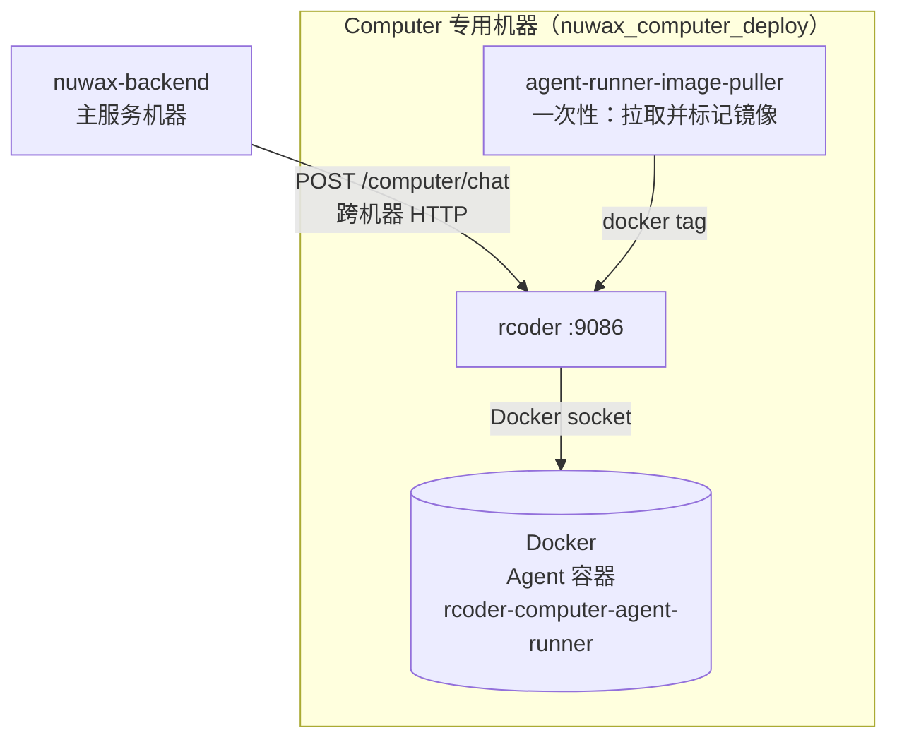

# nuwax_computer_deploy 总览

`nuwax_computer_deploy` 是 **Computer Agent 沙箱服务的独立部署包**，只包含 `rcoder` 一个服务。它供需要把 Agent 沙箱执行环境单独部署到另一台（通常更高配）机器时使用，与 `nuwax_deploy` 主服务解耦。

一句话定位：`nuwax_computer_deploy` = **rcoder 单独部署包**，把 Computer Agent 沙箱从主服务机器剥离出去独立运行，适合沙箱需要大量 CPU/内存/GPU 资源的生产场景。

## 1. 与 nuwax_deploy 的对比

| 维度 | nuwax_deploy | nuwax_computer_deploy |
|------|--------------|-----------------------|
| 包含服务 | frontend + backend + 全套中间件 + rcoder | **只有 rcoder** |
| 定位 | 主服务一体包 | 沙箱单独部署包 |
| rcoder 宿主机端口 | :8086, :8088, :8099, :60000 | :9086, :9088, :9099, :60001（偏移避冲突）|
| 网络名 | agent-network | agent-compouter-network |
| 适用场景 | 单机一体部署 | 沙箱单独部署到大内存/GPU 机器 |

## 2. 包含的服务



| 服务 | 说明 |
|------|------|
| `agent-runner-image-pre-pull` | 一次性：触发 `docker compose pull` 预拉取 agent-runner 镜像 |
| `agent-runner-image-puller` | 一次性：给镜像打简短本地标签（`rcoder-computer-agent-runner:latest`、`rcoder:latest`）|
| `rcoder` | 主服务，端口映射到 9086/9088/9099/60001 |

## 3. 镜像管理设计

Computer Agent 容器（Agent Runner）的镜像体积大，启动时才 `docker pull` 会导致首次等待过长。`nuwax_computer_deploy` 通过两个一次性容器解决这个问题：

```
docker compose pull
    → 触发 agent-runner-image-pre-pull 拉取 agent-runner 镜像（宿主机上缓存）

docker compose up
    → agent-runner-image-puller 运行：
        1. docker pull <registry>/rcoder-computer-agent-runner:latest
        2. docker tag <registry>/... rcoder-computer-agent-runner:latest（简短名）
        3. docker pull <registry>/rcoder:latest
        4. docker tag ... rcoder:latest
    → rcoder 启动，直接用本地已有的 rcoder-computer-agent-runner:latest 镜像
```

## 4. rcoder 关键挂载

```
./docker.sock                  → /var/run/docker.sock (只读)  ← 创建 Agent 容器
./config/rcoder/config.yml     → /app/config.yml
./project_workspace            → /app/project_workspace
./computer-project-workspace   → /app/computer-project-workspace
./computer-cache               → /root/.cache   ← npm/uv 包缓存
./config/rcoder/wallpaper      → /app/assets    ← VNC 壁纸
```

与 `nuwax_deploy` 中 rcoder 挂载相同，区别是多了 `wallpaper` 目录挂载（Computer Agent 专用）。

## 5. 启动命令

```bash
# 进入 docker-computer 目录
cd nuwax_computer_deploy/docker-computer/

# 先拉镜像（触发预拉取）
docker compose pull

# 启动（一次性容器完成镜像标记后，rcoder 自动启动）
docker compose up -d
```

## 6. 端口速查

| 功能 | 宿主机端口 | 容器端口 |
|------|-----------|---------|
| rcoder HTTP API | :9086 | :8086 |
| rcoder Pingora 反向代理 | :9088 | :8088 |
| rcoder nginx（项目预览）| :9099 | :80 |
| nuwax-file-server | :60001 | :60000 |

`nuwax-backend` 的 `rcoder.base-url` 配置需指向这台机器的 `:9086`。

## 7. rcoder 启动入口差异

Computer 部署包的 rcoder entrypoint 在主服务包的基础上多了清理步骤：

```bash
# nuwax_computer_deploy 版本
entrypoint: ["sh", "-c", "rm -f /run/dbus/pid /var/run/dbus/pid /tmp/dbus-* ...; exec /bin/bash /app/start-services.sh"]
```

用于清理上次异常退出遗留的 dbus/supervisor pid 文件，避免容器重启失败。

## 一句话总结

`nuwax_computer_deploy` 把 rcoder 从主服务包剥离成独立的 Docker Compose 部署单元，通过两个一次性容器预拉取并标记 Agent Runner 镜像，让沙箱服务可以部署到资源充足的专用机器，端口整体偏移（9086/9088）避免与主服务冲突。
