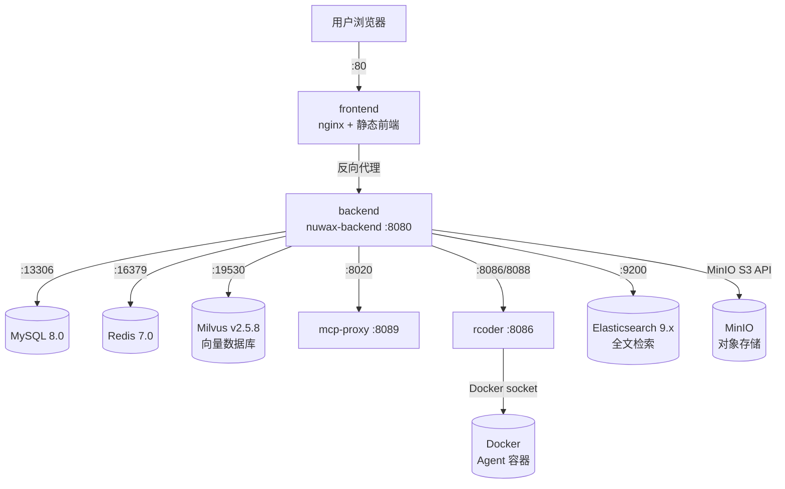

# nuwax_deploy 总览

`nuwax_deploy` 是 **Nuwax 主服务的 Docker Compose 部署包**。它把平台所有服务（前端、后端、数据库、向量库、MCP 代理、rcoder 沙箱等）组织到一个 `docker-compose.yml` 中，通过 `deploy.sh` 一键拉起。

一句话定位：`nuwax_deploy` = **平台主服务的完整部署单元**，运维人员只需要这一份包就能在一台服务器上跑起整个 Nuwax 平台。

## 1. 包含的服务（docker-compose.yml）



| 服务 | 镜像 | 宿主机端口 | 说明 |
|------|------|-----------|------|
| `frontend` | agent-platform-front | :80 | nginx 静态前端 |
| `backend` | agent-platform-backend | :8080, :6443 | nuwax-backend Java 服务 |
| `mcp-proxy` | mcp-proxy | :8020 (→8089) | MCP 协议代理 |
| `rcoder` | rcoder | :8086, :60000, :8088, :8099 | Agent 沙箱主控 |
| `mysql` | mysql:8.0 | :13306 | 主数据库 |
| `redis` | redis:7.0 | :16379 | 缓存 / 会话 |
| `milvus` | milvusdb/milvus:v2.5.8 | :19530, :9091 | 向量检索 |
| `minio` | MinIO | S3 API | 文件对象存储 |
| `elasticsearch` | elasticsearch:9.2.1 | :9200 | 全文检索 |
| `quickwit` | Quickwit | 日志 API | 日志平台 |
| `log_platform` | — | — | 日志聚合 |

> `mysql-permission-fix` / `elasticsearch-permission-fix` / `minio-init` 是一次性初始化容器（`restart: "no"`），确保数据目录权限正确后即退出。

## 2. 目录结构

```
nuwax_deploy/docker/
├── docker-compose.yml     核心编排文件
├── deploy.sh              一键部署脚本（含端口参数）
├── health-restart.sh      后台健康检查自愈脚本
├── backup.sh              手动/自动备份脚本
├── config/
│   ├── nginx.conf         前端 nginx 配置
│   ├── application-external.yml  backend 外部配置覆盖
│   ├── mcp_config.yml     mcp-proxy 服务配置
│   └── rcoder/config.yml  rcoder 配置
├── data/                  各服务持久化数据（mysql/redis/milvus/…）
├── logs/                  各服务日志
└── app/                   Java jar 包、前端静态文件
```

## 3. 关键挂载关系

### rcoder 挂载（核心）

```
./data/docker.sock      → /var/run/docker.sock  (只读)  ← rcoder 用它创建 Agent 容器
./config/rcoder/config.yml → /app/config.yml
./project_workspace     → /app/project_workspace  ← 普通 Agent 工作目录
./computer-project-workspace → /app/computer-project-workspace  ← Computer Agent 工作目录
./computer-cache        → /root/.cache   ← npm/uv/pnpm 包缓存（跨容器复用）
```

### backend 挂载

```
./config/application-external.yml → /app/config/  ← 覆盖 Spring Boot 外部配置
./upload                           → /app/upload   ← 用户上传文件
./data/jwt/                        → /app/config/jwt
```

## 4. 启动顺序（健康检查依赖链）

```
mysql + redis + milvus（健康）
        ↓
    backend（就绪）
        ↓
    frontend（就绪）
```

`mcp-proxy` 和 `rcoder` 独立启动，不阻塞 frontend/backend 启动链。

## 5. 运维命令

```bash
# 首次部署（或指定端口）
sudo ./deploy.sh
sudo ./deploy.sh -p 8090

# 启停管理
sudo ./deploy.sh start
sudo ./deploy.sh stop
sudo ./deploy.sh restart

# 后台健康自愈（backend 连续 3 次健康检查失败时自动重启）
sudo sh -c 'nohup ./health-restart.sh > health-monitor.log 2>&1 &'

# 手动备份（MySQL + Redis + Milvus + data 目录）
./backup.sh
```

## 6. 初始登录

| 字段 | 值 |
|------|-----|
| 管理员邮箱 | `admin@nuwax.com` |
| 初始密码 | `123456` |
| 首次配置 | 系统管理 → 系统配置 → 站点访问地址（改为实际 IP 或域名）|

## 7. 与 nuwax_computer_deploy 的关系

`nuwax_deploy` 是**主服务包**，包含完整的业务功能（含 rcoder）。`nuwax_computer_deploy` 是**独立 Computer Agent 部署包**，只包含 rcoder，供需要将沙箱单独部署到另一台机器时使用（端口偏移到 9086/9088/9099 避免冲突）。

## 一句话总结

`nuwax_deploy` 是 Nuwax 平台的一站式 Docker Compose 部署包，通过 `deploy.sh` 拉起 frontend/backend/mcp-proxy/rcoder 及 MySQL/Redis/Milvus/MinIO/Elasticsearch 共 10+ 个服务，rcoder 通过 Docker socket 挂载在宿主机上动态创建 Agent 子容器。
