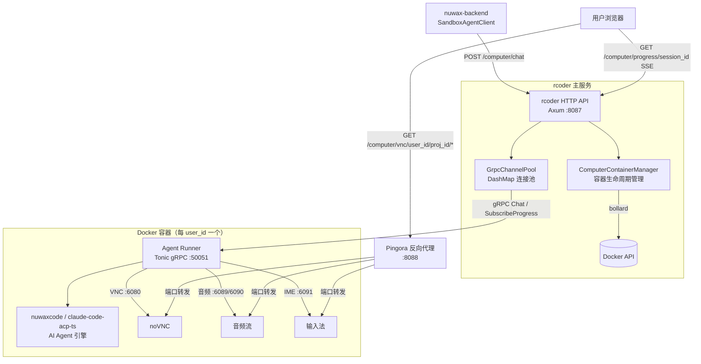

# rcoder 总览

`rcoder` 是 Nuwax 平台的 **Agent Computer 主控层**，用 Rust 编写。它负责把来自 `nuwax-backend` 的 AI 任务请求转化为容器化的执行环境：创建 Docker 容器、启动容器内的 Agent Runner、通过 gRPC 下发任务、把进度流转换为 SSE 推回调用方，并提供 VNC 远程桌面、音频流、IME 输入法代理等 Computer Agent 能力。

一句话定位：`rcoder` = **AI 任务 → Docker 容器 → Agent 执行 → SSE 流 的全链路调度器**。

## 1. 它解决什么问题

`nuwax-backend` 的 `TaskAgent`（沙箱模式）需要一个独立的安全执行环境，以便 AI 代理能自由执行代码、操作文件系统、使用浏览器。`rcoder` 做的事：

1. 按 `user_id` / `project_id` 维度**创建、复用、清理 Docker 容器**
2. 在容器内启动 **Agent Runner**（`nuwaxcode` 或 `claude-code-acp-ts`），暴露 gRPC 服务
3. 把外部 HTTP 请求**转换为 gRPC Chat RPC** 下发给 Agent Runner
4. 把 Agent Runner 的 **gRPC Server Streaming 进度事件转换为 SSE** 推回调用方
5. 通过 **Pingora 反向代理**透传容器内的 VNC、音频、IME 端口

## 2. 整体架构



## 3. Workspace 成员（crate 一览）

```
rcoder/crates/
├── rcoder/              主应用（HTTP API + gRPC 客户端）
├── agent_runner/        容器内 gRPC 服务端（随容器镜像一起打包）
├── agent_abstraction/   Agent 抽象层（统一接口定义）
├── agent_config/        Agent 配置管理
├── docker_manager/      Docker 容器管理（bollard 封装）
├── duckdb_manager/      会话/状态持久化（DuckDB）
├── rcoder-proxy/        Pingora 反向代理封装
├── rcoder-telemetry/    日志 + OpenTelemetry + Pyroscope
├── shared_types/        共享类型 + Proto 定义（agent.proto）
└── container-runtime-api/  容器运行时 API 抽象
```

## 4. 两种工作模式

### 模式一：普通 Agent 模式（project_id 维度）

每个 `project_id` 对应一个 Docker 容器，适合代码补全、文件操作类任务。

- 入口：`POST /chat`
- 容器标识：`project_id`
- 工作目录：`{projects_dir}/{project_id}`

### 模式二：Computer Agent 模式（user_id 维度）

每个 `user_id` 对应一个**共享容器**，容器内可运行多个 `project_id` 的 Agent 实例，适合需要图形界面（VNC）的 AI 桌面操作任务。

- 入口：`POST /computer/chat`
- 容器标识：`user_id`
- 工作目录：`/home/user/{project_id}`（容器内），宿主机挂载 `/computer-project-workspace/{user_id}`
- 额外能力：VNC 远程桌面、音频流、IME 输入法

## 5. HTTP API 速查

### 普通 Agent API

| 方法 | 路径 | 说明 |
|------|------|------|
| GET  | `/health` | 健康检查 |
| POST | `/chat` | 发送任务给 AI Agent |
| GET  | `/agent/progress/{session_id}` | 订阅进度 SSE |
| POST | `/agent/session/cancel` | 取消会话 |
| POST | `/agent/stop` | 停止 Agent |
| GET  | `/agent/status/{project_id}` | 查询 Agent 状态 |

### Computer Agent API

| 方法 | 路径 | 说明 |
|------|------|------|
| POST | `/computer/chat` | 发送任务（Computer 模式）|
| GET  | `/computer/progress/{session_id}` | 订阅进度 SSE |
| POST | `/computer/agent/stop` | 停止 Agent（不销毁容器）|
| POST | `/computer/agent/status` | 查询 Agent 状态 |
| POST | `/computer/agent/session/cancel` | 取消会话 |
| GET  | `/computer/desktop/{user_id}/{project_id}` | 获取 VNC 访问地址 |
| GET  | `/computer/vnc/{user_id}/{project_id}/*` | VNC/noVNC 代理（:6080）|
| GET  | `/computer/audio/{user_id}/{project_id}/*` | 音频流代理（:6089/6090）|
| GET  | `/computer/ime/{user_id}/{project_id}/*` | IME 代理（:6091）|
| GET  | `/computer/pod/count` | 容器数量统计 |
| GET  | `/computer/pod/list` | 列出所有容器 |
| POST | `/computer/pod/ensure` | 确保容器存在（幂等）|
| POST | `/computer/pod/keepalive` | 刷新容器活跃时间 |
| POST | `/computer/pod/restart` | 重启容器 |
| GET  | `/computer/pod/status` | 查询容器状态 |
| GET  | `/computer/pod/vnc-status` | VNC 服务就绪状态 |

### 反向代理（Pingora :8088）

| 路径 | 说明 |
|------|------|
| `/proxy/{port}/{*path}` | 把请求转发到容器内 `{port}` 端口 |

## 6. gRPC 内部通信（agent.proto）

rcoder → Agent Runner 之间全程 gRPC：

| RPC 方法 | 类型 | 说明 |
|---------|------|------|
| `Chat` | Unary | 下发 AI 任务请求 |
| `SubscribeProgress` | Server Streaming | 实时推送进度事件 |
| `CancelSession` | Unary | 取消会话 |
| `GetStatus` | Unary | 查询 Agent 状态 |
| `StopAgent` | Unary | 停止 Agent |
| `GetContainerStatus` | Unary | 容器状态 |
| `GetVncStatus` | Unary | VNC 服务就绪状态 |

进度事件使用 Protobuf `oneof` 定义 8 种类型：`LogEvent`、`ThinkingEvent`、`ChunkEvent`、`CompletionEvent`、`ErrorEvent`、`AskConfirmationEvent`、`ProgressNotificationEvent`、`ToolUseEvent`。

## 7. 配置文件速查

```yaml
# config.yml
default_agent_id: "claude-code-acp-ts"   # 默认 Agent 镜像
projects_dir: "./project_workspace"
port: 8087

docker_config:
  network_mode: "bridge"
  network_base_name: "agent-network"
  container_ttl_seconds: 3600           # 容器最长存活
  auto_cleanup: true
  cache_status_ttl_seconds: 10

cleanup_config:
  enabled: true
  idle_timeout_seconds: 600             # 容器空闲 10 分钟清理
  cleanup_interval_seconds: 300

api_key_auth:
  enabled: false
  api_key: "sk-xxx"

proxy_config:                            # Pingora
  listen_port: 8088
  default_backend_port: 8086
```

## 8. 与平台的关系

| 调用方 | 调用什么 | 目的 |
|-------|---------|------|
| `nuwax-backend` SandboxAgentClient | `POST /computer/chat` | 在沙箱容器内执行 TaskAgent |
| `nuwax-backend` SandboxAgentClient | `GET /computer/progress/{id}` | 接收 Agent 进度 SSE |
| `nuwax` 前端 | `GET /computer/vnc/*`（经 Pingora）| 显示 VNC 远程桌面 |
| `nuwax` 前端 | `GET /computer/audio/*` | 播放容器内音频 |

## 9. 技术栈

| 技术 | 用途 |
|------|------|
| Rust 2024 Edition + Tokio | 异步主体 |
| Axum | HTTP API 服务 |
| Tonic | gRPC 客户端（rcoder）+ 服务端（agent_runner）|
| Pingora（Cloudflare）| 高性能反向代理 |
| Bollard | Docker API Rust 客户端 |
| DashMap | 连接池、会话状态无锁并发表 |
| DuckDB + SQLx | 会话/状态持久化 |
| OpenTelemetry + Pyroscope | 分布式追踪 + 性能分析 |
| Protobuf（prost + tonic-build）| gRPC 协议定义与代码生成 |

## 10. 一句话总结

`rcoder` 是 Nuwax 平台沙箱 AI 执行层的主控服务，通过 Docker 容器管理 + gRPC 内部通信 + SSE 进度桥接，把 `nuwax-backend` 的 AI 任务请求转化为隔离的容器内执行，并通过 Pingora 透传 VNC/音频/IME 端口实现 Computer Agent 的远程桌面操控能力。
