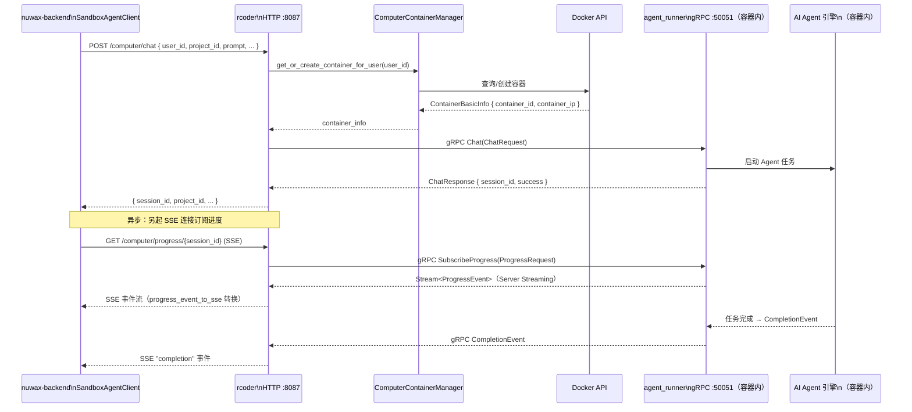

# 请求主链路

一次 Computer Agent 任务从 `nuwax-backend` 发出到 Agent 执行结果回传，贯穿多个进程边界。这篇文档把整条链路逐步展开。

## 1. 全链路概览



## 2. chat_handler 流程（普通 Agent 模式）

```
POST /chat { project_id?, prompt, session_id?, ... }

handle_chat()
├── 若无 project_id → 自动生成
├── 参数校验（pod_id 存在时 isolation_type/tenant_id/space_id 必填）
├── get_or_create_container(project_id, ServiceType::RCoder)
│   └── docker_manager → 查找 or 创建 Docker 容器
├── extract_grpc_addr_with_port() → "{container_ip}:50051"
├── grpc_chat_with_pool(grpc_pool, grpc_addr, ChatRequest)
│   ├── 连接池命中 → 复用 gRPC Channel
│   └── 连接池未命中 → Channel::connect() + 缓存
└── 返回 { session_id, project_id, success }
```

## 3. computer_chat_handler 流程（Computer Agent 模式）

```
POST /computer/chat { user_id, project_id?, prompt, ... }

handle_computer_chat()
├── 验证 user_id 非空
├── 参数校验（同 chat_handler）
├── 并发保护（DashMap pod_creating）
│   ├── 已有其他请求在创建同 user_id 容器 → 轮询等待（最多 30s）
│   └── 等待超时 → 继续正常创建流程
├── ComputerContainerManager::get_or_create_container_for_user(user_id)
│   └── 挂载: /computer-project-workspace/{user_id} → /home/user
├── 二次验证：container_ip 非空（缓存/Docker API 不一致保护）
│   └── IP 为空 → cleanup → 强制重建
├── 创建项目工作目录 /home/user/{project_id}
├── 更新 session 映射
└── gRPC Chat → 同 handle_chat
```

### 并发保护机制

同一 `user_id` 并发两次 `/computer/chat` 时，第二个请求检测到 `pod_creating` 标记，轮询最多 30 秒等待第一个请求完成容器创建，避免创建两个重复容器。

## 4. SSE 进度流链路

```
GET /computer/progress/{session_id}

create_grpc_sse_stream(grpc_addr, session_id, project_id, pool)
├── 2 次重试机制
│   ├── pool.get_client(grpc_addr) → 连接池获取 gRPC 客户端
│   └── pool.remove() → 连接失败时清理连接
├── 先检查 Agent 状态（GetStatus by session_id）
│   └── status == "idle" → 直接发送 SessionPromptEnd，关闭连接
├── SubscribeProgress(ProgressRequest { session_id }) → Server Streaming
└── 逐条转换 ProgressEvent → SSE Event（progress_event_to_sse）
    ├── LogEvent       → event: "log"
    ├── ThinkingEvent  → event: "thinking"
    ├── ChunkEvent     → event: "chunk"
    ├── CompletionEvent → event: "completion"
    ├── ErrorEvent     → event: "error"
    ├── AskConfirmationEvent → event: "ask_confirmation"
    ├── ProgressNotificationEvent → event: "progress_notification"
    └── ToolUseEvent   → event: "tool_use"
```

mpsc channel（容量 100）解耦 gRPC 接收和 SSE 推送，避免背压阻塞。

## 5. gRPC 连接池（GrpcChannelPool）

```rust
// 基于 DashMap，key = "container_ip:50051"
channels: DashMap<String, Channel>

get_client(addr)
├── 命中 → clone Channel（零拷贝，HTTP/2 连接复用）
└── 未命中 → Channel::from_shared(addr)
             .connect_timeout(5s)
             .timeout(30s)
             .connect()
             → 插入 DashMap
```

gRPC Channel 底层是 HTTP/2，同一 addr 的并发请求复用同一 TCP 连接（多路复用），无需重复握手。

## 6. HTTP 回退机制

gRPC Chat RPC 失败时自动降级到 HTTP：

```rust
match grpc_chat_with_pool(...).await {
    Ok(resp) => { /* 正常路径 */ }
    Err(_)   => forward_request_via_http(request, container_info).await
}
```

HTTP 回退调用容器内 `{container_ip}:{port}/chat`，保证可用性。

## 7. 事件类型与 nuwax-backend 的映射

rcoder 收到 gRPC `ProgressEvent` 后转为 SSE 推给 `nuwax-backend` 的 `SandboxAgentClient`，后者把 SSE 事件映射回 `AgentOutputDto` 继续流入 `Sinks.Many` 推给前端：

| gRPC ProgressEvent | SSE event 字段 | nuwax-backend AgentOutputDto 类型 |
|-------------------|---------------|----------------------------------|
| `ChunkEvent` | `chunk` | `MESSAGE`（流式文本）|
| `ThinkingEvent` | `thinking` | `PROCESSING`（思考块）|
| `ToolUseEvent` | `tool_use` | `PROCESSING`（工具调用）|
| `CompletionEvent` | `completion` | `FINAL_RESULT`（结束）|
| `AskConfirmationEvent` | `ask_confirmation` | 需用户确认的交互 |

## 一句话总结

rcoder 的请求链路核心是"HTTP → 容器管理 → gRPC Chat → gRPC SubscribeProgress Server Streaming → SSE"，连接池复用 HTTP/2 通道，mpsc channel 解耦接收与推送，gRPC `oneof` ProgressEvent 携带 8 种类型化进度事件，整条链路对 nuwax-backend 透明。
