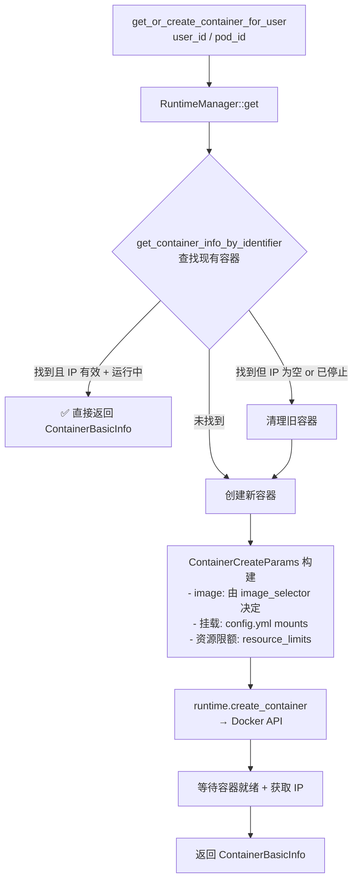
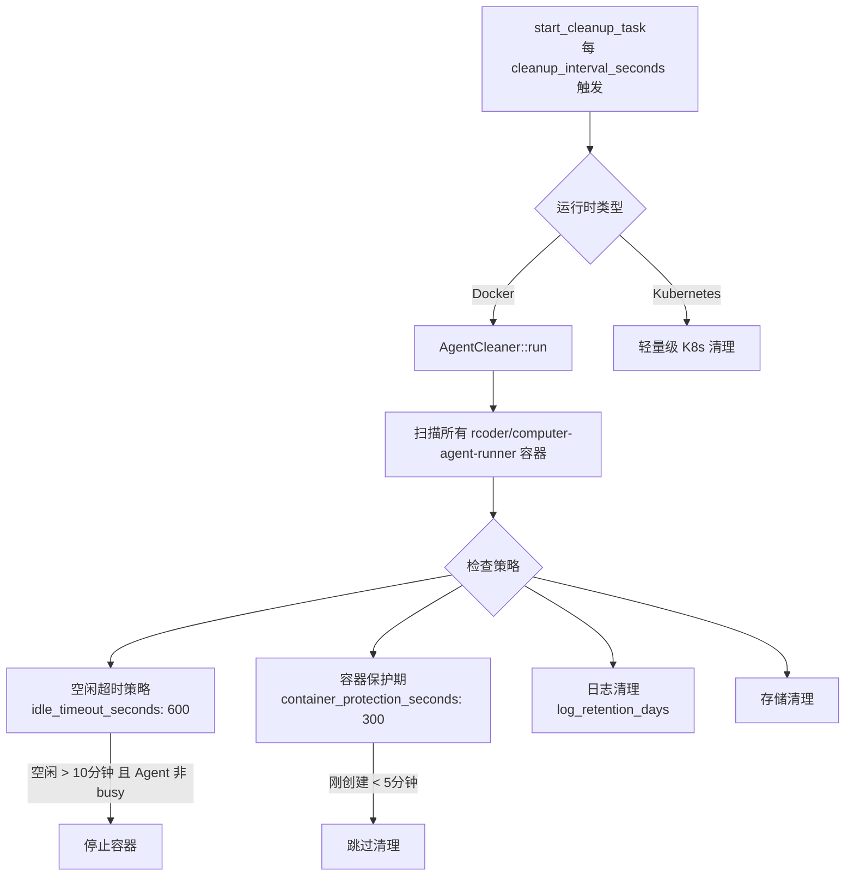

# 容器管理与生命周期

rcoder 的容器管理是其核心能力——每个 AI Agent 任务都在独立的 Docker 容器中运行，rcoder 负责容器的创建、复用、健康检查和清理。

## 1. 两种容器模式对比

| 维度 | 普通 Agent（RCoder 模式）| Computer Agent 模式 |
|------|------------------------|-------------------|
| 容器标识 | `project_id` | `user_id`（或 `pod_id`）|
| 容器名称 | `rcoder-agent-{project_id}` | `computer-agent-runner-{user_id}` |
| 容器内工作目录 | `/app/project_workspace/{project_id}` | `/home/user`（通过宿主机挂载）|
| 宿主机挂载 | `{projects_dir}/{project_id}` | `/computer-project-workspace/{user_id}` |
| Agent 实例 | 1 个 | 多个（按 project_id 区分，共享容器）|
| VNC/音频/IME | 无 | 有（端口 6080/6089/6091）|
| 挂载配置方式 | 硬编码 | `config.yml mounts` 配置化 |

## 2. 容器创建流程（Computer 模式）



### IP 为空时的二次验证

容器创建后，`computer_chat_handler` 再次校验 `container_ip` 是否非空（Docker 缓存/API 不一致保护）。若仍为空：
1. 清理旧容器（避免 "running" 状态的无效容器被复用）
2. 强制重建
3. 不向调用方返回错误（对调用方透明）

## 3. 容器标识与隔离类型

当 `pod_id` 存在时，使用 `pod_id` 作为容器标识而非 `user_id`，同时需要提供：

- `isolation_type`：`tenant`（租户级）/ `space`（空间级）/ `project`（项目级）
- `tenant_id`：租户 ID
- `space_id`：空间 ID

这允许平台按租户/空间共享容器，实现更细粒度的资源隔离策略。

## 4. 镜像选择（image_selector）

`image_selector` 根据 `ServiceType` 和配置选择对应镜像：

- `ServiceType::RCoder` → `config.docker_config.image`（默认 Agent 镜像）
- `ServiceType::ComputerAgentRunner` → Computer Agent 专用镜像（含桌面环境）
- `config.default_agent_id` 决定容器内启动哪个 Agent 引擎（默认 `claude-code-acp-ts`）

## 5. 容器清理机制



### 清理配置

```yaml
cleanup_config:
  enabled: true
  idle_timeout_seconds: 600        # 空闲超时（10分钟）
  cleanup_interval_seconds: 300    # 检查间隔（5分钟）
  container_protection_seconds: 300  # 新容器保护期（5分钟）
  log_cleanup:
    log_retention_days: 7
```

## 6. 容器同步任务

除清理外，还有两个后台同步任务：

| 任务 | 功能 | 间隔 |
|------|------|------|
| `start_container_sync_task` | 同步容器状态到内存缓存 | 30s |
| `start_vnc_sync_task` | 同步 VNC 服务就绪状态 | 10s |
| `start_container_status_checker` | 实时检查容器健康 | 按配置 |

## 7. container_ttl vs idle_timeout

| 参数 | 位置 | 作用 |
|------|------|------|
| `container_ttl_seconds` | docker_config | Docker 容器最长存活（绝对上限）|
| `idle_timeout_seconds` | cleanup_config | 空闲后触发清理（活跃中不清理）|
| `container_protection_seconds` | cleanup_config | 新容器免清理保护期 |

"空闲"定义：Agent Runner 状态为 `idle`（非 `busy`）且超过 `idle_timeout_seconds`。

## 8. K8s 兼容

`RuntimeManager::runtime_type()` 检测环境变量判断运行时：

- **Docker 模式**：完整容器管理（bollard + Docker socket）
- **Kubernetes 模式**：跳过 Docker socket 路径初始化，使用 K8s API 管理 Pod，清理任务退化为轻量级

`DOCKER_SOCKET_PATH` 环境变量指定 socket 路径（默认 `/var/run/docker.sock`）。

## 9. Pingora VNC 代理

Computer Agent 的 VNC/音频/IME 通过 Pingora 反向代理透传：

```
GET /computer/vnc/{user_id}/{project_id}/{*path}
    ↓
Pingora :8088（rcoder-proxy crate）
    ↓
容器 IP:6080（noVNC HTTP 服务）
```

路径 `/computer/desktop/{user_id}/{project_id}` 返回前端需要 iframe 嵌入的 VNC URL，包含容器的 noVNC 访问地址。

## 一句话总结

rcoder 的容器管理核心是"按 user_id/project_id 幂等创建并复用 Docker 容器"，配合并发保护（DashMap pod_creating）、IP 二次验证、定时清理（空闲超时 + 保护期）、K8s 兼容运行时抽象，让容器生命周期对 AI Agent 任务调用方完全透明。
